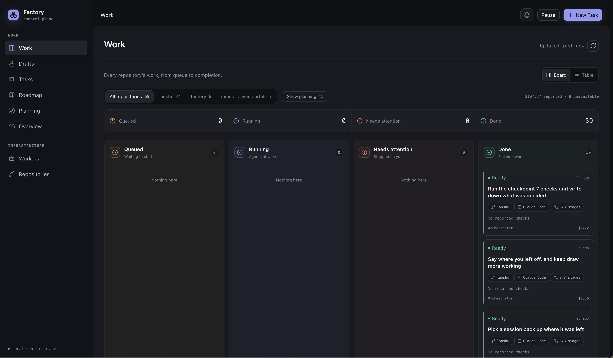
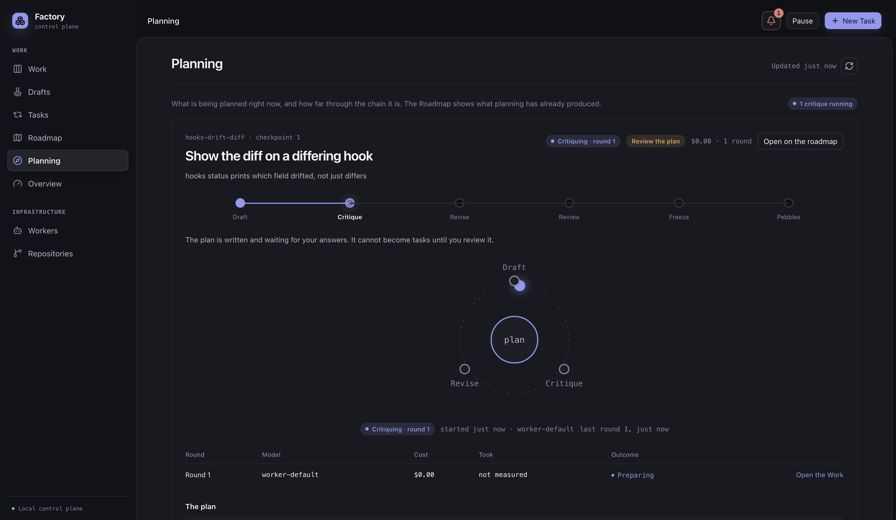
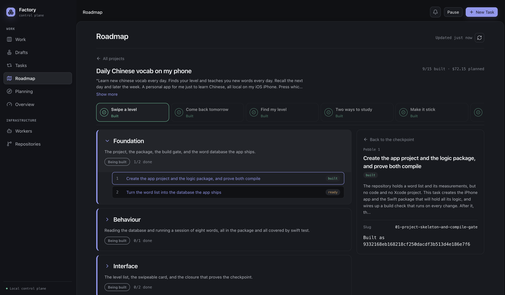

# not-so-simple-software-factory

This was my personal light/dark factory workflow that works with Claude, Codex, and Pi. The light factory and the dark factory are agent skills. They talk to an adapted local factory server. The agent you already sit with is the orchestrator that decides which skill to load.

I ran the server on a Mac mini so I could work on my laptop, send work over, and let the always-on machine work while I was offline. The actual factory backend is my adaptation of a fork of [Owain Lewis's factory](https://github.com/owainlewis/factory). 


## How the two factories fit

The fork I started with was a simple software factory: drop a GitHub issue on a queue, wait for a pull request. That is a dark factory. It did not work for me as a developer starting a new project from scratch every other week. You still had to come back and iterate with an agent on the issues it leaves behind, and there is no planning step, so most of the time and work still goes into 3-4 parallel sessions for you to check in on.

The /light-factory skill was the missing half. It is human-in-the-loop planning. You and the orchestrator research an idea, make a roadmap of checkpoints, write a PRD with every decision cited, run a critic, review it in the browser, then freeze/approve it and cut it into small tasks. Only then does anything go to the dark factory.

The /dark-factory skill teaches the agent how to use my factory, a locally hosted server. A decided spec goes in either from a ticket or from the light factory. A dark factory worker builds it in an isolated worktree and opens a pull request. Totally magic.


## In the cockpit

### Work board

Shows what is queued, running, and finished work across repositories.



### Planning

Milestones broken into checkpoints. Simple to keep track of and visualizes the real loop.



### Roadmap

This keeps your view clear. It is the source of truth for both you and all your agents.
Tasks broken down layer by layer into the simplest jobs. And each one shows a description and how much it cost.



## What I learned, and why I do not use this as my daily workflow

I used to read about companies like OpenAI and Uber running dark factories. What I found is that a dark factory is only really useful for a small, precise issue that does not need human opinion, on a codebase that already exists. A GitHub issue that should become a pull request while you are away. A scheduled job that picks off the next issue it can actually solve. An end-to-end test loop. That is the job.

On a small project it is the wrong tool. The factory will run several rounds of implementation and review on a change that you could have one shotted in the beginning of a project and fixed everything together. Models have enough context now that packing those little tasks into one larger change, in one session, ships more pull requests and is much faster at the beginning.

That is why this is not what I use day to day. I work fast and sporatic. I would come back to the dark factory if ever I had a large codebase that needed constant maintenance that does not fail; if a small bug needs fixing immediately after a user submits a bug report. 

The roadmap was the part I am keeping for myself. Just having a set plan ahead so that you and your agent's vision is on the same page. Drifting is the worst. The way I incorporate the roadmap now is through a set architecture for all my projects, and direct instructions in AGENTS.md to traverse that. I can share my new workflow soon.

I do not recommend this as your main way of writing code. But if you have an always-on machine, it is set to work with Tailscale. It does not burn that many credits, but it is slow, and it may have bugs from the migration to your machine. Try it anyway. The UI is genuinely fun to click around. Everything opens.

## Quick start

**Factory server** (Claude, Codex, or Pi on the worker host):

```sh
cd factory
just build
mkdir -p ~/.factory
cp examples/worker.toml ~/.factory/worker.toml
just run
```

Open [http://127.0.0.1:7337](http://127.0.0.1:7337). Full setup is in [`factory/README.md`](factory/README.md).

**Skills** (Claude Code and/or Codex):

```sh
cd skills
./install.sh --targets claude   # or codex, or both
```

Point the factory skills at your server with `FACTORY_BASE`. There is no default. See [`skills/README.md`](skills/README.md).

## Provenance

- `factory/` is MIT, forked from [`owainlewis/factory`](https://github.com/owainlewis/factory).
- `skills/` is MIT. Some skills were adapted from [`kunchenguid/firstmate`](https://github.com/kunchenguid/firstmate), [`mattpocock/skills`](https://github.com/mattpocock/skills), and [`cursor/plugins`](https://github.com/cursor/plugins). See `skills/NOTICE.md`.

This repository is MIT. See [LICENSE](LICENSE).
