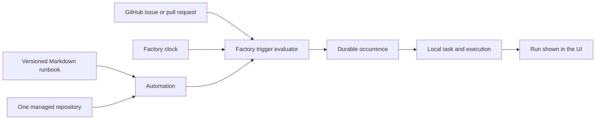

# Coding automation experience

> **Status:** First UX slice implemented; multi-repository Runs proposed
>
> **Verification basis:** Factory working tree based on `0072c47`; Multica `f44df04`

## 1. Executive summary

Factory already has most of the durable machinery that makes Multica's Autopilots feel trustworthy. It stores versioned Markdown instructions, typed triggers, durable trigger occurrences, ordinary tasks, attempts, and terminal outcomes. The main problem is that the browser exposes those internal parts directly. An operator must understand Workflows, Occurrences, polling intervals, raw cron, and control-plane counters before they can answer the simple questions: what will run, where will it run, when will it run, and what happened last time?

This change adapts Multica's strongest product ideas without copying its code or making Factory own a second issue tracker. The UI calls Markdown instructions a runbook, presents trigger setup in plain language, keeps expert settings available but secondary, and presents each durable occurrence plus its task as one run with a live state. GitHub issues remain the source of work. Factory remains the source of execution state.

The main downside is that one Automation still targets one repository. A later multi-repository change must add a parent Run and durable Run Targets. A repository multi-select over the current schema would hide partial failure and weaken retry semantics.

## 2. Context and scope

Factory's current [architecture](../../ARCHITECTURE.md) separates coordination from execution. A Workflow owns immutable Markdown revisions. An Automation binds one Workflow revision source, one managed repository, trusted context, timeout, enabled state, and one typed trigger. A durable Occurrence snapshots the rule and repository before it creates an ordinary Task. The Task then owns queue and execution state.

Multica uses a similar web, Go, database, and local-daemon split. Its Autopilot model presents a Runbook, assignee, execution mode, one or more triggers, and Run history. Its list query deliberately returns trigger kinds, next run, and last-run state so the collection view answers operational questions without extra requests. Its detail view folds the linked issue or task state into each run row. The screenshots supplied with this request also show consistent collection pages, clear machine and agent profiles, restrained density, and actions that stay close to the object they affect.

This design covers the Automation list, editor, detail page, and terminology. It adds an optional latest-Run projection to the Automation response, but does not change the worker protocol, task contract, GitHub evaluation, occurrence identity, or database schema in the first slice.

### Concept transfer

| Multica concept | Factory decision | Reason |
|---|---|---|
| Markdown Runbook as the main Automation input | Keep | Coding work benefits from readable, versioned instructions that can be reused by manual and automated tasks. |
| Durable Run history linked to work | Keep and adapt | Factory projects an Occurrence plus its linked Task as one Run, so it does not duplicate execution state. |
| Operational collection rows with last state and next due time | Keep | Repository filters, health, last run, activity, and next action make a many-repository workspace scannable. |
| Friendly trigger controls with advanced fields available | Keep | Common schedules should not require cron knowledge, while existing power-user control remains compatible. |
| Local daemon or worker runtime | Keep | Coding agents need local repository access and isolated worktrees. |
| Product-owned issue board and issue lifecycle | Skip | GitHub issues and pull requests remain the external source of work. |
| One target hidden behind a repository multi-select | Skip | Partial success, per-target retry, and immutable repository snapshots need explicit child identities. |
| Multi-repository Automation | Adapt later | Add one parent Run with durable Run Targets instead of cloning Automations or pretending one Occurrence represents several repositories. |
| Multica visual components and branding | Skip | Factory uses its own UI system and only transfers product concepts. |

Multica source evidence was inspected at the fixed commit above:

- [`apps/docs/content/docs/autopilots.mdx`](https://github.com/multica-ai/multica/blob/f44df04f96ecd28b2dbb6e5378ae125331380c11/apps/docs/content/docs/autopilots.mdx) defines the Runbook, trigger, execution mode, and Run history product model.
- [`packages/views/autopilots/components/autopilot-detail-page.tsx`](https://github.com/multica-ai/multica/blob/f44df04f96ecd28b2dbb6e5378ae125331380c11/packages/views/autopilots/components/autopilot-detail-page.tsx) derives visible run state from the linked issue or task and keeps trigger management on the detail page.
- [`server/pkg/db/queries/autopilot.sql`](https://github.com/multica-ai/multica/blob/f44df04f96ecd28b2dbb6e5378ae125331380c11/server/pkg/db/queries/autopilot.sql) stores runs separately from tasks and supplies operational list data without N+1 requests.
- [`server/migrations/042_autopilot.up.sql`](https://github.com/multica-ai/multica/blob/f44df04f96ecd28b2dbb6e5378ae125331380c11/server/migrations/042_autopilot.up.sql) defines separate Autopilot, Trigger, Run, Issue, and Task identities.

Multica's license adds interface and branding conditions. Factory therefore adapts concepts only. No Multica source, styles, components, or assets are copied.

## 3. System context

GitHub owns issue and pull-request state. The control plane owns the Automation rule, Occurrence identity, Task, and execution lifecycle. The worker owns the attempt process and worktree. The browser combines these records but does not invent another lifecycle.

## 4. Proposed design

### How it works

An operator opens Automations and can filter by repository or status. They create an Automation by choosing a saved Markdown runbook, a managed repository, and a trigger. Common trigger fields stay visible. Polling, timeout, and raw cron are expert settings. New Automations remain disabled until the operator tests and enables them.

On the detail page, the operator sees the runbook instructions next to the Automation configuration. When a trigger fires, the page presents the durable Occurrence as a Run. Before task creation it shows pending or failed occurrence state. After task creation it shows the actual Task state, such as queued, running, succeeded, failed, or cancelled. The row links to the GitHub source when one exists and to the local Task when one exists. Existing polling keeps the visible state current.

### Components and responsibilities

The Automation collection owns local filtering and concise operational summaries. It depends on the existing Automation page API and does not own scheduling or execution.

The Automation editor owns progressive disclosure and client-side validation. It depends on the existing Workflow and repository catalogs. It does not create hidden rule semantics or bypass server validation.

The Automation detail page owns the combined Run presentation. It depends on Occurrence and Task summaries returned by the current API. It does not persist a second run status.

The control plane remains the sole owner of durable state. No first-slice API or schema change is required.

### Decisions

We keep Workflow as the API and database term but use Runbook in the Automation UI. This matches the operator's mental model while preserving versioned reuse and compatibility. The dedicated Workflow screens remain available for revision management.

We derive visible Run state from `occurrence.task.state` after dispatch and from `occurrence.state` before dispatch. We rejected a new persisted `run_state` because it would duplicate Task state and could drift.

We keep raw cron available but move it behind an expert-settings disclosure. We rejected replacing cron in this slice because a friendly schedule builder needs its own parser, accessibility tests, timezone preview, and round-trip guarantees.

We do not add a repository multi-select to the current create request. A real fan-out model needs parent and child identity so one target can retry without replaying every target.

## 5. Invariants and requirements

### Invariants

1. GitHub remains the source of issue and pull-request work state.
2. Factory remains the source of trigger, run, task, and execution state.
3. One durable Occurrence creates at most one Task.
4. The UI never reports a dispatched run as successful only because a Task exists.
5. A Workflow revision and repository are still snapshotted before task dispatch.
6. New Automations remain disabled until explicitly enabled.

### Requirements

- The Automation list can be narrowed by managed repository and enabled state without another server request.
- The editor calls Workflow instructions a Runbook and explains the relation to saved revisions.
- Expert settings do not block the common create path.
- Run history shows the live Task state when a Task exists.
- A GitHub-backed run links to its source item.
- An operator can still open the local Task for logs, result, retry, and cancellation.
- Existing API payloads and idempotency behavior remain compatible.

## 6. Interfaces and data

The first slice uses the existing `AutomationOccurrence`, `AutomationTaskSummary`, `Workflow`, and `WorkflowDetail` JSON types. It adds an optional `latest_run` Occurrence projection to each `Automation` response so the collection cannot hide a newer pending or failed Run behind an older Task. It adds no stored fields.

The visible Run state is computed as follows:

| Stored records | Visible state |
|---|---|
| Occurrence has a linked Task | Task execution state |
| No Task and Occurrence is pending or dispatching | Preparing |
| No Task and Occurrence is failed, skipped, or task-deleted | Matching terminal Occurrence state |
| No Task and Occurrence is dispatched | Dispatched, with no success claim |

### Naming and identity

The word Run is a UI projection over one existing Occurrence. Its stable identity remains the Occurrence ID. The Task ID and GitHub URL remain links, not replacements for that identity.

For future multi-repository fan-out, add a stable parent `automation_run` ID created from the trigger identity and one `automation_run_target` per repository. Each target owns its own Occurrence and Task request-key domain. Repository removal after a run starts must not remove its target snapshot.

## 7. Failure behavior and lifecycle

An evaluation failure remains Automation health, because no work item was admitted. A routing failure remains a pending or failed Occurrence with its diagnostic. Once a Task exists, its state wins in the Run row. A deleted Task keeps the existing Occurrence tombstone.

Disabling an Automation stops future checks and dispatches but does not relabel or stop existing Tasks. Editing remains disabled while the Automation is enabled. Browser refresh or process restart reloads the same durable state.

Future parent Runs must be terminal only when every target is terminal. A partial failure is a first-class result, not success or total failure. Retrying one target must preserve successful siblings.

## 8. Security, privacy, and operations

The trusted local-host boundary is unchanged. GitHub metadata remains untrusted and bounded. Runbook instructions and trusted Automation context remain operator-authored. Repository and Workflow dependencies continue to be validated by the control plane.

List filtering is local and uses already-loaded bounded pages. Existing polling intervals and request limits are unchanged. The latest Run projection is loaded in one bounded query for the whole Automation page, not one query per row. The runbook detail request is the existing bounded Workflow detail endpoint.

## 9. Acceptance criteria

- Automation collection rows lead with title, repository, trigger, enabled state, last run, and next action.
- Repository and status filters work together and have a clear empty result.
- The editor presents Runbook, repository, and trigger before expert settings.
- The detail page shows the current Markdown runbook revision.
- A queued, running, succeeded, failed, or cancelled Task produces the same visible Run state.
- Provider Runs link to their GitHub issue or pull request.
- Existing Automation create, edit, test, enable, check, run-now, pagination, and migration tests still pass.

## 10. Test approach

React tests cover filters, editor disclosure, runbook loading, live Run-state derivation, source links, and existing mutations. Existing Go tests prove occurrence and task idempotency. The web build and lint catch type and accessibility regressions. The Playwright Automation flows verify the browser against the real control-plane API.

## 11. Risks and tradeoffs

- Run is a UI term over Occurrence. Contributor documentation must keep the mapping explicit until the API is renamed or versioned.
- Loading the runbook on the detail page adds one bounded request. React Query caches it and the detail page already polls other state.
- Progressive disclosure can hide useful tuning. The summary must show current expert values and remain keyboard accessible.
- This slice makes a many-repository workspace easier to operate but does not yet fan one trigger out across repositories.

## 12. Open questions

- Should future fan-out run all repositories in parallel or cap per-Automation concurrency? This does not block the first slice. Start with the existing global worker capacity and add a per-Run cap only after measured contention.
- Should a provider trigger be evaluated independently in every target repository, or should one GitHub event name explicit targets? This blocks the future fan-out API and needs use-case evidence.

## 13. Out of scope

- Owning or synchronizing a second issue board.
- Multi-repository parent Runs and target retries.
- Webhooks, multiple triggers per Automation, squads, notifications, or execution modes.
- Copying Multica's visual design, source code, assets, or component structure.
