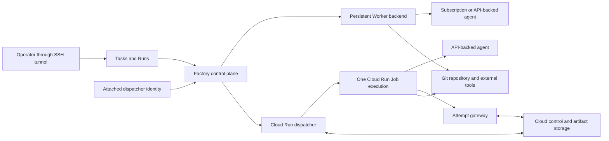

# Elastic Cloud Run agent backend

> **Status:** Proposed for review

## 1. Executive summary

Factory currently runs every coding agent through a persistent Worker on a
local machine or VM. That path is valuable because it can use authenticated
subscription CLIs, reuse repository caches, and retain failed worktrees, but an
operator must provide and maintain enough machines for peak demand.

This design adds Cloud Run Jobs as a second execution backend. Factory will
start one disposable container for one Run Session, run Pi, Codex, or Claude
Code with API-backed model access, ingest ordered events, preserve a recovery
artifact, and stop paying for compute when the Job exits. The existing control
plane remains the source of truth. Cloud Run provides managed compute, not a
second scheduler or product model.

The first hosted deployment runs `factory-server` on a dedicated Compute
Engine VM. Its attached dispatcher service account supplies metadata-backed
workload credentials to Google client libraries. Factory calls Cloud Run and the
Attempt gateway directly and never shells out to `gcloud` or loads a downloaded
service-account key. Coding agents do not run on this VM because any process on
it could otherwise request the attached identity from the metadata server.

The main downside is weaker local recovery. An ephemeral Job cannot retain an
inspectable worktree after it exits, so it must publish a durable, verified
artifact before Factory accepts completion. Cloud Run also isolates a process
from the operator's machine but does not make arbitrary repository code safe.

## 2. Context and scope

The current [architecture](../../ARCHITECTURE.md) separates durable
coordination from agent execution. A persistent Worker claims work, prepares a
worktree, owns a 30-second Attempt lease, starts one runtime process, sends
events, observes cancellation, and retains uncertain Git state. Local and VM
Workers use the same lifecycle contract.

The [Cloud Run experiment](https://github.com/owainlewis/factory/pull/275)
proved a narrower path against the Factory repository:

- Cloud Build produced a pinned, non-root Pi container.
- A Cloud Run Job checked out an exact commit and ran Pi from that directory.
- Pi used DeepSeek V4 Flash through OpenRouter in read-only and write modes.
- Structured output omitted model reasoning and reported model cost.
- Write mode produced an exact patch without pushing a branch.
- The final read-only execution completed in 55 seconds, including a 33-second
  start, with $0.00209 of model usage. At the current published default Cloud
  Cloud Run Jobs rates, its one-minute minimum would cost about $0.00132 before
  the free tier.

That experiment proves container execution, not the Factory lifecycle. It does
not prove durable dispatch, lease fencing, restart recovery, prompt
cancellation, private repository access, event ingestion, or artifact
retention. This design covers those boundaries for one Google Cloud project
and region. It does not replace persistent Workers or generalize execution to
every cloud provider.

## 3. System context



Factory owns Tasks, Runs, Sessions, and Attempt identity, the frozen prompt and
commit, scheduling, capacity, retries, cancellation, events, results, cost
history, and terminal outcomes. The persistent Worker owns its cache,
worktrees, agent processes, and local cleanup. The Cloud Run adapter owns cloud
dispatch, execution reconciliation, authority publication, cancellation, and
artifact transport. Cloud Run owns disposable compute only.

Backend, runtime, and model are independent choices:

| Choice | Examples | Owner |
| --- | --- | --- |
| Execution backend | Persistent Worker, Cloud Run Job | Factory routing |
| Agent runtime | Pi, Codex, Claude Code | Backend capability |
| Provider and model | Subscription session, OpenRouter and DeepSeek | Execution profile |

DeepSeek V4 Flash is one tested model, not a Cloud Run backend type.

In the first hosted shape, the control plane and SQLite database run on a
dedicated Compute Engine VM with persistent disk. The operator reaches its
loopback listener through an SSH tunnel. Persistent Workers run on separate
local or VM hosts and keep their existing outbound authenticated connection to
Factory. This preserves the current architecture while preventing an agent
process from using the dispatcher VM's attached Google identity.

## 4. Proposed design

### How it works

An operator runs a Task against one repository and supplies the configured
`Cloud Run Europe` profile as a manual run override. Factory creates ordinary
Run and Session records. A cloud repository input resolver turns the configured
source ref into a full Git commit SHA before the Session queues. Factory freezes
that commit, the complete prompt, runtime, provider and model selection,
repository identity, and execution-profile version on the cloud Session. Every
cloud Attempt and explicit retry for that Session reuses those inputs.

The embedded Cloud Run dispatcher creates an Attempt and a backend dispatch
record in one transaction. The record contains a random non-secret run ID and
starts in `dispatching`. Factory writes the immutable input and gateway
registration, then asks the gateway to create the initial short-lived authority
document using the gateway clock and an object-generation precondition. That
response also fixes `session_started_at` to gateway server time and
`session_deadline_at` to `session_started_at + timeout_seconds`; both are
persisted in the dispatch before the Run call and bound into the authority
object. Factory records local monotonic time immediately before that gateway
request and anchors the returned remaining Session duration to the earlier
instant. That conservative monotonic deadline drives the live dispatcher even if
later gateway responses are delayed or unavailable. Factory calls one immutable,
versioned Cloud Run Job resource with the Attempt ID, run ID, and a separate
random 256-bit run capability as bounded overrides. The capability is sensitive,
excluded from logs, and visible only to identities already allowed to inspect
Cloud Run executions. The prompt, model credential, and any cloud credential are
not override values.

The Job service account has no access to the artifact bucket, Cloud Run
administration, or sibling Attempts. Its only data permission is access to the
dedicated, single-version model secret when the selected provider requires one.
The wrapper requests an identity token for the Attempt gateway. Although code
in the Job can ask the metadata server for another audience, the Job identity
has no invoker grant on another Factory service. The gateway requires the exact
gateway audience, expected service-account subject, and random run capability,
maps them to one active Attempt prefix, and permits only the protocol operations
and byte limits defined in this document.
The gateway performs all Job-originated storage reads and conditional writes.
This prevents one profile's execution from reading or corrupting a sibling
execution. It does not prevent trusted repository code from tampering with its
own Attempt, which is part of the initial trusted-repository boundary.

The Job wrapper starts a monotonic pre-fence timer when its process starts and
sets it to the smaller of five minutes and the trusted remaining Session
duration. It exits without an agent if that timer expires. It records local
monotonic time immediately before requesting the Attempt and run-ID start fence.
If a lost API response causes Factory to launch a duplicate, only one execution
can win that fence; every duplicate exits without running an agent. The gateway
serializes the fence and revocation through a conditional authority-object
update, then publishes `started.json` as immutable evidence. The successful
response includes gateway server time and the persisted `session_deadline_at`.
The wrapper anchors `session_deadline_at - server_time` to the earlier
pre-request monotonic instant, so Cloud Run startup and response delay consume
rather than extend the frozen Session timeout. The winning wrapper verifies the
input, checks out only the frozen commit, and starts the selected runtime in the
checkout. Checkout and agent execution share that deadline. After it expires,
the wrapper kills the process group and exits nonzero. It cannot publish new
evidence, restart the agent, or perform repository tool actions. Factory's
durable timeout record is authoritative and may reference only bounded evidence
uploaded before authority expired.

The dispatcher requests an authority refresh every ten seconds while it owns
the Attempt. The gateway performs the conditional write and computes
`valid_until` as the earlier of 30 seconds from its own server clock and the
frozen Session deadline. The wrapper checks authority before agent launch and at
most every five seconds while the process runs. An expired, cancelled,
mismatched, or timed-out Attempt starts shutdown of the runtime process group.
This preserves
fail-closed lease behavior without making the local Factory API reachable from
the internet.
Cloud execution therefore depends on one continuously running Factory control
plane in the first release. Closing a laptop-hosted control plane deliberately
stops its Cloud Jobs within the authority window.

The wrapper uploads normalized event batches with stable sequence numbers.
Factory polls and ingests those batches idempotently into the existing Attempt
event history. Cloud Logging receives a sanitized diagnostic mirror but is not
the event database.

Before exit, the wrapper uploads a bounded result, Git status, checksummed
patch or Git recovery bundle, untracked-file archive when present, model cost,
and a final manifest. The manifest binds the Attempt ID, run ID, exact
commit, canonical input digest, image digest, runtime and model, Cloud
execution identity, and byte length and SHA-256 digest of every required
output. It is written last. Factory rejects an object or manifest whose storage
generation, prefix, identity, digest, or immutable input does not match the
dispatch record. Transport checks are not enough for success. In a temporary
verification checkout at the frozen commit, Factory applies a patch with
`git apply --check` before applying it, or verifies a Git bundle, its advertised
tip, and the frozen commit as the expected base. It extracts untracked content
only after rejecting absolute paths, `..` traversal, links, devices, excess file
counts, and excess expanded bytes. Factory then compares the reconstructed Git
status and working-tree manifest with the wrapper's manifest. Any malformed,
non-applicable, incomplete, or semantically mismatched recovery artifact fails
the Attempt. Partial artifacts remain visible on failure.

Cancellation first records Factory's intent and revokes authority. The
dispatcher then calls the Cloud Run cancellation API and keeps reconciling
until Google reports a terminal execution. A result published after the
cancellation decision is retained for inspection but cannot turn the Attempt
into succeeded.

### Guided setup and operator experience

Persistent Workers remain available with no Google Cloud configuration. An
operator who adds a Cloud Run profile supplies a project, region, and billing
account, then asks Factory to validate or provision the managed resources. The
setup creates or verifies required APIs, Artifact Registry, immutable Job
versions, artifact storage, the Attempt gateway, separate dispatcher, gateway,
and Job service accounts, exact secret bindings, budget alerts, and the
dispatcher identity. It prints every permission before applying it and can run
in validation-only mode.

The setup screen reports image digest, region, available capacity, supported
runtimes and models, secret readiness, artifact retention, and the latest
validation. It never labels the backend as infrastructure-free or unlimited.
A disabled or unhealthy profile remains visible with an actionable reason and
cannot receive new Runs.

Task authoring keeps its current runtime field and gains an optional default
execution profile. A missing profile means the built-in `persistent-auto`
profile, so every existing Task keeps its current behavior without a data
migration. A manual Run request may override the default with any compatible
profile without creating a new Task generation. A scheduled Run uses the
Task default. A Run freezes the effective profile version, runtime, provider,
and model at admission. A retry cannot change backend, and Factory does not
automatically fail over between backends in the first release.

Run and Attempt detail show the selected backend, but lists and metrics
continue to use one product lifecycle across both backends.

### Google Cloud deployment and authentication

The first supported hosted control plane is one dedicated Compute Engine VM.
It runs `factory-server`, SQLite on persistent disk, the scheduler, and the
Cloud Run dispatcher. It does not run `factory-worker` or any coding-agent
process. The operator keeps the existing loopback-only API and reaches it with
an SSH tunnel. Running `factory-server` itself as a Cloud Run service would
require a separate design for durable state, leader election, continuously
running dispatch, and operator authentication.

The VM has one dedicated dispatcher service account attached at creation and
uses the `cloud-platform` OAuth scope. IAM supplies the narrow authorization.
The hosted profile fixes `credential_mode` to `compute_metadata`. In this mode
Factory rejects a set `GOOGLE_APPLICATION_CREDENTIALS` variable and a local ADC
file at Google's well-known path, then obtains short-lived access and ID tokens
directly from the Compute Engine metadata server. It does not use the generic
[Application Default Credentials search
order](https://docs.cloud.google.com/docs/authentication/application-default-credentials),
which could prefer a credential file over the attached identity.

Local development uses a separate `impersonated_adc` mode. Its ADC file must be
an impersonated-service-account configuration targeting the expected
dispatcher subject. Factory rejects `service_account` key files and plain
`authorized_user` ADC for dispatch. A human developer receives Token Creator
on only the dispatcher service account. Validation-only setup may use the
human's existing Google session, but it cannot enable or run a profile. Neither
mode makes `gcloud` a Factory runtime dependency. User-managed service-account
keys are unsupported, and setup recommends enforcing the organization policies
that disable key creation and upload, following Google's
[service-account security
guidance](https://docs.cloud.google.com/iam/docs/best-practices-service-accounts).

Factory uses access tokens with Google client libraries and the Cloud Run v2
API. Gateway calls carry an audience-bound Google-signed ID token in exactly
one `Authorization: Bearer` header. The caller never uses
`X-Serverless-Authorization`, and the gateway rejects that header, a missing or
repeated Authorization header, or another authentication scheme. Before
reading a request body, the gateway verifies the Google signature, issuer,
expiry, exact service URL or configured custom audience, immutable numeric
`sub`, and the path-specific dispatcher or Job allowlist. This follows Google's
[service-to-service authentication
contract](https://docs.cloud.google.com/run/docs/authenticating/service-to-service)
while preserving the signed token for application verification.

The identity and binding table is normative:

| Identity | Retained grant | Resource scope | Forbidden at runtime |
| --- | --- | --- | --- |
| Provisioning operator or temporary provisioner | None managed by Factory after setup validation | Setup session only | Credentials in Factory, gateway, Job, config, or SQLite |
| Dispatcher service account | Custom Job dispatcher role containing `run.jobs.get`, `run.jobs.run`, `run.jobs.runWithOverrides`, `run.executions.get`, `run.executions.list`, `run.executions.cancel`, and `run.executions.delete`; custom operation reader containing only `run.operations.get`; custom gateway reader containing only `run.services.get`; custom identity reader containing only `iam.serviceAccounts.get`; `roles/run.servicesInvoker` | Job dispatcher on each versioned Job; operation reader on the project; gateway reader and invoker on the one gateway; identity reader on the dispatcher, gateway, and Job service-account resources | Job create, update, delete, or IAM changes; service-account impersonation; artifact objects; model secrets |
| Gateway service account | `roles/storage.objectAdmin` | Dedicated artifact bucket | Cloud Run Job administration, model secrets, Factory operator API |
| Profile Job service account | `roles/run.servicesInvoker`; `roles/secretmanager.secretAccessor` | One gateway service; one dedicated model secret | Artifact bucket, Cloud Run administration, Factory operator API, sibling model secrets |

These are the complete Factory-managed bindings. A runtime principal with any
other direct or inherited project, folder, organization, resource, or
service-account binding fails deployment validation. Google-managed service
agents are outside this table and never run Factory code. The provisioning
operator's pre-existing human administration is part of the deployment trust
boundary, not a Factory runtime identity.

The supported setup uses the operator's current identity or a temporary
provisioner identity to enable APIs and create resources. Setup prints its
permission plan before applying it. Factory never stores that identity. If a
temporary provisioner service account is used, setup removes all of its project
and resource bindings after runtime validation; later changes require an
explicit operator session to grant them again. The runtime bindings above are
resource-level except `run.operations.get` where Google requires a wider parent.
Google provides execution and cancellation through the
[Cloud Run Jobs Executor With Overrides
role](https://docs.cloud.google.com/run/docs/reference/iam/roles), but Factory
uses the documented custom role so drift inspection and
[`run.executions.delete`](https://docs.cloud.google.com/run/docs/reference/rest/v2/projects.locations.jobs.executions/delete)
do not require Cloud Run Developer.

Profile validation obtains both token types, verifies the active subject,
reads the immutable Job and gateway service, resolves the immutable numeric IDs
of every expected service account, and checks required and explicitly forbidden
dispatcher permissions before enabling new dispatch. Hosted mode also reads
the attached service-account identity from the metadata server before every Run
call and authority refresh, so an active identity change is detected within the
ten-second refresh interval even while an earlier token remains valid. Idle
profiles repeat the full validation every 30 seconds. Tokens remain in process
memory only and are never written to SQLite, config, events, artifacts, logs,
or Cloud Run overrides.

### Delivery sequence

The work ships in six independently reviewable slices:

1. **Backend contract.** Add immutable execution-profile versions, a manual Run
   override, cloud repository input resolution, and a fake cloud backend behind
   the current Run and Attempt state machine. Existing Persistent Worker
   configuration and commit-resolution behavior remain compatible.
2. **Artifact protocol.** Define canonical input, authority, start fence,
   ordered event batches, recovery artifacts, checksums, size limits, retention,
   and the Attempt gateway against local test doubles.
3. **Durable dispatcher.** Add dispatch persistence, zero-retry launch,
   authority renewal, cancellation, bounded polling, restart reconciliation,
   quota backoff, and duplicate-start tests against a fake Cloud Run API.
4. **Managed runner.** Turn the experimental image into the trusted Job wrapper,
   pin its dependencies and image digest, and prove read-only, patch-producing,
   cancellation, lease-expiry, and corrupt-artifact cases in a real test
   project.
5. **Product setup.** Add profile configuration, validation, guided resource
   provisioning, health, cost evidence, Attempt diagnostics, and operator
   documentation.
6. **Repository publishing.** After the lifecycle is stable, add short-lived,
   repository-scoped credentials for private checkout and branch or pull-request
   publication. The first five slices require only durable patch recovery.

Each slice must preserve the invariants and pass independent review before the
next slice depends on it. The Cloud backend remains disabled by default until
the real-project acceptance suite passes.

### Components and responsibilities

The execution router owns backend selection from the effective profile frozen
in the immutable Run snapshot and compatible capacity. The Task default or
manual Run override chooses that profile before admission. The router depends
on configured backend profiles. It does not interpret runtime output or call
cloud APIs, and it does not move an admitted Session to another backend.

The cloud repository input resolver owns mutable-ref resolution for Cloud Run.
It records the requested source ref, resolved full commit, resolver identity,
and resolution time on each cloud Run Session before that Session can queue. A
cloud retry never resolves the ref again. Persistent Workers keep the current
`resolve_per_attempt` behavior in the first release, including resolving the
base again on explicit retry. The Run records the resolution policy so the
difference is visible rather than implied to be uniform.

One enabled Cloud Run profile projects into one stable synthetic Worker pool in
the existing routing model. The pool advertises configured capabilities,
health, and capacity, but it never enrolls, polls, or holds a remote Worker
credential. The dispatcher claims and supervises work internally on its behalf.
This preserves non-null Execution and Attempt worker attribution while making
the different recovery contract explicit in the Worker and Attempt views.

The persistent Worker backend is the current Worker manager and supervisor. It
owns subscription-backed CLI sessions, repository caches, worktrees, process
groups, and local recovery. It does not manage cloud resources.

The Cloud Run dispatcher is a durable control-plane component. It owns dispatch
records, Cloud Run API calls, Attempt lease renewal, authority refresh,
event ingestion, artifact verification, cancellation, and restart
reconciliation. It does not run an agent or make Cloud Run state authoritative.

The Attempt gateway is a narrow authenticated Cloud Run service with separate
Job and dispatcher surfaces. The Job surface maps one Job identity plus one
random run capability to one active Attempt and exposes only input read,
authority read, conditional start-fence creation, bounded event append, and
bounded output publication. The dispatcher surface authenticates Factory's
dedicated dispatcher service identity and exposes only initial-authority
creation, conditional authority refresh, conditional revocation, and trusted
gateway-time and authority-status reads for the named Attempt and run ID. Job
identities cannot invoke dispatcher operations, and dispatcher credentials are
never present in the Job. Every authority mutation requires the expected object
generation and an active matching dispatch registration. The gateway service
account, not the Job service account, accesses the artifact bucket. It rejects
unknown, expired, terminal, mismatched, cross-prefix, conflicting, and oversized
operations.

The Job wrapper is the trusted container entrypoint. It owns input validation,
the start fence, exact checkout, runtime supervision, authority checks, event
normalization, monotonic timeout enforcement, artifact publication, and exit
status. It does not choose work, retry an Attempt, or decide Factory's terminal
outcome.

The agent runtime owns model interaction and engineering tool use. It receives
one prepared checkout and a bounded prompt. It does not receive control-plane
credentials or authority to dispatch other Jobs.

The artifact store holds immutable input, authority, event, and output objects.
It is transport and recovery storage, not the source of Factory lifecycle
truth. Factory remains able to rebuild its view from SQLite and reconcile
nonterminal cloud dispatches.

### Decisions

#### Two backends, one product contract

Persistent Workers and Cloud Run Jobs produce the same Run, Session, Attempt,
event, result, cancellation, and retry experience. We reject a separate
"cloud task" product because execution location must not split Task history
or metrics.

#### Backend choice freezes on the Run

An existing Task defaults to `persistent-auto`. A Task may save another
default, and a manual Run may override it without editing the Task. The
effective profile version freezes on Run admission and every Session and retry
uses it. We reject automatic cross-backend failover because the credential,
commit-resolution, and recovery contracts differ and a retry may repeat
external effects.

#### Backend, runtime, and model stay separate

An execution profile combines compatible settings without making them one
identity. We reject `deepseek_cloud` or similar backend names because Pi can
use DeepSeek locally and a Cloud Run image can support other API-backed models.

#### Outbound-only control

The first integration uses outbound Google APIs and cloud storage. We reject a
public callback into Factory because the operator API is loopback-only and the
current product has no tenant authentication boundary. A later hosted Factory
deployment may replace polling with an authenticated private callback or queue
without changing Attempt identity.

#### Factory owns retries

Cloud Run task retries are zero. Every operator retry creates a new Factory
Attempt, run ID, run capability, and cloud execution while reusing the original
frozen Run input. We reject native task retries because an agent may already
have made external side effects and Factory must preserve one visible retry
history.

#### Durable artifact replaces retained worktree

Persistent Workers keep the current retained-worktree contract. Cloud Jobs
publish a recovery artifact because their filesystem is ephemeral. We reject
success based only on exit code or logs because either can be present without
recoverable Git output.

#### Cloud Logging is a mirror

Structured Cloud logs remain useful for live operator inspection and platform
diagnosis. Ordered event objects and the verified final manifest drive Factory
state. We reject parsing Cloud Logging as the event protocol because delivery,
ordering, retention, and redaction are controlled outside Factory.

#### Trusted repositories first

The first release supports repositories and prompts trusted by the Factory
operator. Cloud Run supplies disposable container isolation, not a promise that
hostile code cannot read injected credentials, use the Job service account, or
send network traffic. Arbitrary untrusted code requires a separate threat model
and stronger controls.

#### Immutable Job versions

Cloud Run Run overrides cannot change an image or service identity. Every
execution-profile edit that affects the image digest, service account, mounted
secret version, resources, timeout, or wrapper configuration creates a new
immutable profile version and a distinct versioned Job resource. A Run freezes
that version before dispatch. Referenced versions cannot be deleted. An
explicit retry uses the same version; if it is unavailable, Factory blocks the
retry instead of silently running different code.

#### Direct APIs with attached workload identity

Factory uses Google client libraries and direct v2 APIs. Hosted mode obtains
credentials only from Compute Engine metadata, while development dispatch uses
explicit service-account impersonation through ADC. We reject invoking `gcloud`
from the dispatcher because CLI configuration, output, and subprocess state are
not a durable runtime contract. We also reject downloaded service-account keys
because they are long-lived bearer credentials that add rotation and leakage
risk. The cost is that setup must attach and validate a dedicated workload
identity before a cloud profile can be enabled.

#### Dedicated control-plane VM

The first hosted deployment uses a dedicated Compute Engine VM because the
current control plane owns local SQLite, continuous dispatch, and a loopback
operator API. We reject co-locating a persistent Worker on that VM because
agent and repository code could obtain the VM's dispatcher identity from the
metadata server. We also defer hosting Factory itself on Cloud Run because that
requires a different persistence, leadership, and operator-authentication
design.

## 5. Invariants and requirements

### Invariants

- `INV-1`: Factory is the sole authority for Run, Attempt, retry,
  cancellation, and terminal state.
- `INV-2`: Every cloud Run Session freezes one full commit SHA, prompt, runtime,
  provider, model, and execution-profile version before its first dispatch;
  every cloud retry reuses them.
- `INV-3`: At most one agent process can pass the start fence for one Attempt
  and run ID.
- `INV-4`: Authority expiry starts process-group shutdown immediately and the
  wrapper sends SIGKILL no later than ten seconds after expiry.
- `INV-5`: Cloud Run task retries remain zero; Factory creates every retry.
- `INV-6`: Event ingestion is ordered and idempotent by Attempt, run ID,
  sequence, and event ID.
- `INV-7`: Factory accepts successful completion only after verifying the final
  manifest and every required artifact.
- `INV-8`: Cancellation or timeout intent committed before terminal success
  cannot become succeeded because of prior artifact ingestion or a late cloud
  result. The first committed success, cancellation, or timeout intent owns the
  outcome.
- `INV-9`: A control-plane restart can identify, reconcile, and either resume
  supervision or cancel every nonterminal cloud execution.
- `INV-10`: The Job receives no operator API credential or broad cloud
  administration role.
- `INV-11`: Cloud and persistent backends use the same user-facing Task,
  Run, Session, result, retry, and cancellation concepts.
- `INV-12`: Cloud execution never weakens the loopback-only operator API.
- `INV-13`: A Job identity and run capability can access only its own Attempt
  protocol and cannot read or mutate a sibling Attempt.
- `INV-14`: The gateway refuses to start an agent at or after the frozen
  Session deadline. Factory times out and cancels an accepted execution that has
  not started by then. A running wrapper starts process-group shutdown at the
  same deadline and sends SIGKILL no later than ten seconds afterward,
  independent of the longer profile or Cloud Run Job timeout.
- `INV-15`: Hosted Factory authenticates Google runtime calls only through the
  attached Compute Engine metadata identity and direct APIs. Development
  dispatch permits only explicit ADC service-account impersonation. Neither
  mode invokes `gcloud` or accepts a user-managed key at runtime.
- `INV-16`: Provisioning, dispatcher, gateway, and Job runtime identities stay
  separate. No runtime identity can change IAM policy or assume another runtime
  identity.
- `INV-17`: The gateway accepts a dispatcher or Job call only when its
  Google-signed ID token has the exact audience and expected immutable service
  account subject for that surface.
- `INV-18`: No coding-agent process runs on the Compute Engine VM that owns the
  dispatcher service account.

### Requirements

- One backend profile has a stable ID and immutable versions. Each version has
  a Google Cloud project and region, Job resource, image digest, service
  account, dedicated model-secret resource, artifact gateway, capacity limit,
  trust tier, and
  supported runtime and provider capabilities.
- A Task stores an optional default backend profile. A manual Run may supply
  a compatible override. The admitted Run snapshot records the effective
  profile version, runtime, provider, model, timeout, resource class, and commit
  resolution policy. Editing a Task or profile does not change existing
  Runs.
- Dispatch stores the Attempt ID, non-secret run ID, run-capability digest,
  envelope-encrypted run-capability ciphertext, state, immutable profile
  version, every observed Cloud operation and execution name, timestamps,
  gateway-derived `session_started_at` and `session_deadline_at`, the last
  acknowledged authority generation, an early fail-closed client deadline, a
  conservative authority-expiry upper bound, any single outstanding refresh
  request ID, error, and reconciliation deadline.
- The Job input uses the full commit SHA. Branch names and mutable tags are
  rejected.
- Before every Run call, the dispatcher reads the Job and verifies its resource
  name, template digest, image digest, service account, model-secret resource
  and version, task count of one, and native retry count of zero against the
  frozen profile version. It also requires current authority and a conservative
  monotonic Session deadline that has not expired. Drift or expiry blocks
  dispatch. The wrapper repeats the verifiable checks and binds the effective
  values into its final manifest.
- Dispatch and reconciliation respect the profile capacity and Google Cloud
  API, CPU, memory, and execution quotas. Quota pressure leaves work queued or
  blocked with an actionable reason; it does not create extra executions.
- Dispatch retries transient pre-launch failures after one second with jitter,
  doubles to at most 30 seconds, and stops after the five-minute dispatch
  deadline. The dispatcher polls running execution state at most five seconds
  apart and event objects at most two seconds apart.
- The wrapper checks authority at most five seconds apart. Authority remains
  valid for no more than 30 seconds without a dispatcher refresh.
- The immutable input includes `timeout_seconds`. The gateway start-fence
  response supplies trusted server time and the persisted `session_deadline_at`
  established before the Run call. The wrapper anchors the remaining duration
  to the monotonic instant recorded before the request, producing a conservative
  deadline shared by Cloud Run startup, checkout, and agent execution. At the
  deadline Factory records timeout intent in SQLite, while the wrapper applies
  the ten-second process-group kill rule, stops all Job-originated gateway
  writes, and exits nonzero. Gateway control-plane authority revocation remains
  permitted. A wrapper has no more than five minutes from process start to
  acquire its fence and never beyond `session_deadline_at`. The versioned Cloud
  Run Job timeout is at least the maximum Session timeout plus ten seconds and
  is a platform safety limit, not the Session timeout.
- Event and completion sizes reuse the existing Attempt limits. Artifact size
  defaults to 64 MiB and has a 512 MiB maximum. Completion is rejected when the
  configured bound is exceeded.
- Cloud execution status, model cost, compute duration, image digest, and
  console log URL appear in Attempt detail.
- The hosted Factory VM has one dedicated attached dispatcher service account,
  the `cloud-platform` OAuth scope, and no downloaded Google credential file.
  IAM, not narrower VM access scopes, restricts its resource access.
- Hosted Factory rejects environment or well-known-file ADC and calls the Cloud
  Run v2 API with metadata-backed access tokens. Development dispatch accepts
  only impersonated-service-account ADC. Both modes call the gateway with
  short-lived ID tokens whose audience is the exact configured service URL or
  custom audience. Token values are never persisted.
- The dispatcher may read and run only configured immutable Jobs, inspect,
  cancel, and delete their executions, read their operations, and invoke the
  gateway. It cannot create, update, delete, or change IAM on a Job, impersonate
  another service account, or access a model secret.
- The gateway service account has object administration only on the dedicated
  artifact bucket. Each Job service account can invoke the gateway and access
  only its profile's pinned model secret. These bindings are resource-level,
  not project-wide.
- Startup validates the configured credential mode, the active dispatcher
  subject, both token types, the Job and gateway resources, every configured
  service-account subject, and required and forbidden permissions. Hosted mode
  revalidates its attached identity before every Run and authority refresh. A
  failed check leaves the profile disabled and starts no Cloud Run execution.
- Persistent Workers remain the default backend and require no Google Cloud
  configuration.

## 6. Interfaces and data

### Backend profile

The first proposed profile fields are:

```text
id
name
kind = cloud_run_job
project
region
artifact_bucket
gateway_url
credential_mode = compute_metadata | impersonated_adc
dispatcher_service_account
gateway_service_account
max_concurrent
trust_tier = trusted_repository
capabilities[] = runtime + provider + model selectors
enabled
```

Each immutable profile version records `job`, `image_digest`,
`job_service_account`, resource limits, timeout, wrapper configuration, and a
dedicated model-secret resource with one enabled pinned version. Cloud
credential values do not belong in this record. The service-account fields are
expected principal identifiers used for validation, not credentials. Secret
values belong in Secret Manager and are referenced by the versioned Job
configuration.

The dispatcher creates
`attempts/<attempt-id>/gateway-registration.json` before launch. The immutable
registration stores the expected Job service-account principal, SHA-256 digest
of the run capability, non-secret run ID, exact Attempt prefix, input digest,
frozen `timeout_seconds`, protocol version, and absolute registration expiry.
The gateway uses that registered duration and its own server time to establish
`session_started_at` and `session_deadline_at`; neither the Job nor a later
refresh can change them. The Job sends the raw capability only to the gateway.
The gateway hashes it, uses its own bucket identity to load the registration and
authority, and never exposes list or arbitrary object operations. Authority
revocation closes an otherwise valid registration immediately. The Job sends the
capability only over TLS in an authenticated request body. The Job and gateway
redact request bodies and authorization data, never place the capability in a
URL, header echoed by infrastructure, metric, trace, error, or log. The wrapper
retains the capability only for the Job lifetime and clears its copy on
shutdown. The gateway discards its request copy after each operation.

### Naming and identity

A backend profile receives one random stable ID when it is created. Its
synthetic Worker ID is `cloud-run-<profile-id>` and never changes when the
display name, image, region settings, or capabilities change. Deleting and
recreating a profile creates a new identity. An existing Run continues to point
at the frozen old profile and synthetic Worker record.

Google service accounts are stored by full resource name, email, and immutable
numeric subject. Validation fails if a name is missing, resolves to a different
subject, or no longer matches the deployed Job or gateway. Deleting and
recreating a service account with the same email therefore cannot inherit an
enabled profile silently. Tokens and credential file paths are never stored.

The synthetic Worker cannot authenticate to the Worker HTTP API and cannot be
claimed by an external process. The dispatcher uses an internal store
transaction to create its Attempt and lease. Attempt and run ID identify the
dispatch protocol; the Google operation name, execution name, and image digest
are immutable external observations after they become known.

### Dispatch record

```text
attempt_id
backend_profile_id
run_id
run_capability_digest
run_capability_ciphertext
state
session_started_at
session_deadline_at
provider_search_not_before
provider_search_unbounded
cloud_operation_name
cloud_execution_name
image_digest
input_object
authority_object
artifact_prefix
last_reconciled_at
reconciliation_deadline
error
```

The singular names above are normalized into child observations in storage:
one dispatch can have several operation and execution records. Each record
stores its provider name, first and last observation, create time, effective
override digest, state, and duplicate disposition. The winning execution name
is set only from the create-only start fence. All other matching executions
are retained as duplicate evidence and cancelled.

`attempt_id` is the Factory identity. `run_id` is random, non-secret, and
immutable for one dispatch. It is safe for object names, events, manifests,
logs, and diagnostic URLs. Factory envelope-encrypts the separate raw run
capability before committing the dispatch. The encryption key comes from the
host keyring or process environment and is never stored in SQLite. The raw
value exists transiently in dispatcher, Job wrapper, TLS request, and gateway
memory. Cloud Run retains the raw active execution override as provider-managed
metadata for its documented execution-retention period, so permission to
inspect executions is restricted to the dispatcher and operators who may
inspect model credentials. Factory never stores raw plaintext: SQLite stores
only `run_capability_ciphertext`, and the artifact store keeps only
`run_capability_digest`. A restart decrypts the ciphertext to retry or reconcile
the same dispatch. A missing or invalid encryption key blocks new cloud Run,
revokes authority, and fails active dispatches closed rather than minting a new
capability. Cloud operation and execution names are observations returned by
Google and never replace Factory identity. Missing names keep the record in
reconciliation; they do not authorize a second agent to pass the start fence.

### Object layout

```text
attempts/<attempt-id>/gateway-registration.json
attempts/<attempt-id>/<run-id>/
  input.json
  authority.json
  started.json
  events/<first-sequence>-<last-sequence>.json
  output/result.json
  output/git-status.txt
  output/changes.patch
  output/untracked.tar
  output/manifest.json
```

Inputs are immutable. Authority is the only mutable object and uses generation
preconditions. Event and output objects are create-only. The final manifest
carries the complete provenance and checksum binding defined in section 4 and
is published last.

### Dispatch states

The internal dispatch states are `dispatching`, `starting`, `running`,
`timeout_requested`, `cancel_requested`, `reconciling`, and `terminal`. They map
onto the existing Attempt states and remain internal. A transient Google API
failure moves a record to `reconciling`; it does not invent a second Attempt or
user-facing lifecycle.

### Normative state machine

Factory is the only state-machine writer. GCS objects and Cloud Run status are
evidence that permit one Factory transition; they never transition a Run by
themselves.

| Factory dispatch state | Required evidence | Allowed next states |
| --- | --- | --- |
| `dispatching` | Committed Attempt, run ID, immutable input; after authority creation, an unexpired monotonic Session deadline | `starting`, `timeout_requested`, `cancel_requested`, `terminal` |
| `starting` | Accepted Run operation or matching start fence, before `session_deadline_at` | `running`, `reconciling`, `timeout_requested`, `cancel_requested`, `terminal` |
| `running` | Matching start fence and valid authority generation | `reconciling`, `timeout_requested`, `cancel_requested`, `terminal` |
| `reconciling` | Incomplete or conflicting cloud observation; an unexpired Session deadline before returning to `starting` or `running` | `starting`, `running`, `timeout_requested`, `cancel_requested`, `terminal` |
| `timeout_requested` | Expired conservative monotonic Session deadline; refresh and Run calls disabled | `terminal` after confirmed revocation, elapsed conservative authority-uncertainty deadline, or provider-terminal proof for the matching execution set |
| `cancel_requested` | Durable cancellation time; refresh and Run calls disabled | `terminal` after confirmed revocation, elapsed conservative authority-uncertainty deadline, or provider-terminal proof for the matching execution set |
| `terminal` | One stored Factory outcome | none |

Before every external side effect, the dispatcher commits the intended state
and immutable run ID. A crash before the Run call leaves `dispatching` and may
safely retry the same run ID and capability. A crash after Google accepts the
call but before its response leaves `dispatching`. Immediately before each Run
call, Factory obtains a Cloud Run provider timestamp from the preceding API
response. Before the first Run, it durably initializes
`provider_search_not_before` to that timestamp minus a 60-second provider-clock
margin. Before a later Run, it may only broaden discovery by storing the earlier
of the existing and new cutoffs. Reconciliation pages every execution of the
frozen Job version with provider `createTime` at or after that bound, inspects
its effective environment overrides, and persists every execution carrying the
exact Attempt ID and run ID before another Run call is allowed. It never derives
this cutoff from the Factory clock. If any Run call lacks a trustworthy provider
timestamp, Factory durably sets `provider_search_unbounded`; that flag never
returns to bounded for the dispatch, and reconciliation pages all retained
executions for the frozen Job version. A retry remains blocked until a complete
paginated search and the two-minute provider-discovery window both find no
matching execution.
Another call may still create a duplicate container. Before checkout, model
calls, Git writes, or external tool use, every container asks the gateway for
the start fence. The gateway conditionally updates `authority.json` with the
winning execution identity and then creates the exact `started.json` object
with `ifGenerationMatch=0`. A retry after a failure between those writes
completes the same winner's immutable evidence. Revocation and start-fence
authority updates use the same generation compare-and-swap, so their order is
unambiguous. A fence winner whose Attempt, run ID, input digest, or authority is
stale exits nonzero. A fence loser exits zero without running the agent.

Cloud Run execution names are provider-assigned and cannot be deterministic.
The Factory Attempt and run ID provide deterministic dispatch identity.
Factory stores every operation or execution name observed for that run ID
immutably. The `started.json` winner names its `CLOUD_RUN_EXECUTION`; additional
names are duplicate evidence and are cancelled. They never replace the winning
identity. The prototype must prove that the v2 execution-list response exposes
the effective overrides needed for this search. If it does not, durable launch
is blocked until the design supplies another discoverable correlation key.

Artifact ingestion and verification do not decide the terminal race. Three
SQLite transactions compete. Successful completion loads the verified manifest
evidence and first obtains a fresh gateway authority-state response. Factory
records local monotonic time immediately before that request and derives the
conservative remaining Session duration from the returned gateway time and
`session_deadline_at`. The single serialized SQLite statement that conditionally
writes terminal success invokes a registered suspend-aware monotonic clock
function and requires `now < deadline` together with the checks that neither
cancellation nor timeout intent is committed. The clock uses an operating-system
continuous-time source that includes host sleep. The deadline value is not a
wall-clock comparison or a boolean computed before entering SQLite. The
serialized transaction first preserves any existing terminal, cancellation, or
timeout owner. Only when no owner exists and the time predicate fails does it
record timeout intent instead of success. A stale, missing, or failed gateway
read does not by itself own the outcome. While the last trusted suspend-aware
Session deadline remains unexpired, Factory leaves completion in `reconciling`
and retries the authority read without accepting success. Once that deadline has
expired, the same conditional timeout branch applies. An expired response also
uses that branch. None can replace an existing owner. Prior manifest publication
cannot extend the Session. Explicit cancellation checks that neither a terminal
outcome nor timeout intent is committed and atomically records
`cancellation_requested_at`. Timeout checks that neither a terminal outcome nor
cancellation is committed and atomically records `timeout_requested_at` and the
`timeout_requested` dispatch state. SQLite serialization makes one transaction
the first durable Factory decision. If timeout intent wins, a later explicit
cancel may accelerate the same gateway revocation and Cloud Run cleanup but
cannot change the eventual timed-out outcome. If cancellation wins, later
timeout observation cannot replace cancelled. If success wins before its
deadline, neither signal can replace succeeded. Terminal completion is
idempotent and the stored outcome always wins.

### Authority lease protocol

The dispatcher is the sole authority decision-maker, and the gateway is the
sole physical authority-object writer. `authority.json` contains the Attempt
ID, run ID, run-capability digest, monotonically increasing revision, input
digest, `session_deadline_at`, `valid_until`, winning execution identity when
fenced, a complete `last_refresh_receipt`, revocation reason, and previous
object generation. The receipt contains the request ID, expected storage
generation, gateway processing time, resulting `valid_until`, and deterministic
resulting logical authority revision. It does not claim the provider-assigned
generation of the write that contains it, because GCS assigns that value only
after accepting the payload. The receipt is written atomically with the
authority extension. Every later non-refresh authority mutation, including
fencing and revocation, copies it byte-for-byte; the next successful refresh
atomically replaces it with its own receipt. It remains in `authority.json` for
the dispatch retention period, so any gateway instance can replay the current
receipt after restart without process memory.

An authenticated refresh request contains a durable unique request ID and the
expected generation, but no caller-supplied time. Factory allows only one
outstanding refresh per dispatch and commits its request ID before sending. The
gateway accepts it only while its own clock is before the current object's
`valid_until`. It computes the new `valid_until` as the earlier of 30 seconds
after its own server time and `session_deadline_at`, then writes the authority
and receipt with one GCS `ifGenerationMatch`. Replaying the request ID in the
current receipt returns that exact receipt and never performs another
compare-and-set or extends authority again, including after a later revocation.
An older resolved request ID is rejected without mutation. The gateway returns
the logical receipt together with the separately read current storage
generation, current logical revision, and revocation state. The receipt is
historical evidence, not current authority state, and Factory never treats its
expected generation as a current generation. Factory ignores such a replay after
timeout or cancellation intent owns the outcome. Factory cannot issue the next
request until it has received and persisted that result. Thus one lost or
delayed refresh can extend authority at most one 30-second window beyond the
last acknowledged deadline; it cannot form an unbounded chain. At or after
`session_deadline_at`, the gateway refuses refresh and start-fence requests and
conditionally revokes any remaining authority. A precondition failure moves the
dispatch to `reconciling` and stops refresh because another writer or stale
state exists. A timeout or cancellation revocation then reads the new generation
and retries until revocation is confirmed or the absolute deadline has arrived.

Every refresh and authority-read response returns the gateway server time,
`valid_until`, refresh request ID, logical revision, and the storage generation
observed on the current object from one
operation. The wrapper and Factory record suspend-aware monotonic instants both
immediately before sending and immediately after receiving the response. They
set an early fail-closed deadline by adding `valid_until - server_time` to the
pre-request instant. Factory separately persists an authority-expiry upper
bound by adding the same duration to the response-receipt instant. Network delay
therefore shortens client permission but lengthens only the conservative proof
window; neither bound can let Factory terminalize while gateway authority may
still be valid. Neither the Factory clock nor the wrapper wall clock can extend
validity. The wrapper fetches authority at most
five seconds apart and verifies the revision and generation never move
backwards. A read error is not authority. The wrapper may continue only until
the last verified monotonic deadline; there is no grace period after that
instant. Before checkout, agent start, every external publish action exposed by
the wrapper, and final manifest upload, it requires current matching authority.
On expiry or cancellation it sends SIGTERM to the process group immediately,
waits ten seconds, sends SIGKILL, stops all Job-originated gateway writes, and
exits nonzero. Any bounded failure evidence must already have been uploaded
while the gateway still authorized it; timeout does not grant the Job a
post-expiry write window. This does not prevent the gateway from performing a
control-plane authority-revocation compare-and-set requested by Factory.

Factory asks the gateway to refresh authority only while the same Attempt lease
and dispatch record remain active. Every gateway response includes server time.
Factory records local monotonic time immediately before every request and
anchors `session_deadline_at - server_time` to that earlier instant. During
dispatch and reconciliation, the shortest such monotonic deadline determines
whether an accepted execution may continue; neither Factory wall time nor a
delayed response can extend the Session. Once that deadline arrives, Factory
stops refresh and Run calls, atomically records `timeout_requested`, and asks
the gateway to revoke authority even when no start fence exists. Fence and
revocation requests compete through the same authority generation. On a
generation conflict, Factory reads the new generation and retries revocation; it
never refreshes authority. A successful revocation compare-and-set is the
gateway fence: a delayed first delivery carrying the older generation is
rejected, while replay of an already-consumed request ID may return only its
immutable durable receipt and cannot mutate the revoked object. When the gateway
is unreachable, Factory does not treat the last acknowledged lease alone as
proof if a refresh is outstanding. Confirmed revocation, a gateway response
showing that the absolute deadline has arrived, provider-terminal proof, or
expiry of a conservative authority-uncertainty deadline permits Factory to
commit the terminal outcome already owned by timeout or cancellation intent.
When there is no outstanding refresh, that uncertainty deadline is the last
acknowledged authority-expiry upper bound, not the earlier client-stop deadline.
When one refresh may be unacknowledged, Factory adds one full 30-second
authority window to that receipt-anchored upper bound. The single-flight,
idempotent refresh rule proves that no delayed request can extend authority
beyond that later instant. Another gateway response is not required merely to
restate expiry. Factory durably records which proof terminalized the outcome,
then requests Cloud Run cancellation as platform cleanup. Therefore no container
can retain valid authority after Factory records the terminal timeout or
cancellation. After a Factory restart, no refresh or Run retry is allowed until
a fresh gateway response establishes a new conservative monotonic deadline. If
the gateway is unreachable, Factory first proves exclusive dispatch ownership
and waits a full 60 seconds from its suspend-aware monotonic startup instant:
one maximum currently valid 30-second lease plus one possible unacknowledged
refresh extension. That conservative wait substitutes for the lost pre-restart
anchor and may terminalize an already owned timeout or cancellation without a
fresh gateway response; provider terminal state may do the same sooner only when
it satisfies the set-wide proof below. Gateway failure cannot revive the
execution.

Provider-terminal proof is set-wide, not evidence from any one duplicate. If a
start-fence winner is known, its Cloud Run execution must be terminal and every
other discovered matching execution must either be terminal or be proven unable
to win the immutable fence. If no winner is known, every discovered matching
execution must be terminal; otherwise Factory uses revocation or authority-
expiry proof instead. Reconciliation completes pagination and the discovery
window before declaring that set complete.
The gateway performs every initial, refresh, and revocation authority-object
write using its clock and generation precondition. A server shutdown,
dispatcher crash, SQLite ownership loss, GCS generation conflict, or inability
to prove state stops refresh. The first-release availability contract is
explicit: a continuously available Factory controller is required for a
continuously running Cloud Job.

After Factory commits explicit cancellation, it asks the gateway to revoke
authority with one conditional write. A healthy wrapper observes that
revocation within five seconds and kills a process that ignores SIGTERM within
a further ten seconds.
The product bound is 15 seconds after successful authority revocation, with a
five-second allowance for dispatcher scheduling. If the controller disappears
without revoking authority, the last 30-second authority window plus the
possible single unacknowledged 30-second refresh extension plus the ten-second
kill grace bounds process survival to 70 seconds. When no refresh is outstanding
the original 40-second bound applies. Cloud Run may take longer to report the
execution terminal, so Factory tracks that platform reconciliation separately
with a two-minute deadline.

## 7. Failure behavior and lifecycle

At startup, each enabled cloud profile must complete authentication validation
before the dispatcher admits cloud Run. A disallowed credential source, a
principal mismatch, an invalid gateway audience, or a missing required or
present forbidden permission marks the profile unhealthy with a specific
reason. Factory does not try another local credential, invoke `gcloud`, read a
key file, or fall back to a broader identity.

If access-token or ID-token acquisition fails while an Attempt is active,
Factory stops new Run and authority-refresh calls and moves the dispatch to
reconciling. The wrapper stops when its last verified authority expires.
Factory retries profile validation no more than once every 30 seconds with
jitter. Restored credentials permit cleanup and reconciliation first. An agent
whose authority expired is failed and cancelled rather than resumed. New cloud
Runs start only after the complete profile validation passes again.

Replacing the VM's attached service account, deleting and recreating a service
account under the same email, or changing the gateway audience creates an
identity mismatch. Compute Engine requires a stop before changing the attached
account, so startup validation rejects the new subject before reconciliation
or dispatch after the VM restarts. As a defensive runtime check, Factory still
reads the attached account from metadata before each ten-second authority
refresh and every Run call. A live token or gateway-authorization failure stops
the next refresh. Factory keeps the profile disabled until the stored expected
subjects and deployed resources are explicitly reprovisioned and validated.

If input upload fails, the Attempt remains preparing and dispatch retries after
one second with jitter, doubling to at most 30 seconds until its five-minute
dispatch deadline. No Cloud Job starts. Reaching the deadline fails the Attempt
with an actionable storage or permission error.

If the Run API accepts a request but its response is lost, Factory keeps the
same run ID and capability and enumerates matching executions as specified in
section 6. It persists and supervises the complete matching set. A repeated API
call is allowed only before the same monotonic Session deadline and may create
another container, but only the execution that creates `started.json` can
launch the agent. Other executions exit successfully without agent side
effects, are recorded as duplicates, and are cancelled if they remain active.

If container startup exceeds 30 seconds, the dispatcher continues renewing the
Factory lease and cloud authority only while gateway time remains before the
persisted `session_deadline_at` and Factory's conservative monotonic deadline
has not expired. The gateway caps every authority lease at that deadline. When
the monotonic deadline arrives, Factory records timeout intent and conditionally
revokes gateway authority. After revocation is confirmed, it records the
timed-out failure and requests Cloud Run cancellation even if the container has
not started. A container that starts after that terminal decision cannot acquire
the start fence or valid authority and exits without checkout or an agent
process.

If the frozen Session timeout expires during checkout or agent execution, the
wrapper sends SIGTERM immediately, sends SIGKILL after ten seconds, and exits
nonzero without attempting a final event. Factory's durable record supplies the
same timed-out failure semantics as the persistent backend. The profile-wide
Cloud Run Job timeout remains only a final platform kill switch.

If event upload or ingestion fails, the wrapper retries bounded, immutable
batches. Factory accepts a repeated batch only when its identity and bytes
match. A conflicting batch fails the Attempt.

If the agent, wrapper, or container crashes, Cloud Run does not retry it. The
dispatcher retains partial artifacts, records the exit evidence, and fails the
Attempt. An operator can create an explicit retry.

If Factory loses Google API access temporarily, it keeps the dispatch in
reconciling and continues authority only while it can still prove ownership and
remain within the 30-second bound. Once authority expires, the wrapper stops the
agent. Factory cancels the cloud execution when access returns and fails the
Attempt rather than reviving it.

If Factory restarts, it loads every nonterminal dispatch before admitting more
cloud Runs. It verifies profile identity, authority generation, start fence,
Cloud Run execution state, and artifacts. It resumes supervision only when the
same Attempt still owns valid authority. Otherwise it revokes authority,
cancels the execution, and records the outcome owned by the durable decision:
timed out for stored timeout intent, cancelled for stored cancellation, or
failed when neither exists and ownership cannot be proved.

If cancellation or timeout races with completion, the first durable Factory
decision wins. Manifest upload, ingestion, or verification alone does not win.
A terminal-success transaction committed first succeeds. Cancellation committed
first produces cancelled. Timeout intent committed first produces timed out
after authority revocation. Either non-success outcome retains any late
artifact.

Disabling a backend profile stops new dispatches. Existing executions continue
under their frozen profile unless the operator explicitly cancels them. A
profile cannot be deleted while nonterminal or retained cloud Attempts refer to
it.

Server shutdown stops new dispatch, revokes authority for active Jobs, requests
Cloud Run cancellation, and waits for up to 30 seconds. On restart, Factory
reconciles every nonterminal cloud dispatch before admitting new cloud Runs.
The two-minute reconciliation deadline never replaces a durable terminal owner
or bypasses authority-expiry proof. A dispatch with timeout or cancellation
intent remains nonterminal until the gateway confirms revocation or absolute
expiry, the conservative authority-uncertainty deadline elapses, or set-wide
provider-terminal proof completes as defined above. It then commits
the outcome already owned by that intent. Only a dispatch with neither intent
that still cannot prove
ownership within two minutes records a `cloud_reconciliation_timeout` failure
with the external execution identity for operator cleanup. Expired or revoked
authority keeps the agent stopped throughout.

## 8. Security, privacy, and operations

The initial trust boundary is one trusted Factory operator, trusted repository
configuration, trusted Task instructions, and untrusted external context
embedded inside that prompt. The Job may execute repository code. That code can
read credentials available to the agent process, request tokens for permissions
granted to the Job service account, and use permitted network egress.

The dedicated control-plane VM is part of the dispatcher trust boundary. Any
person or process with code execution on that VM can request its attached
identity from the metadata server, so coding agents and repository hooks run on
separate Worker hosts. The VM uses a dedicated service account rather than the
Compute Engine default account. SSH and operating-system administration of that
VM are therefore privileged dispatcher operations.

Each trust tier uses dedicated dispatcher, gateway, and Job service accounts
and preferably a separate Google Cloud project. The dispatcher can run the
versioned Job, manage its executions, and invoke only the gateway's dispatcher
authority surface. The gateway validates the exact dispatcher principal and can
access only the artifact bucket. The Job can invoke only the gateway's Job
surface and read its dedicated model-secret resource, which has one enabled
pinned version. It receives no
artifact-store permission, Cloud Run administration, project editor, or
Factory control-plane credential.
Repository credentials are short-lived and scoped to one repository when
private checkout or publishing is added.

Factory's runtime image and service definition do not require the Google Cloud
CLI. Provisioning may use `gcloud`, but it cannot copy its user configuration
or tokens into the Factory service account. The deployment creates no
user-managed service-account keys and recommends the
`iam.disableServiceAccountKeyCreation` and
`iam.disableServiceAccountKeyUpload` organization-policy constraints. Cloud
Audit Logs remain enabled for Cloud Run administration, service-account token
creation or impersonation, Secret Manager access, and artifact storage.

Prompt text is stored in the encrypted artifact store rather than Cloud Run
environment overrides. Identifiers placed in execution metadata are not
secrets. Model keys are mounted from dedicated, single-version Secret Manager
resources.
Sanitized logs exclude prompts, secret values, raw model reasoning, and
unbounded patches.

Cloud Run Jobs use disposable second-generation containers with namespace and
privilege restrictions. They are not gVisor sandboxes. The product must call
this managed isolation, not safe execution of hostile code. Egress restriction,
per-repository credentials, quota isolation, and a stronger sandbox remain
required before accepting arbitrary repositories. See Google's
[container runtime
contract](https://docs.cloud.google.com/run/docs/container-contract).

As measured on 2026-08-12, one 1 vCPU and 2 GiB Job costs about $0.00132
per billable minute at the published default Jobs rates before the free tier.
Jobs have a one-minute minimum, then bill in 100 ms increments. The
published free tier is 240,000 vCPU-seconds and 450,000 GiB-seconds per billing
account each month, equivalent to about 62.5 hours at that resource shape before
other Cloud Run usage. Actual cost also includes model tokens, image builds and
storage, logs, artifacts, Secret Manager, and network transfer. Region prices
and quotas vary. Recheck the official [Cloud Run
pricing](https://cloud.google.com/run/pricing) before using these figures for a
budget.

Cloud execution is elastic, not infinite. The dispatcher enforces a configured
capacity below project and regional quotas and rate limits. It reports quota,
billing, permission, image, secret, and artifact failures separately. Cost and
usage alerts belong in the guided setup before a profile can be enabled. See
the current [Cloud Run quotas](https://docs.cloud.google.com/run/quotas) when
choosing profile capacity.

Completed artifact prefixes use a configured retention period. Factory keeps
the final manifest and digest after object expiry so history remains explicit
about whether recovery bytes are still available. Cloud Run execution and
Cloud Logging retention are diagnostic and are never the only retained record.

## 9. Acceptance criteria

- `AC-1`: One unchanged Task can run through its persistent default or a
  compatible Cloud Run manual override and produces the same user-facing Run
  lifecycle. Existing Tasks need no migration and remain persistent by
  default.
- `AC-2`: A cloud Attempt runs the frozen full commit and rejects a mutable or
  mismatched Git reference.
- `AC-3`: A lost launch response or duplicate execution starts at most one
  agent process for the Attempt and run ID.
- `AC-4`: After Factory commits cancellation, it revokes authority within five
  seconds; a healthy wrapper stops the agent within 15 more seconds, requests
  Cloud Run cancellation, and reaches a stable cancelled outcome. Controller
  loss with no outstanding refresh starts shutdown by 30 seconds and kills the
  process by 40 seconds. One unacknowledged refresh increases those conservative
  bounds to 60 and 70 seconds; it cannot chain another extension.
- `AC-5`: Factory restart reconciles every nonterminal execution before it
  admits new cloud Runs.
- `AC-6`: Native Cloud Run retries are zero and only an explicit Factory retry
  creates another Attempt.
- `AC-7`: Events remain ordered, bounded, and duplicate-safe across delayed or
  repeated object ingestion.
- `AC-8`: Success requires Factory to reconstruct a verified final manifest and
  recovery artifact against the frozen commit; missing, non-applicable,
  conflicting, corrupt, unsafe, incomplete, or oversized artifacts fail the
  Attempt.
- `AC-9`: The Job receives only the configured least-privilege identity and no
  operator API credential, durable cloud key, or secret prompt metadata.
- `AC-10`: Attempt detail shows backend, execution identity, image digest,
  timing, model cost, artifact availability, and diagnostic log link.
- `AC-11`: Persistent Worker behavior and configuration, including
  resolve-per-Attempt commit selection, remain compatible when no Cloud Run
  profile exists.
- `AC-12`: Documentation and setup describe Cloud Run as managed, elastic,
  quota-bound isolation rather than free infrastructure or a hostile-code
  sandbox.
- `AC-13`: Two concurrent Attempts using one profile cannot read, overwrite,
  fence, publish, or cancel each other's protocol data.
- `AC-14`: Cloud Run startup, checkout, and agent execution share one frozen
  Session timeout established before the Run call. At its deadline Factory times
  out and cancels an accepted but unstarted execution, the gateway rejects a
  late start fence, and a running wrapper starts agent shutdown immediately,
  kills the process group within ten seconds, and publishes no success.
- `AC-15`: On a dedicated Compute Engine VM with the configured dispatcher
  service account attached, Factory can read and run the versioned Job, inspect,
  cancel, and delete its executions, and invoke the gateway through direct APIs
  when `gcloud` is absent. Hosted mode rejects valid environment or local-file
  credentials, including a key for the expected dispatcher subject.
- `AC-16`: A disallowed credential source, a different service-account subject,
  a wrong gateway audience, or a missing required or present forbidden
  permission leaves the cloud profile unhealthy and starts no execution. A live
  token or gateway-authorization failure during an Attempt stops authority
  refresh within ten seconds of the first observable authentication failure,
  lets authority expire, stops the agent, and reconciles cleanup before
  admitting new Runs. An attached-identity change made while the VM is stopped
  fails startup validation after restart.
- `AC-17`: Effective IAM analysis, including inherited bindings, custom-role
  contents, and service-account policies, gives the dispatcher, gateway, and
  Job identities only the normative table's permissions. No temporary
  provisioner binding remains after setup. The gateway rejects a valid Google
  token for the wrong audience, surface, or service-account subject.
- `AC-18`: The supported Google Cloud deployment runs no `factory-worker`,
  coding-agent process, or repository hook on the dispatcher VM. Persistent
  Workers on separate hosts can complete Runs without access to the dispatcher
  service account.

## 10. Test approach

State-machine tests will admit the same Task once through its persistent
default and once through a Cloud Run manual override. They will prove
`INV-1`, `INV-5`, `INV-11`, `AC-1`, `AC-6`, and `AC-11`. Cloud-specific input
tests will prove `INV-2` and `AC-2`, including exact-commit reuse on retry.

Dispatcher tests will inject lost responses, duplicate executions, delayed
startup, API outages, stale generations, restart with the encrypted capability,
missing or invalid encryption keys, Factory clocks ahead of and behind the
gateway, delayed gateway responses, and quota failures to prove `INV-3`,
`INV-4`, `INV-9`, `AC-3`, `AC-4`, and `AC-5`. A container-start delay beyond
`session_deadline_at` must produce a timed-out Attempt, a Cloud Run cancellation
request, no successful start fence, and no authority refresh beyond the
deadline. A delayed gateway response that shortens Factory's monotonic deadline
must persist timeout intent, race a late container start through one authority
generation, confirm revocation before terminal timeout, and prevent any fence
after that terminal commit. Delay tests anchor timers to the pre-request
monotonic instant and prove startup and response transit cannot extend Session
or authority deadlines. Lost-launch tests skew the Factory clock in both
directions, place the accepted execution inside the provider-clock margin, and
remove the provider timestamp entirely. They must still discover the exact
Attempt and run ID before another Run call; the no-timestamp case must fall back
to a complete retained-execution scan. Multiple-lost-response tests must prove
that a later provider timestamp cannot move the cutoff forward and that an
unbounded fallback can never become bounded again.

Protocol tests will reorder, repeat, corrupt, truncate, and oversize event and
artifact objects to prove `INV-6`, `INV-7`, `INV-8`, `AC-7`, and `AC-8`.
They will supply a hash-valid patch that does not apply, an invalid bundle base,
unsafe and incomplete untracked archives, and a reconstructed Git status that
differs from the manifest; none may reach success.
They will force both SQLite transaction orderings for success versus
cancellation, success versus timeout intent, and cancellation versus timeout
intent. Each test proves that exactly one durable decision owns the outcome and
that later signals can perform cleanup without replacing it. Success tests will
verify that a manifest published before the deadline is still rejected when
gateway response delay, scheduler delay, SQLite contention, host suspension, or
restart makes the conservative monotonic deadline expire before the conditional
terminal write. Before the trusted Session deadline, a transient missing or
stale gateway response must remain `reconciling` and retry rather than record
timeout. After expiry it must reject success and take the conditional timeout
branch. Authority tests will make the gateway permanently unreachable after
timeout and cancellation intent. With no outstanding refresh, expiry of the last
acknowledged receipt-anchored authority-expiry upper bound terminalizes the
owned outcome. With one committed unacknowledged refresh, terminalization
remains blocked for one additional full authority window. Tests delay an
acknowledged response, then lose a refresh accepted near actual expiry and prove
Factory waits beyond the real lease plus its possible extension. A separate
restart test discards the old monotonic anchor, makes the gateway unreachable,
and proves terminalization remains blocked until Factory acquires exclusive
dispatcher ownership and completes the full 60-second
current-plus-unacknowledged-lease wait on a fresh suspend-aware clock, including
host suspension during that wait. Refresh-race tests delay and lose a refresh
response, then prove cancellation cannot terminalize before the uncertainty
deadline, replaying its request ID cannot extend authority again, and Factory
cannot issue a second refresh while the first is unresolved. A request delayed
past the current `valid_until` must be rejected without changing the authority
generation, last request ID, or deadline. When revocation succeeds, its
generation and request-ID fence must reject a delayed first delivery. A replay
of a refresh consumed before revocation must return the original response
without changing the current generation, revocation marker, or deadline, and
Factory must ignore it for state transitions. The same replay must run after
gateway restart and from a different gateway instance by reading the receipt
retained in `authority.json`; an older resolved request ID must be rejected
without mutation. A crash after the authority CAS succeeds but before response
delivery, followed by fencing or revocation, gateway restart, and cross-instance
replay must recover the logical receipt while returning the separately observed
current generation and revocation state; no step may require embedding the
provider-assigned resulting generation in the original receipt. Duplicate tests
must prove that one terminal execution cannot satisfy provider-terminal proof
while the fence winner remains active, and that the no-winner case requires
every matching execution to be terminal.

Security tests will inspect the deployed Job configuration, IAM policy, input
metadata, gateway request logs and traces, structured logs, and container
environment to prove `INV-10`, `INV-12`, `INV-13`, `AC-9`, `AC-12`, and
`AC-13`. They will verify that raw capabilities never appear in Factory
artifacts or telemetry, that Cloud Run execution inspection is restricted to
the intended identities, and that repository code cannot use the Job identity
to run or cancel Cloud Run resources or access a sibling Attempt through the
gateway or storage API. The real-project prototype must measure how long Cloud
Run retains completed execution overrides and feed that value into the profile
retention and operator warning.

Wrapper tests will expire the frozen Session timeout during checkout and agent
execution, expire the five-minute pre-fence window, delay start-fence responses,
make the process ignore SIGTERM, and delay artifact upload to prove `INV-14`
and `AC-14` independently from the profile-wide Job timeout. After expiry they
must observe no attempted or accepted Job-originated timeout event, final
manifest, artifact, or other gateway write, while still permitting Factory's
gateway authority-revocation compare-and-set.

A gated real-project integration test will build an immutable image, run one
read-only and one patch-producing Attempt, cancel one long-running Attempt,
restart the dispatcher during one Attempt, and verify the final UI/API evidence
required by `AC-4`, `AC-5`, and `AC-10`.

Authentication tests will run `factory-server` in an image without `gcloud` and
then on a dedicated Compute Engine VM with an attached service account. Hosted
mode tests set a valid expected-subject service-account key in
`GOOGLE_APPLICATION_CREDENTIALS`, install valid user and service-account ADC at
the well-known path, and confirm that each source is rejected before token
resolution. Development tests accept only an impersonated-service-account ADC
file targeting the expected subject. These cases prove `INV-15`, `AC-15`, and
the direct API path.

Fault tests return token-refresh errors, deny each required permission, grant
each forbidden permission, and use a wrong gateway audience. A controlled
gateway returns 401 and 403 responses during a running Attempt and proves that
Factory stops refresh within ten seconds of the first response. A separate
real-project test removes the gateway invocation binding, waits until an access
probe observes the removal, and then applies the same ten-second bound; IAM
propagation time is recorded but is not part of that bound. Another real-VM
test stops the VM, replaces its attached service account, restarts it, and
proves startup reconciliation rejects the new subject before issuing a Run or
refresh. A controlled metadata-server test double changes the subject while the
process is active and proves the defensive pre-refresh check. These tests prove
`AC-16` and that no launch or refresh occurs after validation fails.

The real-project security test will use effective-access analysis rather than
only direct resource policy exports. It inspects inherited project, folder, and
organization bindings; every custom-role definition; the configured Job,
gateway, bucket, and secret policies; and each service-account resource policy.
It tests the dispatcher allowlist and forbidden permissions, asserts that no
runtime key or temporary provisioner binding exists, and sends gateway requests
with `X-Serverless-Authorization`, missing or repeated Authorization headers,
and signed tokens for the wrong issuer, expiry, audience, surface, and subject.
These cases prove `INV-16`, `INV-17`, and `AC-17`. The deployment topology test
will inspect the dispatcher VM's service definition and process tree, then
confirm that its separately hosted persistent Worker has no dispatcher token
source, to prove `INV-18` and `AC-18`.

## 11. Risks and tradeoffs

- Cold starts and repeated checkout make short Jobs slower than warm Workers.
  Keep persistent Workers as the default and record backend timing separately.
- API model usage can cost more than an existing subscription. Show model and
  compute cost separately and allow per-profile budgets.
- A control-plane outage can leave cloud compute briefly alive. The external
  authority document bounds that window and the wrapper fails closed.
- Ephemeral recovery is weaker than a retained worktree. Require a verified
  artifact and show its expiry prominently.
- The Job identity and mounted model credential are visible to code in its Job.
  Separate trust tiers, pin the exact secret version, isolate artifact access
  behind the per-Attempt gateway, and start with trusted repositories.
- The Attempt gateway adds a managed service, cold-start latency, and request
  cost. It is required to prevent a shared Job identity from reaching sibling
  artifacts. Keep its API narrow and its deployment reproducible.
- Polling storage adds latency and API cost. Keep bounded intervals and preserve
  room for a private callback or queue in hosted deployments.
- Any process on the dispatcher VM can use its attached service account. Keep
  that VM dedicated to the control plane, restrict SSH access, and run every
  coding agent on a separate Worker or Cloud Run Job.
- Google Cloud concepts could leak into the product. Keep them in backend
  profile setup and Attempt diagnostics, not Task authoring vocabulary.

## 12. Open questions

- Should the first release support private repositories and branch publishing?
  This does not block the dispatcher and lifecycle work. The recommended first
  slice is public or otherwise pre-authorized read-only checkout plus durable
  patch artifacts, followed by short-lived repository-scoped GitHub App tokens.
- Should a hosted Factory deployment replace storage polling with a private
  callback or queue? This does not block the local-first design because the
  event and artifact identities remain the same.
- Should another managed job provider implement the same backend contract?
  This does not block Cloud Run. Extract a provider interface only after a
  second implementation proves the shared boundary.

## 13. Out of scope

- Replacing SQLite orchestration with Temporal or another durable workflow
  engine.
- Hosting `factory-server` itself on Cloud Run, GKE, or another replicated
  platform.
- Removing or deprecating local and VM Workers.
- Running arbitrary untrusted repositories safely.
- Automatic provider selection based only on price.
- Native Cloud Run task fan-out for one Run Session.
- GPU agents, interactive terminals, or long-lived cloud development
  workspaces.
- A general multi-cloud job abstraction before a second provider exists.
