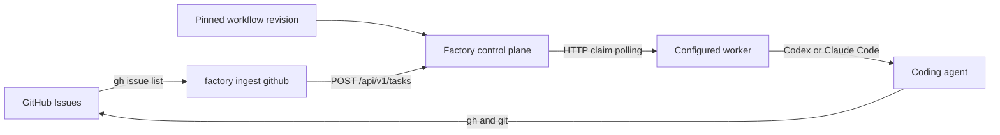

# GitHub issue ingest for Factory

> **Status:** Superseded. Do not implement this external-ingest architecture.
> GitHub polling, scheduling, typed Trigger configuration, and durable
> deduplication belong to the control plane in the
> [Workflow and Automation design](../workflows/design.md). The retired
> standalone MVP is preserved only as migration history.
>
> GitHub App identity, webhook admission, and scheduled GitHub queries now
> belong to the [Software Factory target architecture](../software-factory/design.md).

The material below is retained as historical context for the rejected
`factory ingest github` process and must not be used for implementation.

## 1. Executive summary

Factory previously had a simple `factory-poller` process that submitted a
matching issue once and kept a local dispatch ledger. It did not support
workflow revisions, trigger rearming, or the proposed unified CLI. This design
described that more advanced model through the rejected process role
`factory ingest github`.

The process uses the authenticated `gh` CLI and the control-plane HTTP API. It
keeps its own small SQLite database so restarts and repeated polls do not
create duplicate tasks. A pinned control-plane workflow revision remains
responsible for live issue checks, issue comments, branches, pull requests,
and status changes. The main downside is that this model remains file-based and
starts with one repository and one trigger.

## 2. Context and scope

The Go control plane accepts `{title, description, worker_id, repository_id}`
from the UI or API. The proposed workflow extension adds an optional immutable
`workflow_revision_id`. Go workers claim resolved task prompts and run Codex or
Claude Code. They do not know whether a task came from a human, GitHub, or a
future scheduler.

This rejected design placed source polling outside the control plane and
workers. Current Factory instead runs typed GitHub Automation evaluation and
durable deduplication inside the one control-plane process.

This design extends the current GitHub issue path:

```text
matching GitHub issue -> Factory task -> selected worker -> agent-managed issue and PR
```

## 3. System context



`factory ingest github` owns polling, trigger-episode identity, and task
submission. It does not execute agents, open pull requests, or encode a GitHub
workflow.

The control plane owns task idempotency, assignment, execution history, and the
UI. It does not store GitHub credentials or poll GitHub.

The selected worker owns the runtime, local repository, worktree, and agent
process. The pinned workflow revision owns the engineering and GitHub process.

## 4. Proposed design

### How it works

The operator configures one GitHub repository, one required label, one worker
ID, one repository key advertised by that worker, and one workflow ID. At
startup ingest fetches and validates the workflow's current enabled revision.
The operator starts `factory ingest github` continuously or runs
`factory ingest github --once` for a bounded test.

On each successful poll, ingest asks `gh issue list` for up to 100 open issues
with the configured label. It validates the result and compares it with its
local trigger state.

The first time an issue appears in a continuous matching period, ingest creates
a random episode ID and a stable request key. It stores that pending episode
and the exact normalized `CreateTaskRequest` JSON before submitting a valid
task. The task title is the trusted static text `GitHub issue #<number>`. The
description is free-text context containing a clear untrusted-data label plus
the issue number, URL, title, and body. The request pins the workflow revision
ID resolved at startup. If this context already exceeds the task API limit,
ingest stores the episode as abandoned with `invalid_description` and does not
create or submit a pending request.

Ingest posts the task through `POST /api/v1/tasks`. A lost response is safe:
the next attempt uses the same request key, and the control plane returns the
task it already created. A pending episode cannot be rearmed. Ingest must replay
its request key until a `200` or `201` response supplies the task ID, even when
the issue has stopped matching. The agent may receive a stale task in that
crash window, so the pinned workflow must revalidate the live label and stop
without mutation when it is absent. The task appears in the existing UI and is
claimed by the configured worker.

The workflow tells the agent to reread the live issue and confirm that the
trigger label is still present before making changes. It also owns removing
the trigger label, commenting on the issue, pushing a branch, opening or
updating a pull request, and reporting blockers. Ingest does not duplicate
those actions.

Only a submitted or abandoned issue may become absent. When it is absent from
a complete successful poll, its episode is rearmed. If the label is applied
again later, ingest creates a new episode and task. Edits and agent comments
while the issue remains continuously matched do not create another task.

### Components and responsibilities

The `factory ingest github` command owns parsing, startup, shutdown, `--once`,
and operator output. It ships in the shared `factory` binary, depends on the
ingest package, and does not import worker or control-plane storage.

`internal/ingest` owns config validation, GitHub polling, issue-context
normalization, episode reconciliation, API submission, retry decisions, and
SQLite state. It depends on `gh`, the control-plane workflow and task APIs, and
a local data directory. It does not compose workflow prompts, own worker
execution, or perform GitHub mutations after submission.

The worker keeps its existing claim contract. Ingest depends on the workflow
tables and endpoints defined by the workflow design, but adds no
ingest-specific control-plane table, endpoint, runtime interface, or UI
framework.

### Decisions

The first version uses `gh` instead of a GitHub App, OAuth flow, or embedded API
client. This reuses local authentication and keeps credentials out of Factory.
It also means the ingest process is intended for a trusted Unix host.

The first version supports one repository and one trigger. The config shape
leaves room for a later list, but this slice does not add cross-repository
fairness, concurrency, or rate-limit coordination.

Ingest uses a separate SQLite database rather than the control-plane database.
This preserves the control-plane API boundary and allows ingest to be replaced
or run on another host later. It costs one more small state file.

Issue and pull-request updates remain prompt-driven. Adding deterministic
GitHub mutations to ingest would duplicate repository workflow policy and make
the MVP larger.

## 5. Invariants and requirements

### Invariants

1. One continuous matching period creates at most one control-plane task.
2. A crash before, during, or after task submission cannot create a duplicate.
3. An incomplete or failed GitHub poll never rearms an issue.
4. GitHub issue content, including its title, is marked as untrusted context.
5. Ingest never opens, edits, labels, comments on, or closes a GitHub issue.
6. Ingest never opens the control-plane SQLite database.
7. A task is submitted only to the configured worker and the advertised
   repository whose remote identity matches the polled GitHub repository.
8. A pending episode cannot become absent or create a second request key.

### Requirements

- `factory ingest github --once` performs one poll and submission pass, prints a
  summary, and exits.
- Continuous mode polls at the configured interval, which must be between 10
  seconds and 24 hours.
- Startup validates the config, enabled workflow and current revision, `gh`
  availability and authentication, control-plane health, worker registration,
  and advertised repository.
- The advertised repository remote must equal
  `github.com/<owner>/<repository>` using an ASCII case-insensitive comparison.
- A worker may be offline when ingest starts. Its registration and repository
  must exist, and submitted work remains queued until it returns.
- Each successful poll reads at most 100 matching issues.
- If 100 issues are returned, missing issues are not rearmed because the result
  may be truncated.
- An invalid issue with a valid number is reported, skipped, and still counted
  as seen for rearming. If an entry has no valid number, no missing issue is
  rearmed during that poll.
- A composed title or description that exceeds the existing task API limits is
  rejected rather than silently truncated.
- Pending task submissions are retried on the next poll.
- Ingest stores at most 1,000 issue rows. At the limit it continues pending
  recovery and existing reconciliation, rejects new episodes, and reports an
  operator error.
- Shutdown stops after the current bounded `gh` or HTTP operation and does not
  start another poll.

## 6. Interfaces and data

The default config path is `$FACTORY_HOME/ingest.toml`.
`FACTORY_HOME` defaults to `~/.factory`. An explicit `--config` overrides it.

```toml
server = "http://127.0.0.1:7337"
poll_every = "30s"
data_directory = "/Users/example/.factory/ingest/github"

[github]
repository = "owner/repository"
label = "needs-agent"
worker_id = "61b30338-95dc-4704-80bd-8a4c63aa3037"
repository_key = "repository"
workflow_id = "9ec13fe1-4f41-49e2-94c9-5bb4b7f3c807"
```

Unknown fields are errors. The first slice always polls open issues. The server
must be plain HTTP on loopback, matching the local worker trust model. The
repository must be a normalized GitHub `owner/name`.

The default state path is
`$FACTORY_HOME/ingest/github/ingest.sqlite3`. The database stores one current
episode per repository, trigger, and issue:

- issue number and URL;
- random episode ID and derived request key;
- state: `pending`, `submitted`, `abandoned`, or `absent`;
- exact normalized `CreateTaskRequest` JSON used for every pending replay;
- control-plane task ID when submitted;
- first-seen, last-seen, submitted, and absent timestamps.

Absent rows are deleted after 30 days. At most 1,000 issue rows may exist,
including rows that cannot become absent while a source result is truncated.
The stored request is bounded by the existing task API limits. Request keys
include the random episode ID, so a later reappearance cannot collide with a
pruned episode.

### Naming and identity

The source identity is `github:<owner>/<repository>:issue:<number>`. The trigger
identity is the repository plus configured label. An episode ID is a random
UUID created only when an armed issue first matches. The bounded request key
is:

```text
github:<uuid>
```

The ingest database stores the human-readable repository, trigger, and issue
identity. Changing the repository or label creates a new trigger identity.

The server, worker ID, repository key, and workflow ID are delivery settings,
not trigger identity. Their stored fingerprint detects a config change at
startup. A configured delivery change is rejected while any pending episode
exists because its destination is frozen. Otherwise, submitted episodes keep
their current identity and do not refire while still matched.

The workflow revision ID is a per-request snapshot, not a configured delivery
setting. Ingest resolves it once at startup. If the workflow receives a new
current revision, pending episodes replay their stored revision and newly
observed episodes in the running process continue using the startup revision.
Episodes observed after the next restart use the new current revision. A
workflow revision change does not refire a continuously matching submitted
issue.

## 7. Failure behavior and lifecycle

Config, authentication, database, workflow, or control-plane validation
failures stop startup with a direct error. Pending task recovery is the one
exception: it runs before validation of the workflow's current enabled
revision because every pending request already pins an immutable revision.

A `gh` timeout, nonzero exit, or malformed JSON response records the source poll
failure and leaves all existing episode states unchanged. Continuous mode tries
again at the next configured poll. `--once` exits nonzero.

The `gh` command and each HTTP request have a 30-second timeout. Task submission
is sequential. A failed control-plane submission leaves the episode pending
and does not stop later valid issues from being considered.

The episode is written and synced before the POST. The submitted task ID is
written after a successful `200` or `201` response. If the process crashes
between those writes, the same POST is repeated and control-plane request-key
idempotency returns the original task. Pending recovery happens before absence
reconciliation. A pending episode never becomes absent, even if the issue no
longer appears in the source result. Recovery sends the exact stored request
bytes, including its immutable workflow revision ID. Later edits to the issue
or workflow cannot change a pending request.

If the original POST created a task but its response was lost, exact
request-key replay returns that task before the control plane checks current
workflow state. Disabling the workflow therefore cannot hide a task that
already exists.

If no task was created and recovery receives `workflow_disabled`,
`workflow_revision_not_found`, `resolved_prompt_too_large`, or
`agent_prompt_too_large`, or `invalid_description`, ingest atomically marks the
episode `abandoned`, records the stable error, and does not retry or create
another episode while the issue remains continuously matched. A later complete
poll moves an abandoned issue that no longer matches to `absent`; applying the
label again after the workflow or context is corrected creates a new episode.
Transport, temporary server, and rate-limit failures leave the episode pending
for bounded retry.

Recovery also treats `410 request_key_deleted` as terminal. It atomically marks
the pending episode `abandoned`, records that stable error, and never recreates
the deliberately deleted task under another key while the issue remains
continuously matched. Removing the label through a complete poll and applying
it again creates a new episode under the normal rearm rule.

Absence reconciliation requires a successful result with fewer than 100 issues
and a valid issue number for every entry. Other invalid fields suppress the
entry's submission but preserve its number as seen. An entry without a usable
number suppresses all absence transitions for that poll.

The config and current enabled workflow revision are read at startup. Config
changes require a restart. A new current workflow revision is adopted at the
next restart. Pending recovery still uses each stored request's pinned
revision. In-flight control-plane tasks continue independently when ingest
stops or its config changes.

## 8. Security, privacy, and operations

`gh` owns GitHub credentials. Ingest never requests, stores, prints, or forwards
the token. The pending request and control-plane task description store the
issue body, while the control-plane task also stores the resolved workflow
prompt. Operators must treat both databases as sensitive. Existing task
deletion and retention policy apply. The ingest database removes absent rows
after 30 days and has the 1,000-row hard limit.

Issue content is untrusted input. Ingest validates JSON types and sizes and
labels its description as untrusted context. The control plane places the
pinned workflow before that context. The worker safety preamble remains the
highest Factory-owned instruction.

The control-plane URL is restricted to loopback HTTP. The SQLite directory and
files are owner-only. Ingest takes an exclusive process lock so two processes
cannot poll with the same state directory.

One poll returns at most 100 issues, uses one `gh` process, and submits tasks
sequentially. The ingest database has a hard limit of 1,000 issue rows. At that
limit, the process keeps existing state safe but refuses new episodes until the
operator resolves the source size or old absent rows reach retention cleanup.
The design adds no background goroutine per issue and no unbounded in-memory or
on-disk event history.

## 9. Acceptance criteria

- A configured matching issue creates one task assigned to the configured
  worker and repository.
- Repeating `--once` with the same matching issue returns the same submitted
  episode and creates no second task.
- Restarting after a simulated lost POST response returns the original task by
  request key and records it as submitted.
- Losing a successful POST response, removing and reapplying the label, and
  restarting still creates only the original task until pending recovery
  records its task ID.
- Pending recovery replays the exact stored request after the issue disappears,
  its content changes, or the workflow receives a newer revision.
- A lost-response task is recovered after workflow disablement. A request that
  never created a task becomes abandoned after disablement and does not retry
  or duplicate work while the issue remains matched.
- A lost-response task deleted before ingest recovers it makes the pending
  episode abandoned with `request_key_deleted` and does not recreate the task.
- A permanently oversized pinned request becomes abandoned and is not retried
  every poll.
- An issue whose normalized context exceeds the task description limit is
  abandoned before submission and is not retried while continuously matched.
- A complete poll moves a submitted or abandoned episode that no longer
  matches to absent; a later match creates one new episode.
- Removing the label rearms the issue only after a complete successful poll;
  applying it again creates exactly one new task.
- Failed, malformed, timed-out, or truncated GitHub polls do not rearm missing
  issues.
- A malformed entry with a valid issue number does not rearm that issue; an
  entry without a valid number suppresses all rearming for that poll.
- A worker repository whose remote identity differs from the configured GitHub
  repository is rejected before submission.
- Request keys remain below the control-plane 200-byte limit for every valid
  GitHub repository and issue.
- The static task title contains no GitHub-controlled text. The task description
  is clearly labelled untrusted issue context, and the stored request pins the
  enabled workflow revision resolved at startup.
- The 1,000-row hard limit rejects new episodes without losing or rewriting
  existing state.
- Changing delivery settings does not refire a continuously matching submitted
  issue and is rejected while a pending request exists.
- A newer current workflow revision does not block pending recovery, change its
  pinned request, or refire a continuously matching submitted issue. It applies
  to new episodes only after ingest restarts.
- The existing UI shows the source-created task without UI changes.
- A real smoke test can create a dedicated labeled issue, run `--once`, observe
  the configured local worker complete it, and verify the selected workflow
  updates the issue and opens or updates a pull request.
- Normal Go binary builds continue to use committed UI assets and do not
  require Node.

## 10. Test approach

Focused tests use fake `gh` and HTTP executables or servers. They cover config
validation, authentication failure, workflow resolution, issue-context
normalization and limits, control-plane worker and repository validation,
trigger reconciliation, request-key idempotency, the lost-response plus label
rearm crash window, replay after issue and workflow changes, trigger versus
delivery configuration changes, workflow revision adoption only after restart,
lost-response recovery after workflow disablement, pre-creation failure
followed by disablement and abandonment, lost-response deletion abandonment,
permanent prompt-size abandonment, local oversized-context abandonment,
submitted and abandoned absence transitions, malformed issue identities,
truncation, the hard row limit, pruning, and clean shutdown.

An integration test runs a real control-plane store and API with a registered
fake worker. It polls a fake issue, submits one task, repeats the poll, restarts
ingest, rearms the issue, and proves the expected task counts and request keys.

The release check uses a dedicated real GitHub issue and one local worker. It
records the issue URL, control-plane task ID, terminal result, issue update, and
pull-request URL. This external smoke test is manual because CI must not mutate
GitHub.

## 11. Risks and tradeoffs

- A workflow may fail to update GitHub after the task succeeds. The task result
  and issue remain available for operator diagnosis; ingest does not guess a
  recovery mutation.
- A label can be removed after polling but before execution. The pinned
  workflow must revalidate live issue state before acting.
- File-based worker IDs are not friendly. The first slice favors explicit,
  stable assignment; UI-based ingest configuration can follow later.
- The issue body is retained in task history. Existing deletion controls and a
  future task retention job bound that exposure.

## 12. Open questions

None block task breakdown. The real smoke-test issue should be a small,
meaningful repository change rather than a throwaway commit.

## 13. Out of scope

- More than one repository or trigger.
- Jira, Linear, GitLab, pull requests, webhooks, or GitHub Projects.
- Scheduler or `factory run` compatibility.
- UI configuration or ingest status pages.
- Automatic worker selection, load balancing, or failover.
- Deterministic issue, branch, pull-request, merge, or review mutations.
- Sharing the ingest and control-plane database.
