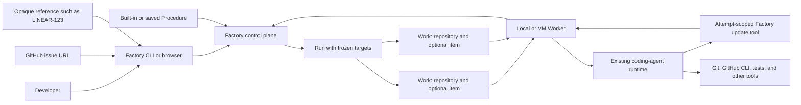

# Agent-directed software factory

> **Status:** Proposed for review. The implemented linear Pipeline model in
> [the current architecture](../../ARCHITECTURE.md) supersedes this proposal's
> single-Procedure execution model. The remaining Work-item and agent-update
> sections are still future direction.

## 1. Executive summary

Factory currently runs saved prompts across repositories, but a developer who
wants several coding tasks completed still has to create and monitor separate
agent conversations. The target product lets that developer submit work-item
references or select a repository fleet, then rely on Factory to queue the
work, assign coding agents, apply consistent instructions, and collect progress
and outcomes in one place.

The design keeps Factory out of the coding-agent business. A capable existing
agent owns refinement, implementation, tests, subagents, review, pull-request
creation, and CI repair. Factory gives the agent a small scoped capability to
report progress, readiness, questions, failure, or no change. Factory owns the
durable outer loop: admission, frozen input, capacity, leases, process safety,
history, and visibility.

The main downside is that V1 trusts an agent's semantic status report. Factory
validates identity, scope, transition shape, and cheap external facts, but it
does not attempt to prove the implementation correct. This is deliberate. The
first version tests whether agent-directed status plus durable coordination is
more useful than managing many terminal sessions.

## 2. Context and scope

The current [architecture](../../ARCHITECTURE.md) already supplies durable
Tasks, Runs, repository Sessions, Attempts, leases, local and VM Workers,
isolated worktrees, cancellation, events, retries, and retained failure state.
The browser now presents Runs as Work, but admission is still centered on a
saved Task with a fixed repository set. An invocation cannot supply several
work-item targets, and an agent can only return arbitrary result text when its
process exits.

Two user needs motivate the change:

```sh
factory build LINEAR-123 LINEAR-124 --repo github.com/acme/api
factory run bug-fix --repos all
```

The first queues existing software tasks. The second applies one reusable
engineering procedure to a repository fleet. Both need the same scheduling,
isolation, agent runtime, progress, cancellation, result, and retry machinery.

This design covers one local single-operator control plane, local and enrolled
VM Workers, a unified CLI, manual work-item admission, repository fleet
admission, a built-in standard Build procedure, saved Procedures, and the
agent update capability. It does not add a public team service, a provider
plugin system, a general pipeline graph, central CI waiting, or automatic
merge.

## 3. System context



The control plane owns Run and Work records, target identity, scheduling,
immutable Factory-supplied input, update history, and user-visible state. A Worker owns its
repository cache, Attempt lease, worktree, supervisor, agent process, and the
local update endpoint. The coding agent owns engineering judgment and external
actions performed with Worker-host tools. GitHub, Linear, and other systems
remain sources of work and delivery state, not Factory databases.

## 4. Proposed design

### How it works

#### Build work items

A developer runs:

```sh
factory build LINEAR-123 LINEAR-124 --repo github.com/acme/api
```

The CLI performs only pure syntax normalization and sends one idempotent
admission request containing the ordered references and unresolved selectors.
It always sends a request key, using the durable generated-key behavior in the
CLI contract when the operator does not provide one.
The control plane checks an existing request key before reading repositories,
Procedures, or defaults. For a new key, it resolves the managed repository,
selects the built-in `standard-build` Procedure, freezes its current generation,
and creates one Run with two Work targets. Each Work has its own identity,
repository, context, state, progress history, result, and Attempts. Two targets
may use the same repository.

GitHub issue URLs derive their repository and canonical source identity. An
opaque reference such as `LINEAR-123` requires `--repo` in V1. Factory does not
fetch Linear. The agent reads the live item with tools available on its Worker,
or reports `needs-input` when it cannot obtain enough context.

When `--repo` is present, it scopes every opaque reference and every GitHub URL
in the batch must resolve to that same managed repository. A mismatch rejects
the complete admission. Omitting `--repo` permits GitHub-only targets from
multiple managed repositories; it never permits an opaque reference.

The immutable target contains the source reference, repository, and any
operator-supplied context, not a copy of live provider content. GitHub or Linear
content read by the agent may change between Attempts. Historical Work records
the exact reference and read time where runtime events expose it, but V1 does
not claim to preserve the exact external item body the agent observed.

A Worker claims eligible Work, prepares an isolated worktree, and starts its
resolved Pi, Codex, or Claude Code runtime. The operator configures one default
Build runtime during setup and may override it with `--runtime`; admission
freezes the resolved choice. The final prompt contains a short
Factory safety preamble, the frozen standard Build Procedure, repository and
branch metadata, the untrusted work-item context, and the update-tool contract.
The agent chooses how to refine, build, test, use subagents, review, open a pull
request, and repair CI.

During execution the agent may report progress:

```sh
factory update --status=running --message="Waiting for integration CI"
```

Before finishing it reports exactly one Attempt-ending outcome:

```sh
factory update --status=ready --pr=<url> --message="Ready for human review"
factory update --status=needs-input --message="Which API behavior is correct?"
factory update --status=failed --message="The required service is unavailable"
```

The local helper validates the Attempt-scoped capability and forwards the
typed update through the Worker. An Attempt-ending update becomes final only after the
agent process stops and the Worker completes the Attempt under its existing
lease. Under `outcome_contract=agent_update`, a process that exits without an
outcome update fails with the visible reason
`Agent exited without reporting an outcome.` A legacy `process_exit` Run keeps
its existing exit-based completion. Factory never parses the agent's final
prose to infer agent-update status.

Attempt lifecycle and Work outcome are deliberately separate. When an agent
reports any valid Attempt-ending outcome and then stops, the Attempt is `succeeded`
because the runtime completed its contract. The Work becomes the reported
`ready`, `needs-input`, `failed`, or `no-change` outcome. A runtime, lease, or
missing-report failure makes the Attempt `failed` and the Work `failed` with an
infrastructure reason. `needs-input` pauses rather than terminates the Work.
Cancellation makes both records cancelled.

#### Run a Procedure across repositories

A developer runs:

```sh
factory run bug-fix --repos all
```

Factory freezes the current `bug-fix` Procedure and the enabled managed
repository set, then creates one Work target per repository. The Procedure asks
the agent to find and fix one concrete bug, or report `no-change` when no
defensible change exists. Work is admitted up to the Run concurrency limit and
Worker capacity. The Run shows aggregate counts without hiding each target.

The same update contract applies:

```sh
factory update --status=no-change --message="No reproducible bug was found"
```

Retry, cancel, events, timeouts, and retained worktrees remain per Work target.

#### Answer a question

When an agent reports `needs-input`, Factory stores the exact question and
makes the Work visible in the attention column. The developer answers through
the CLI or browser. The answer is stored as trusted context labelled with the
actor that gave it, `operator` unless the request names one, and requeues the
same Work. The next Worker claim creates an Attempt when capacity is
available. Factory does not keep an idle agent process alive while waiting for
a person.

Before accepting `needs-input`, the Worker requires a clean worktree and a
durable checkpoint. If the agent changed the repository, local `HEAD` must be
committed and pushed to the immutable publish ref; if it made no change, the
checkpoint is the exact base SHA. A failed check returns actionable feedback
and leaves the Attempt running. The Worker repeats the check after the process
group stops and stores `checkpoint_sha`. The answered Attempt starts from that
exact checkpoint, so partial work cannot silently disappear.

### Components and responsibilities

#### Procedure store

The Procedure store owns names, trusted instructions, runtime, timeout,
concurrency, outcome contract, mutable generation, archive state, and the built-in
`standard-build` Procedure. It snapshots a complete Procedure into every Run.
It does not own work-item content, repositories selected for an ad-hoc
invocation, agent skills, or external provider state. A saved Procedure may
retain a default repository set used by its existing schedule.

`standard-build` has a stable built-in key and a version shipped with the
binary and always uses `outcome_contract=agent_update`. It is read-only through
operator surfaces. Its runtime resolves from
the configured default Build runtime or an explicit invocation override. A
binary update may change the version used by future Runs, but every admitted
Run retains the exact prior text, version, and resolved runtime. The standard
Build Procedure is not schedulable in V1.

Existing Tasks remain on their current process-exit completion contract and
keep the same IDs, generations, repository selection, and schedules. They may
appear as legacy Procedures in operator surfaces, but do not require
`factory update` until an operator explicitly converts them to the new outcome
contract. `outcome_contract` is `process_exit` or `agent_update`; conversion
increments the Procedure generation. Conversion requires the persistent
execution backend. A Task configured with `fake_cloud_run` is rejected with
`agent_update_backend_unsupported` without changing its generation or contract;
the synthetic dispatcher does not launch an agent or implement scoped updates.
Its next scheduled occurrence behaves exactly as it does today.

New Procedures default to `agent_update`. `process_exit` exists only to retain
unconverted legacy behavior. Every Run snapshot stores the selected contract,
so later conversion cannot change admitted or historical Work. Admission of
new `agent_update` Work likewise requires a frozen persistent execution snapshot
and rejects any other backend with `agent_update_backend_unsupported`.

#### Admission service

The admission service owns request idempotency, source normalization, target
validation, repository resolution, target limits, and transactional Run and
Work creation. It does not fetch opaque provider references or start agents.

#### Work service

The Work service owns user-visible state, update events, questions and answers,
result metadata, PR URL, stable publish branch, cancellation, and explicit
retry. It depends on the existing Execution and Attempt lifecycle but does not
own agent processes or worktrees.

#### Worker and supervisor

The Worker owns routing compatibility, repository acquisition, Attempt-local
branches, a stable remote publish branch, the Attempt-scoped update endpoint,
process supervision, leases, event forwarding, cancellation, and cleanup. It
does not transmit its Worker credential or lease token through the update
protocol. V1 does not treat the agent process as isolated from other files and
services available to the Worker operating-system user. The Worker does not
decide whether the engineering task is semantically complete.

The implementation requires `ClaimProtocolVersion` 5. Version 3 introduced
frozen outcome behavior and scoped updates, version 4 added frozen Pipeline
stages, and version 5 adds authoritative resume start evidence to the combined
claim and completion contract. The control plane rejects an
older registration or claim with `worker_upgrade_required`; an old Worker can
never claim `agent_update` Work. V1 requires the server and all Workers to be
upgraded together. A server-first upgrade pauses claims from older Workers,
including legacy `process_exit` Work, until those Workers are upgraded. Rolling
mixed-version operation is not supported.

#### Agent runtime

The agent runtime owns model interaction, repository exploration, planning,
subagents, implementation, tests, review, provider tools, pull-request work,
and semantic status selection. It may update only its current Work through the
scoped capability. Factory does not implement a competing model loop.

#### Operator surfaces

The CLI and browser use the same local operator API. They own presentation and
operator actions, not scheduling or state derivation. The main browser surface
is Work, with Run aggregation, Work detail, latest progress, question answering,
retry, cancellation, Worker visibility, and Procedure management.

### Decisions

#### One execution primitive for items and fleets

A Run contains frozen targets, and each target becomes Work. A work-item target
contains one repository plus a source reference. A fleet target contains one
repository. We reject separate queue, batch, campaign, and fleet-run models
because their execution behavior is the same. The cost is that Work target
identity must replace the current assumption that a Run contains at most one
Session per repository.

#### Agent-directed semantic state

The agent reports progress and an Attempt-ending outcome through a typed Factory
capability. We reject parsing final text and reject deterministic code as the
sole judge of completion. The agent can interpret acceptance criteria,
repository conventions, tests, and external feedback more effectively. The
cost is that a capable but mistaken agent may report `ready` too early. Factory
records evidence and can return obvious validation feedback, but V1 accepts
that semantic trust boundary.

#### Worker-owned process completion

Agent updates do not carry the Worker lease and do not directly complete an
Attempt. The Worker remains the only component that finalizes process state
after the process stops. We reject exposing the control-plane operator or
Worker credential through the update protocol. The cost is a small two-part lifecycle: an
agent outcome report followed by Worker process completion.

#### One agent process owns the inner development loop

The standard Build agent owns refinement, implementation, tests, subagent
review, PR creation, and CI repair in one Attempt. Factory shows these as
progress, not durable stages. We reject a Build, Review, Test, and Merge DAG in
V1. The cost is that an agent may occupy a Worker slot while waiting for CI.
Measured slot waste or timeout frequency can justify a later event-driven
continuation design.

#### Stable remote branch, unique local Attempt branches

Every Work derives one stable remote publish branch. Every Attempt still uses
a unique local branch and worktree. A retry starts from the current remote
publish head when it exists and pushes back to the same remote branch. We
reject reusing one local branch because failed worktrees are intentionally
retained. This reduces duplicate PR risk but cannot provide exactly-once issue
comments or other agent side effects.

The Claim and prompt contain the immutable publish ref. The standard Procedure
requires the agent to push local `HEAD` to that ref and use it as the pull
request head. Before accepting the report provisionally, the Worker verifies
that local `HEAD`, the fetched remote publish ref, and the PR head SHA match,
and that the PR head branch and repository match the Work. A mismatch returns
actionable validation feedback and leaves the Attempt running. After the
process group stops, the Worker repeats every check before making Work ready.
Factory never force-pushes or deletes the remote publish branch. A normal
non-fast-forward push is for the agent to reconcile or report as
`needs-input`.

#### Built-in standard Build Procedure

V1 ships one read-only, versioned standard Build Procedure. It asks the agent
to follow repository instructions, refine the work, implement completely,
test, use a fresh review subagent, fix valid findings, open or update one pull
request, handle CI, and report through Factory. We reject a skill registry and
prompt marketplace. Installed skills remain runtime behavior, while the exact
Procedure text and generation are frozen for audit.

The prompt must also state that the Work is unfinished until the agent has
called `factory update`, list every allowed status, require a PR URL for
`ready`, explain that `needs-input` ends the current Attempt, require committed
and pushed partial work before `needs-input`, and tell the agent to use progress
updates only when they help an operator. These are Procedure requirements, not
a transcript parser or a Factory-owned reasoning loop.

#### GitHub URLs and explicit repositories first

V1 parses GitHub issue URLs because they contain repository identity. Opaque
references require an explicit managed repository. We reject a Linear client,
provider plugin interface, and automatic team mapping in the first slice.
Those additions require separate credential, namespace, and mapping decisions.

#### Ready stops before merge

`ready` means the agent reports that a pull request is ready for a human. The
report includes a PR URL and message. Factory must validate the URL, expected
repository, immutable branch, remote ref, and head SHA after the agent process
group stops. GitHub owns review, mergeability, and
merge. We reject automatic merge and a durable `complete` state in V1 because
both require ongoing provider observation and repository policy.

#### Product names can move before internal table names

The user-facing model becomes Procedure, Run, Work, and Worker. The current
Task, Run, Session, Execution, and Attempt tables may evolve incrementally.
Implementation must not perform a broad schema rename merely to ship the first
vertical slice. Historical API and database names remain internal until a
separate migration can preserve every record and link.

Initially, the existing Task record can back a legacy Procedure and the
existing Session and Execution records can back Work execution. Legacy
schedules keep creating Runs from their configured repository selection and
retain exit-based success. New fields and adapters must preserve current Task,
Run, Session, Attempt, event, and schedule behavior; renaming storage or
converting completion contracts is not a prerequisite for testing the product
model.

## 5. Invariants and requirements

### Invariants

- `INV-1`: Every admitted command creates one Run and at least one Work target
  in one transaction.
- `INV-2`: A Run freezes one complete Procedure generation and ordered target
  set.
- `INV-3`: Every Work belongs to one Run and one managed repository.
- `INV-4`: Two Work targets in one Run may use the same repository but cannot
  have the same target identity.
- `INV-5`: One active Attempt lease owns one agent process.
- `INV-6`: Only an `agent_update` Attempt receives the injected update
  capability, which accepts updates only for its current Work and Attempt.
- `INV-7`: The update protocol never contains a Worker credential, operator
  credential, or Attempt lease token.
- `INV-8`: An Attempt-ending agent report becomes final only after its agent
  process has stopped.
- `INV-9`: Cancellation prevents a later agent report from making Work ready.
- `INV-10`: Factory never derives semantic success by parsing arbitrary agent
  output.
- `INV-11`: One Work has one stable remote publish branch and each Attempt has
  one unique local branch.
- `INV-12`: Retrying one Work never replays a terminal sibling.
- `INV-13`: Work-item and repository content cannot change the trusted
  Procedure or choose a repository clone source.
- `INV-14`: Historical Work identifies the exact Procedure, Factory-supplied
  context, source reference, target, runtime, Worker, updates, Attempts, and
  outcome used. It does not claim an immutable copy of external content read by
  the agent.
- `INV-15`: Factory does not claim exactly-once external side effects performed
  by an agent.
- `INV-16`: A legacy Task keeps its process-exit completion behavior until an
  operator explicitly converts its outcome contract.
- `INV-17`: Agent-owned Work becomes ready only from delivery evidence
  revalidated after its process group has stopped.
- `INV-18`: Once Work enters `needs-input`, it retains the exact checkpoint
  revalidated after the process group stopped until an Attempt successfully
  starts from it. Answer, cancellation, retry, or preparation failure cannot
  fall back from it.
- `INV-19`: A Work that has been replaced cannot be retried, and retry admission
  cannot create a second nonterminal Work target for the same retry identity.

### Work state transitions

Progress is an event, not a durable workflow state change. `running` means an
execution owner exists. `needs-input` ends the current Attempt but pauses the
Work, so it is not terminal. Capacity and routing waits remain `queued` with a
visible `waiting_reason`; V1 does not add a separate blocked state.
Compatibility-only `succeeded` represents exit-zero `process_exit` Work. It is
not an agent update status and does not imply a pull request.

| Current state | Owner | Allowed transition | Cause |
| --- | --- | --- | --- |
| `queued` | none | `running` | Worker claim creates an Attempt, or trusted operator claims manual ownership |
| `queued` | none | `ready`, `failed`, `no-change` | trusted operator claims and completes `agent_update` Work in one transaction |
| `queued` | none | `cancelled` | operator cancellation |
| `running` | Worker Attempt | unchanged | agent `running` progress update |
| `running` | Worker Attempt | `ready`, `needs-input`, `failed`, `no-change` | accepted outcome followed by stopped process |
| `running` | Worker Attempt | `succeeded` or `failed` | legacy `process_exit` completion |
| `running` | operator | `ready`, `failed`, `no-change` | trusted operator update for `agent_update` Work |
| `running` | either | `cancelled` | operator cancellation |
| `needs-input` | none | `queued` | operator answer appends context; the next Worker claim creates the Attempt |
| `needs-input` | none | `running` | trusted operator claims manual ownership |
| `needs-input` | none | `cancelled` | operator cancellation |
| `failed` or `cancelled` | none | `queued` | explicit warned retry, only when no replacement or matching nonterminal Work exists |
| `cancelled` | none | `running` | explicit warned operator takeover after active cancellation, with the same retry guards |

`ready`, `succeeded`, `failed`, `no-change`, and `cancelled` are terminal
outcomes unless an explicit retry rule above applies. A manual `running` update
atomically records operator ownership and removes the Work from Worker
eligibility. A direct manual terminal update from queued Work performs that
claim and completion in one transaction. An operator must cancel an active
Worker Attempt and wait until Work is cancelled before taking manual ownership.
The subsequent operator `running` update atomically applies the retry guards and
claims cancelled Work, so a Worker cannot win an intermediate queued state.

### Requirements

- One admission accepts 1 to 100 Work targets.
- A Run defaults to at most 10 executing Work targets and accepts a configured
  limit from 1 to 100.
- Scheduling must not let one large Run starve older eligible Work in another
  compatible Run. The implementation may reuse the current scheduler and add
  only the smallest fairness rule its tests require.
- Progress messages are non-empty UTF-8 text of at most 2 KiB.
- Outcome messages are non-empty UTF-8 text of at most 8 KiB.
- One Attempt stores at most 200 accepted agent updates: up to 199 progress
  updates and one reserved outcome update. A later progress call receives a
  visible limit error while the required outcome slot remains available.
- Agent update statuses are `running`, `ready`, `needs-input`, `failed`, and
  `no-change`.
- Agent-owned `ready` requires one HTTPS GitHub pull-request URL whose
  repository, head branch, and head SHA match the Work repository, immutable
  publish ref, remote ref, and local `HEAD`. Manual `ready` requires the
  expected repository and records the provider-reported branch and SHA.
- Agent-owned `needs-input` requires a clean worktree and a checkpoint SHA. A
  changed HEAD must equal the fetched publish ref; an unchanged Work uses its
  exact base SHA. The Worker revalidates after process stop, then stores that
  commit as both historical `checkpoint_sha` and authoritative
  `pending_resume_sha`.
- `needs-input`, `failed`, and `no-change` require a message. `needs-input`
  exposes the message as the current operator question.
- Exactly one Attempt-ending agent report can win. Repeating the same report is
  idempotent; a different outcome report conflicts.
- Every update invocation has a random request ID. A transport retry with the
  same Attempt and request ID, or the same operator Work and request ID, returns
  the stored response.
- Agent update handling first verifies that the presented token digest belongs
  to the Attempt, then checks for a stored `(attempt_id, request_id)` response.
  An exact stored request returns that response before lease-expiry or lifecycle
  rejection. Expiry never authorizes a new request ID or different fields.
- An admission request key returns the original Run only when its canonical
  caller-input fingerprint matches. This lookup occurs before repository,
  Procedure, default, state-dependent validation, or predecessor selection.
  Reusing it for `--rebuild` or any different request conflicts.
- Duplicate Build admission conflicts while matching Work is queued, running,
  or needs-input.
- Under `outcome_contract=agent_update`, a process exit without an outcome
  report fails with a fixed reason. `process_exit` Runs retain legacy behavior.
- A `process_exit` Attempt receives no update environment or prompt instruction,
  and the Worker-local update endpoint rejects it from semantic agent updates.
- An operator answer is non-empty UTF-8 text of at most 8 KiB and requeues Work
  without changing the frozen Procedure or original context. The next Worker
  claim creates the Attempt.
- The answer request may name an actor of 1 to 255 bytes, not `agent` in any
  letter case, recorded on the answer and defaulting to `operator`.
- V1 performs no automatic execution retry. Every failed or cancelled Work
  retry is explicit and warns about duplicate external effects if an agent
  process previously started.
- Retrying Work is one transaction that rejects the request when any Work names
  it as `predecessor_work_id` or when another nonterminal Work with the same
  retry identity exists. For work-item Work, retry identity is the exact
  `(repository_id, source_kind, source_key)` tuple. For repository Work, only
  Work in the same predecessor lineage matches; an independent Procedure Run
  against that repository does not. A rejected retry does not change Work state.
- Setup requires one valid default Build runtime. `factory build --runtime`
  accepts only a configured runtime and admission freezes the resolved choice.
- An opaque work-item reference is 1 to 64 ASCII characters matching
  `[A-Za-z0-9][A-Za-z0-9._-]*`. Whitespace, prose, and other characters are
  rejected before admission.
- A trusted operator may update Work only when it has no active Attempt.
- Semantic operator updates are accepted only for Work whose frozen outcome
  contract is `agent_update`; they cannot convert a legacy `process_exit` Run.
- A trusted operator cannot report `needs-input`; that outcome requires a
  Worker-owned checkpoint.
- Queue, Work, update, Attempt, and Worker list APIs remain bounded and cursor
  paginated.
- The local operator API remains loopback-only. Remote Workers continue to use
  the separate authenticated TLS listener.

## 6. Interfaces and data

### CLI

```text
factory build [--repo REPOSITORY] [--runtime RUNTIME] [--request-key KEY] [--rebuild] [--wait] REFERENCE...
factory run PROCEDURE --repos REPOSITORY...|all [--request-key KEY] [--rebuild] [--wait]
factory status [--run RUN_ID]
factory show WORK_ID
factory answer WORK_ID MESSAGE
factory retry WORK_ID
factory replace WORK_ID [--request-key KEY] [--wait]
factory cancel WORK_ID
factory update [--id WORK_ID] --status STATUS --message MESSAGE [--pr URL] [--head-branch BRANCH] [--head-sha SHA]

factory procedures
factory workers
factory worker start [--config PATH]
factory server start [--config PATH]
```

Finite operator commands call the loopback API and never open SQLite or Worker
directories. `factory update` detects an injected Attempt context and uses the
Worker-local capability. Without that context it is a trusted operator command
and requires `--id`. Both paths reject Work whose frozen outcome contract is
`process_exit`; legacy completion remains owned by its existing controls.

`--request-key` is optional for the operator, not for admission. When it is
omitted, the CLI creates a random key and durably records it with the server
endpoint and canonical caller-input fingerprint in its private operator state
directory before the first request. A later invocation with the same pending
fingerprint reuses that key. The CLI removes the pending record only after it
receives a typed admission response that says `admitted`, `replayed`, or
`rejected_before_commit`, renders the command's authoritative result, writes it
to the selected human or JSON output, and successfully flushes that output.
For `--wait`, the authoritative result is the terminal or needs-input result,
not the initial admission response. The CLI prints the key with every result.
A process exit or interruption before the final output is flushed, timeout,
connection loss, malformed response, or server error remains
pending because it may have happened after commit. The control plane returns
`rejected_before_commit` only when the transaction created no Run.
This lets a new CLI process replay a request whose response was lost without
turning all future identical commands into replays. Before journal lookup, the
CLI acquires a nonblocking exclusive OS lock scoped to the endpoint and caller
fingerprint and holds it through the final output flush and journal cleanup.
A concurrent command with that same scope exits before sending any request,
prints that the admission is already in progress, and may be retried after the
owner finishes. Unrelated fingerprints use independent locks. If the owner
process exits, the OS releases its lock and the still-pending record lets the
next process reuse the same key. Journal mutations also use a short global lock;
the journal retains at most 100 pending entries. Its directory uses mode `0700`;
its data and lock files use mode `0600`. At the limit, implicit
key creation fails with the journal path and asks the operator to recover
pending requests or supply an explicit key; it never silently evicts an
uncertain request.

`--wait` streams status and returns as soon as any Work needs input, using exit
code 2, even while independent siblings continue. Otherwise it returns when the
Run finishes: exit 0 when every Work is ready, no-change, or compatibility
succeeded, and exit 1 when any Work is failed or cancelled. The CLI always prints the Work counts and IDs
before returning so the operator can answer or inspect the result.

An operator `running` update atomically claims manual ownership when the Work
has no active Attempt. Later operator updates require that ownership. A direct
terminal update from queued Work claims and completes it in one transaction.
An operator who wants to take over active agent Work must cancel it, wait until
Work is cancelled, then send one `running` update. That update performs the same
replacement and matching-nonterminal checks as retry, records the duplicate-
effect warning, and claims operator ownership without exposing a queued race.
This makes manual and agent-driven Work share one history without creating a
second completion model or a claim race.

Operator-owned Work may finish as `ready`, `failed`, or `no-change` but cannot
enter `needs-input`. Only a Worker Attempt with a verified checkpoint may create
a resumable question. An operator can still answer that agent-created question.

A manual `ready` update is not required to have a Factory worktree or publish
branch. The CLI uses the operator's local GitHub credentials to resolve the PR
head branch and SHA, or accepts explicit `--head-branch` and `--head-sha`
evidence. The control plane validates the PR URL's expected repository and the
field shapes, then records the branch and SHA as trusted operator evidence. It
does not need GitHub credentials. Agent-owned Work uses the stricter Worker
validation below.

### Agent update contract

For only an `agent_update` Attempt, the Worker injects:

```text
FACTORY_WORK_ID
FACTORY_ATTEMPT_ID
FACTORY_UPDATE_SOCKET
FACTORY_UPDATE_TOKEN
```

The socket is created below the Worker data directory with mode `0600`. The
random update token is valid only while the Attempt owns its active lease. The
Worker stores only its digest and never forwards the token to the control
plane. For each invocation, the helper creates a random request ID and reuses it
for bounded transport retries. The Worker validates the token digest and Work
and Attempt identity, performs the exact stored-request lookup, then validates
the frozen `agent_update` outcome contract, active lease, current lifecycle,
request ID, status, message, and optional PR URL before forwarding a new typed
update under the Worker lease. A `process_exit` Attempt has no token or socket
and is rejected if it reaches this endpoint.

The token is a scope and accidental-misuse guard, not a sandbox boundary. V1
trusts processes running as the Worker operating-system user with the same host
authority as that user. A local agent can reach the unauthenticated loopback
operator API, and a remote agent may be able to read the Worker credential.
Operators who need hostile-code isolation must use separate OS identities and
an authenticated operator endpoint, which are outside V1.

An accepted outcome update sets `terminal_reported_at` and asks the agent to
stop. The supervisor allows ten seconds for normal exit, then stops the process
group. The Worker reports terminal Attempt completion only after it proves the
process group stopped. Cancellation received before completion wins.

On completion, a valid non-ready outcome report maps to a `succeeded` Attempt
and its reported Work outcome. A ready report maps to succeeded and ready only
after post-stop delivery revalidation. No report, an infrastructure error, or
failed post-stop validation maps to a `failed` Attempt and failed Work. This
keeps process execution evidence separate from the agent's semantic judgment.
Worktree cleanup uses the final Work outcome as well as Attempt execution state:
a `succeeded` Attempt whose reported Work outcome is `failed` retains its
worktree under the existing failure-retention limits.

### Stored resources

| Resource | New or changed ownership |
| --- | --- |
| Procedure | trusted instructions, runtime, timeout, concurrency, outcome contract, generation |
| Run | Procedure snapshot including outcome contract, complete execution snapshot, source, ordered frozen targets, aggregate state |
| Work | target identity, repository, source context, publish branch, user state, execution owner, waiting reason, question, result |
| Work update | Work, optional Attempt, request ID, sequence, status, message, PR URL, accepted time, actor |
| Attempt | Worker lease, process identity, local branch, lifecycle and events |
| Worker | capacity, runtime capabilities, repository access and retained worktrees |

A Work target stores:

```text
id
run_id
target_key
target_kind: work_item | repository
repository_id
repository_identity
source_kind: github_issue | opaque | repository
source_key
source_reference
context_snapshot
publish_branch
predecessor_work_id
checkpoint_sha
pending_resume_sha
state
execution_owner: none | worker_attempt | operator
waiting_reason
latest_progress
question
pull_request_url
pull_request_head_branch
pull_request_head_sha
terminal_message
timestamps
```

The existing Execution and Attempt records remain internal. Existing Run and
Session history stays readable. An implementation may initially add the new
target and update fields to current records rather than renaming every table.

Run state is a derived summary, not a second workflow engine. A Run is active
while any Work is queued or running, needs attention when no Work can advance
and at least one needs input, and finished when every Work is terminal. Mixed
success and failure are shown as counts rather than collapsed into one success
label. The control plane may cache this projection, but Work remains its source
of truth.

### Naming and identity

Run, Work, Attempt, and Worker IDs are random UUIDs. A Work publish branch is
derived from its immutable Work ID and is bounded to a Git-safe value such as
`factory/work-<uuid-prefix>`.

A GitHub issue URL normalizes to
`github:<lowercase-owner>/<lowercase-repository>:issue:<number>`. An opaque
reference preserves case, must match `[A-Za-z0-9][A-Za-z0-9._-]{0,63}`, and is
scoped to its managed repository. A repository target uses the managed
repository ID.

`target_key` is the source key plus repository ID for a work item and the
repository ID for a fleet target. It is unique inside one Run. The admission
request key and canonical caller-input fingerprint make uncertain client
replay return the original Run. Admission looks up the request key before
target validation, duplicate checks, or rebuild predecessor selection. A
matching stored fingerprint returns its Run without consulting current Work;
a different fingerprint conflicts. Any existing nonterminal Work for the same
work-item target, including `needs-input`, blocks duplicate Build admission.
After terminal Work,
`factory build` requires `--rebuild` to admit the same target again.
For repository-target Work, rebuild identity is the exact
`(procedure_id, repository_id)` tuple; independent Procedures for one repository
remain independent.

A caller fingerprint contains the operation, ordered syntactically normalized
references or repository selectors, explicit repository selector presence and
value, explicit runtime presence and value, rebuild flag, and every submitted
option or context value that changes admitted Work. It excludes the request key
itself and client-only `--wait`. It is computed and compared before repository,
Procedure, configured-default, or current-Work reads.

A new Build or Procedure Run rebuild request must not reuse the original stored
request key.
After proving the new key is unused, one transaction requires every target to
have no nonterminal Work and selects its most recently created terminal Work,
ordered by `created_at DESC, id DESC`. It stores that target's
`predecessor_work_id` on the replacement Work and admits the complete batch.
If any target lacks a terminal predecessor, nothing is admitted. A lost-response
retry with the same new key and caller fingerprint returns that stored rebuild
Run even when a repository is disabled or deleted, configuration changes, or
newer terminal Work now exists.

`factory replace WORK_ID` is the exact-predecessor recovery path. It requires a
new admission key and creates one new Run and one replacement Work by copying
the named terminal Work's frozen Procedure snapshot, complete execution
snapshot, target, source reference, repository identity, and original context.
The execution snapshot includes profile ID and version, backend, runtime,
provider, model, timeout, resource class, and commit-resolution policy; exact
replacement never re-resolves a current or default profile. The transaction
stores that exact `predecessor_work_id` and rejects a nonterminal predecessor,
an existing replacement, matching nonterminal Work, an archived current
Procedure, a disabled or deleted current repository, or an execution snapshot
incompatible with its frozen outcome contract. Current eligibility is checked
only on first admission; it does not replace any frozen field copied from the
predecessor. Its fingerprint contains the operation and Work ID. Exact replay
is checked before reading the named Work or current configuration and returns
the stored replacement even if later configuration becomes ineligible. It
never selects the newest Work by target.

An agent update request is unique by `(attempt_id, request_id)`. An operator
update request is unique by `(work_id, request_id)`. The CLI generates the
request ID once per invocation and reuses it for its internal retry. A repeated
outcome report with identical fields returns the accepted result even when it
arrives in a later invocation; a different outcome report conflicts.

## 7. Failure behavior and lifecycle

Admission validates the complete target set before writing anything. Unknown,
disabled, duplicate, empty, malformed, or oversized targets create no Run. An
opaque reference without an explicit repository creates no Run. With an
explicit repository, any GitHub URL for another repository rejects the whole
batch.

Work waits visibly when no compatible Worker has capacity. A Worker that loses
its lease stops the agent process group. Infrastructure failure before or after
process start fails the Attempt and Work. V1 never retries execution
automatically. An explicit retry warns about duplicate effects when a process
previously started because the agent may already have pushed, commented, or
opened a pull request.

Retry first transactionally proves that no replacement names this Work as its
predecessor and that no other nonterminal Work with the retry identity defined
above exists. Each accepted retry then creates a fresh local worktree. A stored
`pending_resume_sha` always takes precedence and preparation must start from
that exact commit. Without one, preparation uses the current fetched head of an
existing stable remote publish branch, or the repository base only when no PR
is recorded.
A missing publish branch for known PR Work fails preparation with a fixed
recovery message that identifies the PR, ref, and recorded trusted PR head SHA.
It tells the operator to restore the ref to exactly that SHA or admit warned
replacement Work with the matching command's `--rebuild`; a missing trusted SHA
permits only an exact `factory replace WORK_ID`. An operator may also choose
exact replacement instead of restoring a known SHA. Common target rebuilds use
`factory build --rebuild` or `factory run PROCEDURE --repos REPOSITORY
--rebuild`; only `factory replace` guarantees a particular older Work is the
predecessor.
Preparation re-fetches and proves the restored ref equals the recorded SHA. It
does not create a resumable question without a checkpoint. The retry prompt
identifies prior updates, known PR, publish ref, pending and historical
checkpoint SHAs, and duplicate-effect risk. A missing ref for Work with a
previously published checkpoint also fails visibly instead of falling back to
the repository base.
Factory never force-pushes or deletes the ref. If the ref moves while an Attempt
is active, the agent must reconcile a normal push or report `needs-input`.

An agent update request with a wrong token is always rejected. A request with
the correct but expired token can only return an exact stored update with the
same request ID and fields; new or different requests are rejected. This replay
lookup occurs before lease and lifecycle checks. A second identical
Attempt-ending report returns the stored outcome, while a different outcome
report conflicts. Progress after an outcome report conflicts.

For `ready`, the Worker performs a bounded GitHub and remote-ref check before
accepting the report provisionally. A timeout or provider outage returns a
retriable validation error and leaves the Attempt running. After the process
group stops, the Worker repeats the repository, branch, local HEAD, remote ref,
and PR head SHA checks. A mismatch or provider outage at that point fails the
Attempt and Work with stored delivery evidence and a fixed postflight reason;
it never marks stale evidence ready. Factory validates delivery identity, not
CI success or semantic correctness; the agent remains responsible for both.

For agent-owned `needs-input`, the Worker similarly validates a clean worktree
and durable checkpoint before accepting the report and after process stop. A
dirty tree, moved ref, missing commit, or post-stop mismatch fails validation.
If the post-stop check fails, the Attempt and Work fail with the retained
worktree and a fixed checkpoint reason; Factory does not present a question
whose continuation would lose local work.

For `outcome_contract=agent_update`, if the agent process exits without an
outcome report, the Worker fails the Attempt with the fixed missing-report
reason. A `process_exit` Run completes through its legacy exit and result rules.
If an agent-update Run reports an outcome but does not exit, the supervisor
stops it after ten seconds. If the Worker dies after forwarding the report,
normal lease expiry stops or reconciles the process before the report may
become final. Factory never presents Work as ready while process ownership is
uncertain.

A valid `failed` report still completes the Attempt successfully because the
agent fulfilled the reporting contract; the Work outcome is failed. This
distinction lets operators tell an engineering blocker from a broken runtime.
The Worker retains that Attempt worktree even though the Attempt succeeded and
records its Worker and local path for operator inspection. Retry still creates
a fresh worktree from `pending_resume_sha`, the publish ref, or repository base
under the normal rules; it never silently treats unpushed files as durable or
deletes them through successful-Attempt cleanup.

Cancellation of Work with no active Worker Attempt is immediate and
transactional. This includes queued, needs-input, and operator-owned running
Work; Factory clears operator ownership and records cancelled without waiting
for a heartbeat. Cancellation with an active Worker Attempt is returned by the
Worker heartbeat, stops the process group, and overrides any terminal report
not already finalized. Cancelling a Run applies the appropriate path to each
nonterminal Work target without changing terminal siblings.

An operator answer to `needs-input` appends trusted context and requeues the
same Work while retaining its authoritative `pending_resume_sha`. If another
target has taken the released frozen Run concurrency slot, the answered Work
remains blocked until normal fair materialization can admit it.
The next Worker claim creates a new Attempt. The agent receives the original
frozen Procedure, original context, prior question, answer, bounded newest
updates, known branch, checkpoint SHA, and PR metadata. Worktree preparation starts from that
exact checkpoint. A missing or unreachable checkpoint fails preparation visibly
instead of falling back to the publish ref or repository base. Cancellation,
failed preparation, and explicit retry retain `pending_resume_sha`. It is cleared
only after the supervisor starts the runtime child and the Worker acknowledges
that exact commit; the historical `checkpoint_sha` and update remain stored.
Archiving a Procedure prevents new Runs but does not cancel admitted Work.

Every assembled agent prompt remains within the existing 72 KiB byte limit.
For `agent_update` Work, admission requires the frozen Procedure, original
context, fixed wrapper, and bounded recovery metadata to fit while reserving
the maximum 8 KiB question and 8 KiB answer. Before accepting `needs-input` or
an answer, Factory also proves the actual mandatory continuation sections fit;
rejection leaves the current state unchanged. The continuation always includes
the Procedure, original context, current question and answer, checkpoint and
branch identity, PR metadata, and an omission marker. The untrusted agent
question is escaped onto one line so its content cannot create a trusted-looking
Factory heading. The prompt fills remaining bytes
with the newest prior records, prioritizing trusted operator answers, then
Attempt outcomes, then progress, and displaying selected records
chronologically. If history is omitted or one
message must be UTF-8-boundary truncated, the marker includes stored and
inserted counts and a SHA-256 digest of the complete omitted serialized history.
All full updates remain stored and visible outside the prompt.

`process_exit` Work has no question or answer reserve and keeps the current
prompt-fit rules: its resolved prompt may use the existing 64 KiB limit as long
as the final assembled prompt fits within 72 KiB. Migration and the protocol
upgrade do not make a previously valid legacy prompt inadmissible.

Control-plane shutdown stops admission before HTTP shutdown. Workers continue
until lease renewal fails, then stop active processes. Restart sweeps expired
leases and reconstructs queue and update state from SQLite. Worker restart uses
the existing manifest reconciliation before it claims more Work.

## 8. Security, privacy, and operations

V1 remains a trusted single-operator system. The operator API accepts loopback
clients only and has no user authentication. It must not be exposed to a
network. Remote Workers use the existing TLS enrollment and credential model.

The agent has the Worker operating-system user's filesystem, network, Git, and
provider CLI permissions. Worktrees isolate Git state but are not a security
sandbox. Operators must register only repositories and Worker hosts that the
agent may modify.

Procedure instructions are trusted operator policy. Work-item titles, bodies,
comments, repository files, CI output, and review content are untrusted agent
context. Prompt assembly labels those boundaries, and admission prevents that
content from selecting a clone URL or changing the Procedure snapshot. This is
a prompt-integrity boundary, not hostile-code isolation. Factory does not place
credentials in the prompt or update protocol, but the agent may access anything
available to its shared Worker OS identity, including local operator or Worker
credentials.

The Attempt update token is separate from the Worker credential and lease. It
is random, short-lived, stored only as a digest, scoped to one Attempt, removed
from stale inherited environments, and invalid for new updates after process
stop, cancellation, or lease loss. Its retained digest may authenticate only an
exact stored-response replay. It prevents accidental cross-Work updates through
the injected tool; it does not constrain a malicious process with the Worker
user's broader authority. Update events and messages may contain source code or private ticket
context and receive the same local-data protection as current prompts and agent
events.

Existing Worker capacity, repository-cache, event, prompt, result, timeout, and
retained-worktree limits continue to apply. A Run may add at most 100 Work
targets. Update history adds at most 200 records per Attempt, including its
reserved outcome record, and at most 8 KiB per outcome message. Limit failure
remains visible and never silently drops an outcome.

## 9. Acceptance criteria

- `AC-1`: One `factory build` command with five valid references creates one
  Run and five independently visible Work targets without opening agent
  processes in the CLI.
- `AC-2`: Two work-item targets for the same repository run in separate
  worktrees and retain separate state, updates, branches, and outcomes.
- `AC-3`: `factory run bug-fix --repos all` freezes the current enabled
  repository set and produces one independently retryable Work target per
  repository.
- `AC-4`: Every new Build uses the exact recorded `standard-build` Procedure
  generation and resolved runtime, and labels work-item content as untrusted
  context.
- `AC-5`: An active agent can report progress and exactly one Attempt-ending
  outcome for only its current Work through the injected `factory update`
  capability.
- `AC-6`: The Work board shows queued, running, needs-input, ready, succeeded,
  failed, no-change, and cancelled Work with latest progress, repository,
  Worker, and PR link where present. `succeeded` is labelled as legacy
  process-exit completion and never implies a PR.
- `AC-7`: An `agent_update` agent that exits without an outcome update produces
  the fixed visible failure reason and no inferred success; a `process_exit`
  Run retains its legacy completion behavior.
- `AC-8`: A ready update cannot make Work ready until the Worker proves the
  agent process stopped and then revalidates the repository, immutable branch,
  remote ref, local HEAD, and PR head SHA;
  cancellation wins over a late report.
- `AC-9`: Answering a needs-input question requeues Work with the answer and
  prior history while preserving the original Procedure and context; only the
  next Worker claim creates an Attempt, starting from the revalidated
  checkpoint SHA. Cancellation, failed preparation, and retry keep that SHA
  authoritative until an Attempt successfully starts from it. The continuation
  prompt remains within 72 KiB and visibly identifies omitted stored history.
- `AC-10`: A warned retry after process start continues from the stable remote
  publish branch when one exists and does not create a second Work record. It is
  rejected without state change when replacement or matching nonterminal Work
  exists.
- `AC-11`: Replaying an admission or update after a lost response returns the
  original stored result without duplication, including when a new CLI process
  reuses a generated key from its pending-admission journal and when an exact
  stored agent update is retried after its lease expires.
- `AC-12`: Local and enrolled VM Workers use the same scoped update protocol
  without transmitting the operator credential, Worker credential, or Attempt
  lease token in that protocol. Claim protocol version 5 is required; older
  Workers receive `worker_upgrade_required` and cannot claim Work.
- `AC-13`: Restarting the control plane or Worker preserves Work, updates,
  questions, results, and retained recovery state.
- `AC-14`: Existing Task, Run, Session, Attempt, event, schedule, and repository
  history remains readable through the transition.
- `AC-15`: A configured default Build runtime and an explicit `--runtime`
  override both resolve before admission and remain frozen in historical Work.
- `AC-16`: An unconverted legacy Task's next manual and scheduled Runs retain
  their existing repository selection and exit-based success behavior without
  receiving or accepting agent or operator semantic `factory update` calls.
- `AC-17`: Every Run freezes `outcome_contract`; converting a legacy Procedure
  increments its generation and cannot change admitted Runs. Conversion or new
  admission rejects a non-persistent backend for `agent_update` without state
  change, while legacy `fake_cloud_run` process-exit schedules remain unchanged.
- `AC-18`: A manual ready update resolves or accepts operator PR head evidence,
  succeeds without control-plane GitHub credentials, and replays idempotently
  by Work and request ID.
- `AC-19`: Duplicate admission while matching Work needs input conflicts, and
  a Build or Procedure Run rebuild atomically binds every replacement to its
  deterministic terminal predecessor Work with a new idempotency key.
- `AC-20`: `--wait` returns 2 on needs-input, 0 when all Work finishes ready,
  no-change, or legacy succeeded, and 1 when finished Work includes failed or
  cancelled.
- `AC-21`: Retry preparation for known PR Work with a missing publish ref fails
  with the trusted recovery SHA and explicit recovery instructions, accepts only
  a restored ref at that SHA, and never creates `needs-input` without a verified
  checkpoint.
- `AC-22`: An operator can atomically finish queued `agent_update` Work, or take
  over active agent Work by cancelling it and atomically claiming the cancelled
  Work with retry guards and no intermediate queued race.
- `AC-23`: Cancelling queued, needs-input, or operator-owned Work with no active
  Worker Attempt completes synchronously and cannot wait for a heartbeat.
- `AC-24`: Initial and continuation `agent_update` prompts cannot exceed 72 KiB;
  mandatory recovery context is preserved while omitted update history is
  counted and digested without deleting the stored events. `process_exit`
  prompts keep their existing 64 KiB resolved and 72 KiB assembled limits with
  no continuation reserve.
- `AC-25`: `factory replace WORK_ID` admits exactly the named terminal Work's
  frozen Procedure, complete execution snapshot, and target as a new one-Work
  Run, records that predecessor, requires its current Procedure and repository
  to be eligible on first admission, and replays without consulting later Work
  or configuration.
- `AC-26`: An agent-reported `failed` outcome completes the Attempt as succeeded
  but retains its worktree under failure-retention limits and exposes its Worker
  and local path; successful-Attempt cleanup cannot delete it.

## 10. Test approach

Store tests prove `INV-1` through `INV-4`, `INV-9`, `INV-12`, `INV-14`,
`INV-16`, and `INV-19` with transaction rollback, duplicate target, replay,
partial outcome, queued, running, and needs-input cancellation, retry of
replaced Work, matching-nonterminal retry races, manual-claim races, and legacy
completion cases. Manual-claim tests include queued direct completion and
cancel-wait-takeover from cancelled Work. Cancellation tests include every
no-Attempt state and active Worker delivery. HTTP tests prove CLI admission validation, source
normalization, message limits, cursor bounds, and operator updates for `AC-1`,
`AC-3`, `AC-11`, `AC-15`, `AC-17`, and `AC-18`.

Worker and supervisor tests prove `INV-5` through `INV-8`, `INV-11`, `INV-17`,
and `INV-18` with
wrong tokens, expired-lease exact replay, expired-lease new-request rejection,
process-exit update rejection, terminal-report races, cancellation, forced exit,
parent loss, stable publish continuation, preflight and post-stop PR identity
validation, provider outage, branch movement after report, the 199-progress
limit with a reserved outcome slot, dirty needs-input rejection, pushed and
unchanged checkpoints, answer continuation, answer then cancellation or failed
preparation then retry with moved and missing refs, maximum question and answer
sizes, bounded multi-Attempt history with UTF-8 truncation and omission digests,
claim protocol version 5 acceptance, older-Worker rejection before any Work
claim, outcome-aware worktree retention and cleanup.
They verify `AC-5`, `AC-7`, `AC-8`, `AC-10`, `AC-12`, and `AC-13`, including
the race detector.
They also prove that every valid semantic outcome completes the Attempt while
only `ready` makes the Work ready.

Prompt boundary tests prove `INV-10` and `INV-13`, the exact Procedure snapshot,
trusted and untrusted sections, injected update instructions, and maximum final
prompt size for `AC-4`.

Admission tests prove the exact opaque-reference grammar and reject whitespace,
prose, Unicode, empty, and overlength values without creating partial Work.
They prove an explicit repository accepts only matching GitHub URLs, rejects a
mixed-repository batch transactionally, and that GitHub-only multi-repository
admission works when `--repo` is absent.

CLI tests use a real loopback server to prove multi-reference admission,
explicit and generated-key replay across separate CLI processes, pending-journal
locking, fail-fast concurrent invocation for the same endpoint and fingerprint,
independent concurrent fingerprints, owner-process exit and key recovery,
cleanup only after flushed authoritative output, interruption after an admission
response and during `--wait`, uncertain-response retention, human and JSON
output, `--wait`, opaque-reference repository
requirements, runtime default and override, rebuild key conflicts,
Build and Procedure Run rebuild identity, needs-input duplicate rejection,
exact older-Work replacement, replay after a rebuild becomes terminal, wait
exit codes, missing-PR-ref recovery, and agent-context routing. Replay tests also
disable or delete the repository and change configured defaults before retrying
the stored key. Exact-replacement tests reject first admission after Procedure
archive or repository disablement or deletion, then prove a previously admitted
replacement still replays after those changes. Browser
component tests and a real browser flow prove `AC-2`, `AC-6`, `AC-9`, and
accessibility at desktop and 390-pixel widths.

Migration tests open supported historical databases and prove `AC-14` and
`AC-16` without dropping, relabelling, or changing the next scheduled outcome.
They prove that an existing maximum-size valid prompt remains admissible without
question or answer reserves, existing Procedures default to `process_exit`, and
conversion increments generation for `AC-17`. Conversion tests reject
`fake_cloud_run` with no state change and prove its next legacy schedule still
uses synthetic exit completion. Exact-replacement tests preserve every field of
a predecessor's manually overridden execution snapshot and never resolve the
current profile. One end-to-end smoke test runs a fake agent executable that
reports progress and each Attempt-ending outcome through the real Worker-local
update endpoint.

## 11. Risks and tradeoffs

- An agent may report `ready` incorrectly. Factory stores the exact report,
  Procedure, PR, and events so the error is visible. Repository, branch, and
  head-SHA checks reject obvious delivery mismatch, but semantic correctness
  remains the agent's job.
- An agent may forget to call `factory update`. The standard wrapper makes the
  requirement short and explicit. Missing reports fail visibly instead of
  being inferred from prose.
- A live GitHub or Linear item may change between Attempts. V1 records its
  stable reference but does not snapshot provider content. Provider history is
  the source for auditing those edits; a later integration may freeze content
  at admission when credentials and identity are designed.
- Waiting for CI consumes a Worker slot. V1 measures wait duration and timeout
  frequency before adding durable external waiting and continuation.
- Stable publish branches reduce duplicate PRs but cannot make comments,
  labels, or provider writes exactly once. Warned retry remains required after
  process start.
- Multiple Work targets in one repository may produce conflicting pull
  requests. V1 isolates worktrees and leaves integration ordering to human
  review. Automatic merge and conflict sequencing require later evidence.
- Product names and internal table names temporarily differ. This keeps the
  first vertical slice smaller but requires clear API adapters and contributor
  documentation.

## 12. Open questions

No question blocks the first implementation plan. These defaults should be
validated through use:

- Should Factory add a bounded final reminder turn when an agent exits without
  an update? Default: fail visibly first and measure frequency because runtime
  support for another turn differs.
- Should a ready update require Factory to query GitHub checks? Default: no.
  The agent owns semantic completion. Factory still validates the URL,
  repository, immutable branch, remote ref, and head SHA as required above,
  but does not require passing GitHub checks in V1.
- Should one Run limit parallel Work per repository? Default: no separate
  per-repository limit. Worker capacity and Run concurrency bound execution,
  while isolated pull requests expose conflicts for human review.
- When should bare Linear references resolve without `--repo`? Default: after
  a separate design defines workspace identity, credentials, and repository
  mapping.

## 13. Out of scope

- A Factory coding agent, model loop, context manager, or subagent framework.
- Branching or parallel Stage graphs and arbitrary DAGs.
- Central CI polling, webhook-driven continuation, or long-lived wait state.
- Automatic merge, release, deployment, or production monitoring.
- Linear, Jira, or generic provider clients and plugin interfaces.
- Public operator access, team accounts, roles, or multi-tenancy.
- Cloud Run implementation or another execution backend change.
- Deterministic proof that an agent's implementation is correct.
- Exactly-once external provider side effects.
