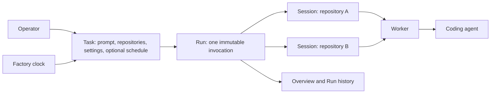

# Tasks and Runs

> **Status:** Accepted for implementation
>
> **Vocabulary:** Implemented as Routine, Work, and Target, then renamed to
> Task, Run, and Session by migration 30. This record uses the current names;
> "legacy Task", "legacy Run", and "Job" refer to the pre-migration-27 tables.

## 1. Executive summary

Factory currently asks an operator to understand Definitions, Runbooks,
Automations, Runs, Jobs, and Tasks before they can run one prompt. The same
split appears in the database and API. The Overview then exposes this internal
model through an eight-card metrics grid and global Definition, repository,
and Worker filters.

This design reduces the product to two operating concepts. A **Task** is a
saved prompt, its repository scope, execution settings, and an optional
schedule. A **Run** is one immutable invocation of that Task. A Run contains
one Session for each snapshotted repository, but Session is shown as detail
inside a Run rather than as another top-level product.

The browser navigation becomes Overview, Runs, Tasks, Workers, and
Repositories. Overview becomes a small status page for active Runs, items that
need attention, recent outcomes, upcoming Tasks, and Worker availability.
The main downside is a deliberate reduction in scope: provider-driven GitHub
issue, pull-request, and webhook triggers leave the first Tasks model. They
can return later as another way to start the same Runs, after manual and
scheduled Tasks are stable.

## 2. Context and scope

The current [architecture](../../ARCHITECTURE.md) has reliable execution
machinery. It provides repository isolation, Worker capacity, leases, retries,
events, cancellation, and cleanup. That machinery stays.

The current authoring model is duplicated. A Definition stores one saved
prompt and execution settings. A Workflow, called a Runbook in the browser,
stores another saved prompt form. An Automation adds a trigger and repository
scope. A Run fans a Definition out to Jobs. A Job creates a Task, which owns
the actual Execution. These boundaries record implementation history rather
than user intent.

This design changes the product, HTTP API, browser routes, and SQLite schema.
It covers manual and scheduled execution across one or more managed
repositories. It also defines the data migration and the simplified Overview.
It does not change the agent process, worktree safety, Worker authentication,
or Attempt event contract except where an old legacy Task or Job identifier
must be replaced by a Run Session identifier.

## 3. System context



The control plane owns Tasks, schedule admission, Run and Session state,
repository selection, Worker assignment, and lifecycle history. A Worker owns
repository preparation, the isolated worktree, the agent process, and cleanup.
The coding agent owns the engineering actions it performs. Tool availability
is configured on each Worker and is not part of a Task. A managed
Repository remains infrastructure and never becomes a second
Task or Run identity.

## 4. Proposed design

### How it works

An operator creates a Task called `Weekly bug scan`. They enter one prompt,
select the coding-agent runtime, select three managed repositories, and keep
the default concurrency limit. They can save it with scheduling off, or add
one cron schedule and timezone.

Pressing **Run now** snapshots the Task generation and its ordered
repository set into one Run record. Factory creates one Session per repository
and admits those Sessions up to the Task concurrency limit. Each Session is
assigned independently, runs in its own worktree, and reaches its own outcome.
The Run page shows aggregate progress and expands to repository-level state,
logs, results, retry, cancellation, and cleanup.

When the Task becomes due, the scheduler creates the same Run and Sessions
from the same snapshot path. Scheduled Session prompt resolution appends the
frozen occurrence time, cron, timezone, and scheduled-occurrence instruction,
preserving the current `ResolveDefinitionSchedulePrompt` behavior. Manual and
scheduled admission otherwise differ only in Run source and scheduled time.
Editing the Task later increments its generation but never changes existing
Runs. Migrated provider-driven history uses a third, read-only
`provider_history` source so Factory preserves provenance without restoring
provider admission.

Overview shows four small facts: active Runs, Runs needing attention, Runs
completed in the last 24 hours, and Workers online. It then shows at most ten
recent Run records and five upcoming scheduled Tasks. A recent Run row
shows Task name, source, session progress, aggregate state, start time, and
duration. It does not show a repository filter or one row per repository.
Repository detail appears after opening the Run.

Active means at least one Session is nonterminal. Needs attention means an
active Run has an actionable Blocked Session, or a Run reached Failed or
Partial in the last 24 hours. Task concurrency throttling is not actionable.
Completed counts Runs that became terminal in the same rolling window. These are
fixed operational definitions, not user-selectable reporting cohorts.

### Components and responsibilities

The Task service owns prompt configuration, repository scope, schedule,
generation control, validation, and archive state. It depends on the managed
Repository catalog. It does not assign Workers or start agent processes.

The admission service owns manual request idempotency and schedule due-time
idempotency. It creates one Run and all of its Sessions in one transaction. It
does not resolve Session outcomes or retry agent side effects.

The Run service owns aggregate state, Session state, cancellation, per-Session
retry, history, and list queries. It depends on the existing execution and
Attempt machinery. It does not mutate the Task snapshot after admission.

The scheduler owns due-time calculation and recovery after restart. It depends
on Task schedule fields and the admission service. A Task stores the
next cron occurrence separately from any pending occurrence and its retry
cursor, so retry backoff never replaces the scheduled instant used for
idempotency. The scheduler does not create a second Automation, Occurrence, or
Run lifecycle.

The Overview API owns one bounded operational projection. It depends on Run,
Task, and Worker queries. It does not expose cohort analytics or accept
global Definition, repository, or Worker filters.

The Worker continues to own runtime discovery, repository preparation,
process supervision, event delivery, cancellation, and cleanup. It receives a
Run Session and a resolved prompt. It does not read Task configuration.

### Decisions

#### Task is the only authoring model

A Task replaces Definition, Workflow, Runbook, and Automation. It stores
the prompt, repositories, execution defaults, and optional schedule together.
We reject a reusable prompt that must be wrapped in another resource before it
can run because that is the duplication causing the current UX.

#### The Run is the only execution model

One manual or scheduled invocation is a Run. Its repository children are Run
Sessions. We reject the legacy Run, Job, and Task split as parallel product and
database names.
Execution and Attempt remain internal lifecycle records because they describe
retries and process history, not another user action.

#### One fixed repository scope

Run now and scheduled admission use the Task's configured repository set.
Run now does not accept a temporary repository override or extra prompt text.
This keeps both paths identical and makes history reproducible. An operator
creates or edits a Task when they want different behavior.

#### One optional schedule

A Task has scheduling off or one cron expression with one IANA timezone.
We reject multiple triggers in the first model because they would require
independent health, due cursors, and controls. A second cadence can be a second
Task with an explicit name.

#### No parameter schema in the first model

The prompt is the complete instruction. We reject Definition inputs and
per-invocation parameters in this change because they recreate an authoring
layer and make manual Runs differ from scheduled Runs. Full snapshots preserve
room to add typed variables later if repeated use cases justify them.

#### Overview is operational, not analytical

Overview answers what is active, what needs attention, what finished, what is
next, and whether Workers are available. We reject success-rate, throughput,
queue-time, cycle-time, cohort windows, formula disclosures, and three global
filters on this page. Detailed filtering and future analytics belong in the Run
or a dedicated report.

#### Pre-launch schema replacement

The migration creates the final Task and Run names and removes the old
authoring and execution tables after validation. We reject permanent aliases,
compatibility views, and dual writes because the product is pre-launch and the
stated goal is to avoid naming debt.

## 5. Invariants and requirements

### Invariants

- `INV-1`: A Run record contains an immutable Task snapshot and source.
- `INV-2`: A Run Session belongs to exactly one Run and one snapshotted
  repository.
- `INV-3`: One Run contains at most one Session for a repository.
- `INV-4`: Manual and scheduled admission call the same transactional creation
  path.
- `INV-5`: One Task generation and scheduled instant create at most one
  Run.
- `INV-6`: Editing or archiving a Task never changes existing Runs.
- `INV-7`: A Run is terminal only when every Session is terminal.
- `INV-8`: Retrying one Session does not replay successful sibling Sessions.
- `INV-9`: Disabling a schedule stops future admission but does not cancel
  active Runs.
- `INV-10`: Workers receive only the resolved Run Session snapshot, never
  mutable Task state.
- `INV-11`: The database, API, UI, logs, and metrics use Task, Run, Session,
  Worker, and Repository consistently.
- `INV-12`: No migrated Run loses its Attempt events, result, failure, or
  retained-worktree state.
- `INV-13`: A pending scheduled occurrence keeps its original due instant
  until admission succeeds, regardless of retry backoff or later cron due
  times.
- `INV-14`: Migrated provider-driven Runs retain their provider kind and
  external occurrence identity but cannot be replayed as a live provider
  trigger.

### Requirements

- A Task can be saved as a draft with zero repositories, but Run now and
  schedule enablement require at least one enabled managed Repository.
- Task names are unique after case folding and whitespace normalization.
- Task names are limited to 200 Unicode characters. Legacy source names
  were limited to 100, so the bounded migration suffix always fits without
  truncating operator text.
- A Task edit uses an expected generation and returns a conflict on stale
  writes.
- Run now defaults to all configured repositories and has no repository picker.
- A Task has one runtime, timeout, and concurrency limit.
- Creating or editing a Task whose resulting schedule is enabled validates
  the fully resolved scheduled prompt, including occurrence metadata, against
  the 64 KiB resolved-prompt limit. A manual-only Task may use the full
  base-prompt limit.
- Runs support the existing table, list, and kanban views over the same API
  records. The selected view remains in the URL.
- A Run detail page shows aggregate progress before Session detail.
- A partial terminal outcome is visible as `Partial`, not `Succeeded` or
  `Failed` for the whole Run.
- Overview has no reporting-window control, formula disclosure, or global
  Definition, repository, or Worker filters.
- Task, Run, Session, Worker, and Repository collection APIs remain bounded
  and cursor-paginated where history can grow.

## 6. Interfaces and data

The operator API becomes:

```text
GET    /api/v1/tasks
POST   /api/v1/tasks
GET    /api/v1/tasks/{task_id}
PUT    /api/v1/tasks/{task_id}
PUT    /api/v1/tasks/{task_id}/archived
POST   /api/v1/tasks/{task_id}/run
POST   /api/v1/tasks/{task_id}/discard-occurrence

GET    /api/v1/runs
GET    /api/v1/runs/{run_id}
POST   /api/v1/runs/{run_id}/cancel
POST   /api/v1/runs/{run_id}/sessions/{session_id}/retry
POST   /api/v1/runs/{run_id}/sessions/{session_id}/cancel

GET    /api/v1/overview
```

`discard-occurrence` requires the exact pending UTC instant as
`pending_due_at`; that instant is its idempotency token.

Task responses contain stable identity, name, prompt, runtime, timeout,
concurrency limit, generation, archive state, ordered
repositories, optional schedule, next due time, and timestamps. The list omits
the full prompt and includes repository count, last Run state, and next due
time. Migration-only history containers are excluded from Task collection
responses and cannot be opened, edited, scheduled, copied, or run.

Run collection responses contain stable identity, Task ID and name, source
`manual`, `schedule`, or read-only `provider_history`, optional scheduled time,
aggregate state, Session counts, admission time, update time, and terminal time.
They omit prompts, repository identities, and provider snapshots.
Run detail adds the complete immutable Task snapshot, optional historical
provider snapshot, ordered Session details, and Attempt summaries. A new Run can
use only `manual` or `schedule`; `provider_history` is migration-only. The
Task foreign key may be nullable only after a future hard-delete feature;
V1 archives Tasks instead.

Session state is one of Blocked, Queued, Preparing, Running, Succeeded, Failed,
or Cancelled. Run state is derived with this ordered, mutually exclusive
precedence:

1. When no Session is nonterminal: Succeeded when all succeeded, Cancelled when
   all were cancelled, Failed when none succeeded and at least one failed, and
   Partial for every other terminal mix.
2. Otherwise, Running when any Session is Preparing or Running, or when any
   terminal and nonterminal Sessions coexist.
3. Otherwise, Blocked when every nonterminal Session is Blocked.
4. Otherwise, Queued when at least one nonterminal Session is Queued.

A separate `needs_attention` field uses the same Overview predicate: it is true
when an active Run has an actionable Blocked Session, or when a Run reached
Failed or Partial in the last 24 hours. Sessions waiting only for a Task
concurrency slot are normal throttling and do not need attention. The
discard-occurrence mutation requires a blocked pending occurrence or a durably
paused pending occurrence on a disabled Task. It is idempotent for the same
frozen occurrence token, clears only its pending and retry fields, records the
discarded due instant for audit, and recalculates the first cron instant
strictly after the current time. A stale token conflicts so an operator cannot
discard a newer occurrence accidentally.

The final SQLite model uses these primary tables:

```text
tasks
task_repositories
runs
sessions
executions
attempts
attempt_events
workers
repositories
worker_repositories
```

`tasks` stores schedule fields directly: `schedule_enabled`, `cron`,
`timezone`, `next_due_at`, `pending_due_at`, `schedule_retry_at`,
`schedule_retry_count`, `pending_snapshot_json`, `last_discarded_due_at`,
`schedule_health_status`, `schedule_health_code`, and
`schedule_health_message`. `next_due_at` is the next unclaimed cron occurrence;
`pending_due_at` is the original occurrence currently awaiting successful
admission; `schedule_retry_at` is only its backoff cursor.
`last_discarded_due_at` durably stores the discarded occurrence token, serves
as its audit record, and makes a repeated discard of that token return the
already-committed result after a lost response. `pending_snapshot_json` freezes
the prompt, repositories, runtime, timeout, concurrency, generation, and
schedule identity used by that occurrence, so later Task edits and migrated
retries cannot change it.
`tasks.migration_only` identifies a fixed set of archived history containers
created only during conversion. They satisfy historical Run foreign keys but
are never authoring resources.
`tasks.read_only` durably marks archived Workflow revision history. These
Tasks remain inspectable but cannot be edited, restored, scheduled, or run.
`task_repositories` stores an explicit position and unique Task and
Repository pair. `runs` stores the Task snapshot as validated JSON.
`sessions` stores the repository ID and canonical identity snapshot,
resolved prompt, state, block reason, assigned Worker, timestamps, result, and
failure.

The migration performs these steps while writes are frozen. Every migrated
operator-authored Task receives `<name> · definition N` or `<name> ·
schedule N`. The globally unique number is allocated deterministically by
source kind and legacy ID. The migration report records every renamed Task,
so valid cross-model name collisions never block the frozen migration.

1. Back up the SQLite file and validate foreign keys.
2. Convert every Definition to a Task. Fold its default input JSON into the
   prompt with the same `protocol.ResolveDefinitionPrompt` representation used
   by current admission. Before conversion, calculate the final UTF-8 byte
   length and block every Definition whose folded prompt exceeds the Task
   64 KiB limit. Report its Definition ID, base prompt size, input size, and
   folded size so the operator can shorten it. A Definition with no known scope
   becomes a draft Task with no repositories. An archived Definition remains
   archived as a Task and cannot start Runs until explicitly restored.
3. Convert every legacy schedule to its own separately named Task. A legacy
   Definition has no repository scope, so inferring that its sole schedule is
   also the Definition's canonical scope would change the draft Definition.
   The schedule Task contains its fully resolved prompt, repository scope,
   runtime, timeout, concurrency, and cadence. Legacy tool restrictions are
   intentionally not converted because Worker setup owns tool availability.
   Record every mapping in the migration report.
   Copy the schedule's enabled flag exactly. A disabled schedule remains
   disabled while retaining its cron and timezone.
   A schedule whose source Definition is archived becomes an archived Task
   with scheduling disabled and its cron and timezone retained. Migration must
   not make a cadence executable when its dependency was unavailable before the
   upgrade.
   Before folding parameters, block and report every schedule whose override
   keys are no longer declared by its current Definition. For every remaining
   schedule, resolve the current defaults and overrides and append the maximum
   scheduled-occurrence metadata used by admission. Block and report every
   final prompt over 64 KiB.
   Before conversion, block any schedule or frozen pending occurrence whose
   repository scope exceeds 100. Report the Automation or occurrence ID and
   repository count so the operator can reduce its scope.
   When no unadmitted occurrence exists, copy the exact legacy
   `automation_schedule_triggers.next_due_at` cursor to the Task.
4. Convert every Workflow revision into a zero-repository Task, including
   revisions that never produced a legacy Task or Automation. Use
   `<title> · workflow N · revision R` and the revision ID, preserve the exact
   instructions and summary as labelled prompt sections, keep the current
   revision as the editable draft, and archive every older revision as
   read-only history. All
   revisions of a disabled Workflow are archived. Because Workflows had no
   runtime settings, use the Task defaults: Codex, a two-hour timeout, and
   concurrency 10. Historical legacy Tasks continue to preserve their exact
   revision identity in immutable Run snapshots.
5. Convert each legacy schedule's unadmitted scheduled occurrence
   into the pending fields on its mapped Task. Copy `scheduled_at` to
   `pending_due_at`, copy `retry_at` to `schedule_retry_at`, initialize
   `schedule_retry_count` to zero because the legacy schema did not store a
   count, and copy its frozen Definition, parameters, repositories, runtime,
   timeout, concurrency, and schedule identity into `pending_snapshot_json`.
   Derive `next_due_at` from the first cron instant after the pending
   occurrence. Every occurrence whose legacy state is `failed` becomes a
   blocked pending occurrence with its diagnostic intact, even when the legacy
   row has a retry cursor; it remains visible and explicitly discardable rather
   than becoming an unreachable retry. If one legacy schedule has more than one
   unadmitted occurrence across the legacy `pending`, `dispatching`, and
   `failed` states, or a frozen snapshot is incomplete, block migration and
   report every occurrence ID rather than dropping or relabelling it. Also
   block and report every unadmitted schedule `run_now` occurrence whose
   `scheduled_at` is null and `run_request_key` is set; it cannot be represented
   by scheduled pending fields and has no admitted Runs to convert.
   A schedule trigger whose `definition_id` is null and whose Automation still
   points at a Workflow represents an unfinished prior product-model upgrade.
   Block migration and report its Automation and Workflow IDs. The operator
   must complete that existing upgrade before this migration can safely resolve
   and freeze its prompt. Never drop or silently disable that cadence.
6. Convert legacy Runs and Jobs into Runs and Run Sessions. Copy the
   resolved prompt and all lifecycle links. For an admitted schedule, also copy
   the occurrence ID, kind, scheduled instant or run-now request identity,
   cron, and timezone into the immutable Run snapshot. Preserve `webhook` and
   other provider Run provenance as a `provider_history` source with its
   immutable provider kind and occurrence snapshot. Normalize the legacy Run
   concurrency block reason to the canonical Task concurrency reason so migrated
   normal throttling does not become an attention alert. A missing block reason
   remains actionable in both Run detail and Overview.
7. Convert every remaining reconstructable legacy Task before dropping legacy
   tables. Create at most three deterministic, archived, migration-only history
   containers for workflow, direct-manual, and provider legacy-Task history.
   Point each converted Run at the matching container, but keep its exact
   prompt, repositories, runtime, timeout, concurrency, legacy source identity,
   and provider occurrence solely in the immutable Run snapshot. Preserve legacy
   tool restrictions only as read-only audit metadata on migrated Runs. Legacy
   Tasks linked through disabled provider occurrences use `provider_history`;
   other legacy Tasks use manual Runs. Copy every Execution, Attempt, event,
   result, failure, and retained-worktree link. Never create one Task per
   historical legacy Task.
8. Before creating Tasks, preflight the editable Task count: one Task
   for each Definition, schedule, and current Workflow revision. Archived
   read-only Workflow revision history does not consume this cap. Block
   migration and report the source and proposed Task IDs
   when that exact count would exceed 500. Also block completion if any
   remaining legacy Task cannot be reconstructed exactly,
   active legacy executions, enabled provider-driven Automations, unfinished
   Workflow-backed schedule triggers, deleted-legacy-Task occurrence tombstones,
   taskless provider occurrences, oversized folded prompts, ambiguous
   snapshots, orphan lifecycle rows, or foreign-key violations remain. A
   `task_deleted` occurrence has deliberately discarded its prompt and
   lifecycle rows, so it cannot become a truthful Run. A provider occurrence
   that never admitted a legacy Task or Run likewise has audit identity and
   diagnostics but no truthful Run lifecycle. Report every blocked occurrence,
   retained legacy Task ID snapshot, external identity, and diagnostic instead
   of silently dropping or relabelling that audit identity.
9. Validate counts, identifiers, terminal outcomes, Attempt events, and
   retained-worktree links.
10. Drop the legacy Definition, Workflow, Automation, Occurrence, Run, Job, and
   Task tables, indexes, triggers, and mutation ledgers. Rename no legacy table
   into a compatibility alias.
11. Commit the migration and retain the backup path in the completion report.

Provider-driven Automation configuration is not silently converted into a
schedule. An enabled provider Automation blocks migration. A disabled one is
listed in the report with the prompt and repository that can be recreated
manually. Its historical occurrence and legacy Task executions still migrate to
read-only `provider_history` Runs when their snapshots are complete.

The old `/definitions`, `/workflows`, `/automations`, `/runs`, `/jobs`, and
`/tasks` routes and API endpoints are removed in the same release. Because the
product is pre-launch, the server does not carry permanent redirect or payload
aliases. The release notes and migration preview are the compatibility
contract.

### Naming and identity

Task, Run, and Session IDs are random stable IDs created by the control
plane. Task names use a normalized unique key. A rename changes only the
current Task generation; historical Runs keep the old name in their
snapshot.

Manual Run idempotency uses the caller request key. A scheduled Run uses a
deterministic key derived from Task ID, Task generation, and the original
`pending_due_at` UTC instant. Session identity is unique by Run ID and
Repository ID. A Repository rename or remote change after admission does not
rewrite the stored canonical identity snapshot.

## 7. Failure behavior and lifecycle

Creating a Run is atomic. If any Session cannot be written, no Run or sibling
Session is visible. A lost response is recovered through the request key and
returns the original Run.

If a configured Repository is disabled or missing when admission starts, the
request fails before Run creation and names every invalid session. If a
Repository becomes unavailable after admission, its Session becomes Blocked
with a reason while siblings continue. Worker capacity also produces Blocked,
not failure or silent skipping.

The scheduler calculates `next_due_at` when a Task is saved or enabled. When
that instant becomes due, one transaction moves it to `pending_due_at` and
advances `next_due_at` to the following cron occurrence. Admission always uses
the immutable `pending_due_at` in its deterministic key. Transient failures
such as a database busy error advance `schedule_retry_at` from one minute up to
fifteen minutes while `pending_due_at` remains unchanged. Permanent snapshot or
dependency failures, including a missing or disabled Repository, set schedule
health to Blocked and stop automatic retries. The Tasks UI exposes the exact
failure and an explicit **Discard occurrence** action; discarding clears the
frozen pending fields only after operator confirmation.

Successful admission or explicit discard clears the pending and retry fields,
then recalculates `next_due_at` as the first cron instant strictly after the
current time. Factory therefore skips cron instants missed during downtime or
retry rather than admitting a backlog. After a process crash the scheduler
resumes pending retries first, then scans overdue Tasks in bounded batches.

Editing a Task while a Run is active affects only later Runs. Disabling its
schedule leaves active Runs unchanged. If an occurrence is already pending,
disable or archive keeps its due instant and frozen snapshot as a durable paused
occurrence. Recovery never admits a pending Run while the schedule is disabled
or the Task is archived. Re-enabling resumes that exact occurrence before
calculating later cadence; the operator may instead use **Discard occurrence**
while it is paused. Archiving disables the schedule and blocks Run now, but
keeps history. Shutdown stops new admission, returns
unclaimed Sessions to a claimable state, asks active Worker processes to stop,
and relies on existing leases for crash recovery.

Cancelling a Run requests cancellation for every nonterminal Session. A race
with completion preserves the first valid terminal outcome. Retrying creates a
new Attempt under the same Session and shows the existing warning that agent
side effects may repeat.

If migration validation fails, the transaction rolls back and the old database
remains untouched. Factory reports the exact blocking records and backup path.
It never starts with a partly converted schema.

## 8. Security, privacy, and operations

The trust boundary stays the same. Task prompts and execution settings are
trusted operator input. Repository identities come only from the managed
catalog. A schedule cannot introduce an arbitrary clone URL. Browser mutations
keep the existing origin and JSON checks. Remote Worker routes keep TLS,
credential hashing, and resource ownership checks.

Task prompts, resolved Session prompts, agent output, and events may contain
sensitive source or operator data. List APIs omit full prompts. Detail APIs are
available only on the operator listener. Logs must use IDs and sizes rather
than prompt bodies.

Existing limits remain unless renamed. Editable Tasks are capped at 500;
archived read-only Workflow revisions and the fixed migration-only history
containers do not count toward that cap.
Repository scope is capped at 100 per Task, prompt size at 64 KiB, timeout
at 8 hours, and concurrency at 1 to 100 with default 10. Overview returns at
most ten recent Run rows and five upcoming Tasks. Scheduler recovery
handles at most 100 due Tasks per transaction so startup cannot monopolize
SQLite.

## 9. Acceptance criteria

- `AC-1`: Primary navigation contains Overview, Runs, Tasks, Workers, and
  Repositories only.
- `AC-2`: An operator can create one Task with a prompt and N repositories,
  then Run now without creating another resource. A Task has no tool list;
  tool availability comes only from manual Worker setup.
- `AC-3`: Enabling a schedule on that Task creates the same Run and Session
  shape as Run now.
- `AC-4`: Run table, list, and kanban views show the same records and open one
  Run detail page.
- `AC-5`: Run detail shows aggregate progress and independent state for every
  repository Session.
- `AC-6`: Retrying one failed Session does not replay a successful sibling.
- `AC-7`: Editing a Task leaves an existing Run snapshot byte-for-byte
  unchanged.
- `AC-8`: Overview has four status facts with the specified fixed definitions,
  recent Runs, upcoming Tasks, and no global filters or formula panel.
- `AC-9`: The final database contains no legacy Definition, Workflow,
  Automation, Occurrence, Run, Job, or Task tables, columns, indexes, triggers,
  or foreign-key names.
- `AC-10`: After migration, the public API and normal emitted operator text
  contain no legacy Definition, Runbook, Automation, Run, Job, or Task resource
  names.
  Migration previews, blockers, and completion reports may name legacy
  resources when required to identify the exact source record.
- `AC-11`: A migration either preserves all compatible history and completes
  atomically or leaves the original database unchanged with actionable
  blockers.
- `AC-12`: Linux, macOS arm64, macOS amd64, browser, migration, boundary,
  security, and release checks pass on the converted model.

## 10. Test approach

Store tests prove `INV-1` through `INV-9` with manual and scheduled admission,
Task edits, duplicate requests, partial outcomes, cancellation, and
per-Session retry. Snapshot byte comparisons prove `AC-7`.

Migration fixtures cover an empty database, Definitions without scope and with
default inputs, schedules with parameter overrides, cross-model name
collisions, several schedules for one Definition, schedules with differing
concurrency, one pending schedule retry with a frozen snapshot, blocking
multiple pending retries, a blocking unadmitted schedule `run_now` request, and
zero-initialized migrated retry counts, single-repository schedules,
multi-repository schedules, completed and active Runs, legacy Workflow Tasks,
more than 500 reconstructable direct-description legacy Tasks, bounded
migration-only history containers, webhook Runs, provider-linked legacy Tasks,
disabled provider
Automations, blocking enabled provider Automations, retained worktrees, and
corrupt foreign keys. Schema inspection proves `AC-9`; count, provenance, and
lifecycle comparisons prove `INV-12`, `INV-13`, `INV-14`, and `AC-11`.

HTTP tests reject old routes and prove the Task, Run, Session, and Overview
payloads. A vocabulary check scans the final schema, public Go types, JSON
fields, active operator documentation, browser copy, and generated assets for
the removed resource names. Historical migrations and superseded design
records are explicitly excluded. This proves `INV-11` and `AC-10`.

React tests cover Task creation, schedule controls, Run now, all three Run
views, aggregate and Session detail, empty states, and the reduced Overview.
Playwright runs the same Task manually and from a schedule across two
repositories and verifies independent Session outcomes. The existing Worker
race, process cleanup, release reproducibility, static analysis, vulnerability,
and platform jobs prove `AC-12`.

## 11. Risks and tradeoffs

- Removing provider triggers reduces capability. Keep the design boundary so a
  future provider trigger admits the same Run without restoring Automations.
- A Task with one repository set cannot support one-off scope changes.
  Favor explicit Task edits or copies until repeated use proves overrides
  are worth the extra history semantics.
- Destructive schema cleanup has migration risk. Use a write freeze, backup,
  one transaction, blocking validation, and post-migration count checks.
- Removing parameters may duplicate a few Tasks. This is preferable to
  keeping a second authoring system before parameter use cases are known.
- Aggregate Run state can hide a failed Session if the row is too quiet. Show
  session progress and make Partial and Needs attention visually distinct.

## 12. Open questions

- Should a future Task support more than one schedule? This does not block
  implementation. Start with one schedule and duplicate the Task for a
  second cadence.
- Which provider event should return first after schedules? This does not block
  implementation. Gather use cases before adding another trigger type.
- Should completed Runs support hard deletion or retention policies? This does
  not block implementation. Keep current retention and archive behavior in the
  first migration.

## 13. Out of scope

- GitHub issue, pull-request, or webhook triggers.
- Multiple schedules or generic trigger plugins.
- Per-invocation prompt text, repository overrides, or typed parameters.
- Workflow graphs, dependencies, approvals, or chained Tasks.
- Cost analytics, SLA reporting, and cohort metric dashboards.
- A new orchestration backend or changes to the Worker execution environment.
