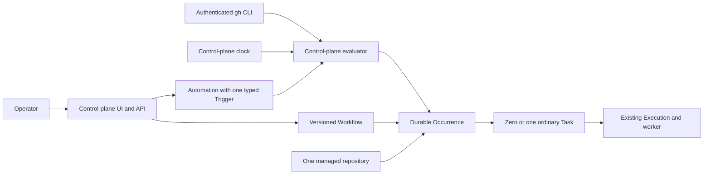

# Reusable Workflows and typed Automations

> **Status:** Implemented historical design. Issues #183 through #187 shipped
> the offline disabled-first legacy-poller migration and retirement. The
> [Software Factory target architecture](../software-factory/design.md)
> supersedes this model for future product work.
>
> **Tracks:** [GitHub issue #173](https://github.com/owainlewis/factory/issues/173)

## 1. Executive summary

Factory can delegate one free-text Task to one repository, but operators must
repeat their instructions, run the standalone poller, and inspect process logs
to understand automated work. Factory now has versioned **Workflows** for
reusable Markdown instructions. This design adds **Automations** that bind one
Workflow, one managed repository, execution context and defaults, enabled state,
and exactly one typed Trigger. A durable **Occurrence** records one time a
Trigger fired and links directly to at most one ordinary Task.

GitHub issue polling, GitHub pull-request polling, and cron scheduling move into
the control plane. Workers stay generic and continue receiving one resolved
Task prompt for one repository. The main downside is that the control plane now
owns background polling, scheduling, recovery, and provider health in addition
to its existing Task coordination work.

## 2. Context and scope

The current [architecture](../../ARCHITECTURE.md) stores one Task and one
Execution for a title, description, worker, repository, and timeout. Managed
GitHub repositories and routing are already control-plane resources. The
standalone `factory-poller` read `poller.toml`, ran `gh`, stored observations in
a separate SQLite ledger, and submitted ordinary Tasks. It had durable
deduplication, but required another process and hid configuration and health
from the browser.

This design builds on the implemented Workflow API and Task snapshot contract
and adds one typed Automation path to the control-plane API, database,
background loops, and UI. The first Trigger types are `github_issue`,
`github_pull_request`, and `schedule`. Each Automation owns one Trigger, targets
one enabled managed repository, and can create independent Occurrences. Each
productive Occurrence creates at most one existing Task.

The earlier [phase proposal](../phases/design.md) and the previous version of
this document are superseded. This design does not add multi-repository Runs,
Run targets, fan-out, generic Queues, TOML Automation definitions, provider
plugins, DAGs, workflow chaining, or approval state.

**Opinion [high]:** the single-repository Occurrence-to-Task model is the right
MVP because it is the model accepted in issue #173 and preserves Factory's
existing Task and worker boundaries. **This changes if:** measured use proves
that one operator action must coordinate several repositories as one durable
unit. That would require a separate Run design.

## 3. System context



The control plane owns Workflow revisions, Automation configuration, Trigger
validation, polling and scheduling, Occurrences, prompt composition, health,
and deduplication. The managed repository catalog remains the source of target
identity and its existing readiness API remains the source of routing feedback.
The local `gh` installation owns GitHub credentials. Existing workers own agent
execution, leases, attempts, worktrees, and cleanup. Workers do not read
Workflow, Automation, Trigger, or Occurrence records.

## 4. Design

### How it works

An operator creates a Workflow titled `Implement a ticket`. Revision 1 contains
Markdown instructions to read the live ticket, inspect repository guidance,
implement and verify the change, request review, and report evidence. Editing
the Workflow creates revision 2. Both revisions remain immutable.

The operator then creates an Automation titled `Ready issues` by selecting that
Workflow, one enabled managed repository, trusted context, a timeout, and the
`github_issue` Trigger. The Trigger form requires issue state, required labels,
and a polling interval. The Automation is created disabled. Test trigger runs a
bounded `gh issue list` preview and shows matches or an actionable error without
creating an Occurrence or Task. Enabling requires a confirmation that repeats
the Workflow, repository, Trigger summary, and next check.

When the check becomes due, the control plane reserves it so a second check for
the same Automation cannot overlap. It runs `gh` without a shell, validates the
entire bounded result, and then processes each matching issue. A transaction
inserts an Occurrence only when the Automation and issue number have not been
seen together. The Occurrence pins the current enabled Workflow revision,
repository, Automation configuration version, context, timeout, observed
metadata, and deterministic Task request key before any Task is created. It
stores the exact prompt or a permanent composition failure.

A dispatcher claims pending Occurrences, then uses a transaction-aware form of
the existing Task creation service to create or recover the Task and link the
Occurrence in one commit. A lost commit response therefore reveals both records
or neither, and deterministic request-key replay returns the original Task. If
no worker can currently acquire the repository, the Occurrence returns to
pending with a visible diagnostic and bounded retry. Once linked, the UI shows
the ordinary Task and its existing execution state.

The Automation repository selector consumes the existing managed-repository
list. Detail views consume the existing repository readiness response, including
`routing_ready` and per-worker reasons. Automation enablement requires the
repository to be enabled but does not require `routing_ready`, which is a
transient fleet fact. When no worker is ready, the Automation UI shows the same
readiness reasons and the dispatcher keeps its Occurrences pending.

Dispatch uses the existing managed-repository route with the Occurrence's
canonical remote identity and required source access `github` on `github.com`.
The returned Task must reference the snapshotted repository or dispatch stops
with a corruption error. Titles use the snapshotted Automation title:
`<title>: GitHub issue #<number>`, `<title>: GitHub pull request #<number>`,
`<title>: scheduled <UTC RFC3339>`, or `<title>: run now`. All remain below the
existing 200-character Task title limit.

The `github_pull_request` Trigger follows the same path with pull-request
fields and conditions. A `schedule` Trigger instead stores a five-field cron
expression, IANA timezone, and next due UTC instant. One scheduled UTC instant
creates at most one Occurrence. Run now creates an immediate Occurrence through
the same dispatcher without changing the next scheduled instant.

For Workflow-backed manual delegation, the browser submits an immutable
Workflow revision and free-text context to the existing Task endpoint. The
control plane stores the context separately and stores this exact UTF-8 Task
description:

```text
Workflow instructions:

<workflow Markdown bytes>

Task context:

<context bytes>
```

For a GitHub Automation, the resolved description separates the trusted
configured predicate from the bounded untrusted observation:

```text
Workflow instructions:

<workflow Markdown bytes>

Automation context:

<trusted Automation context bytes>

Trusted trigger conditions:

<canonical trigger-condition JSON bytes>

Provider instruction:

Use gh to fetch the live GitHub item identified below and revalidate every
trusted trigger condition before any mutation. If it no longer matches, stop
without changing the repository or item.

Untrusted trigger observation:

<bounded type-specific metadata>
```

Trigger-condition JSON has no insignificant whitespace and uses fixed field
order. Issue conditions are
`{"type":"github_issue","state":"open","required_labels":["needs-agent"]}`.
Pull-request conditions are illustrated by
`{"type":"github_pull_request","state":"open","include_drafts":false,"required_labels":["needs-agent"],"base_branches":["main"]}`.
Values come from the typed snapshot. Strings use JSON escaping and arrays use
their snapshotted canonical order. The polling interval is operational timing,
not an item predicate, and is omitted.
Observation metadata also uses compact JSON with fixed field order: issue
JSON is
`{"type":"github_issue","number":123,"url":"https://github.com/owner/repository/issues/123","title":"Example","state":"open","labels":["bug"]}`.
Pull-request JSON is
`{"type":"github_pull_request","number":456,"url":"https://github.com/owner/repository/pull/456","title":"Example","state":"open","is_draft":false,"base_branch":"main","head_commit":"0123456789abcdef0123456789abcdef01234567","labels":["review"]}`.
Those literal keys and their shown string, integer, boolean, and array types are
fixed; values come from the validated snapshot, JSON strings use standard
escaping, and label arrays preserve their stored observation order.

A schedule or Run now Occurrence uses this different exact template and never
instructs the worker to fetch or revalidate a provider item:

```text
Workflow instructions:

<workflow Markdown bytes>

Automation context:

<trusted Automation context bytes>

Schedule instruction:

Execute the Workflow for this scheduled occurrence. There is no provider item
to revalidate.

Trusted schedule occurrence:

<canonical schedule-occurrence JSON bytes>
```

Scheduled JSON is
`{"type":"schedule","kind":"scheduled","scheduled_at":...,"cron":...,"timezone":...}`.
Run now JSON is
`{"type":"schedule","kind":"run_now","request_key":...,"cron":...,"timezone":...}`.
It follows the same compact JSON and escaping rules.

The worker adds its existing fixed Factory safety preamble, title, repository
identity, working branch, and target base branch, then runs the resolved prompt.
Task detail shows the Workflow title and revision, original context, and resolved
prompt.

Factory performs no interpolation, Markdown rendering, URL expansion, or
provider body fetch during composition. Existing blank Task clients keep
sending `description` and behave as they do now.

### Components and responsibilities

#### Workflow store

The Workflow store owns stable Workflow IDs, immutable numbered revisions,
enabled state, title uniqueness, mutation replay, and size limits. It depends on
SQLite. It does not own repositories, Triggers, schedules, runtime selection,
or execution state.

#### Automation store

The Automation store owns one stable Automation, optimistic configuration
version, Workflow ID, managed repository ID, trusted context, timeout, enabled
state, exactly one typed Trigger, evaluation cursor, health, and counters. It
depends on the Workflow store and managed repository catalog. It does not store
provider credentials or implement Task execution.

#### Trigger evaluators

Three control-plane evaluators own concrete validation and occurrence identity:
`github_issue`, `github_pull_request`, and `schedule`. GitHub evaluators own
fixed `gh` commands, strict output decoding, polling intervals, previews, and
provider health. The schedule evaluator owns cron parsing, timezone behavior,
due cursors, and catch-up. They do not share an opaque property map or load
runtime plugins.

#### Occurrence dispatcher

The dispatcher owns pending occurrence recovery, a short durable dispatch
claim, deterministic Task request keys, fair admission, and the direct
Occurrence-to-Task link. It depends on the existing Task creation and repository
routing rules. The claim serializes Task creation against skip and dependency
changes; it is not an Execution lease and does not add a Run, target, attempt,
cancellation, or retry state machine.

#### Browser UI

The UI owns Workflow and Automation forms, type-specific Trigger fields,
previews, confirmation, health feedback, occurrence history, and links to Task
detail. It depends on server validation and computed times. It does not run
`gh`, calculate cron independently, compose prompts, or infer health from Task
state.

#### Worker

The worker keeps its current claim and execution contract. It receives the
resolved description through `claim.task.description` for exactly one
repository. `worker.toml` remains the per-worker identity and runtime file. The
worker does not branch on Workflow or Trigger type.

### Decisions

#### Workflow content is versioned; Automation configuration is not

Every Workflow edit creates an immutable revision because a Task must preserve
the exact instructions it used. An Automation has a stable ID and an
optimistically incremented configuration version. Each Occurrence snapshots
that version and the concrete fields needed for history. Immutable Automation
revisions were rejected because they add another revision library without
improving Task reproducibility. The cost is that Automation history is an
Occurrence snapshot rather than a browsable revision list.

#### An Automation owns exactly one typed Trigger

The API uses a strict tagged union and storage uses one concrete Trigger table
for each type. A generic Queue with optional properties or an unvalidated JSON
map was rejected because issue, pull-request, and schedule conditions have
different validation, health, preview, identity, and UI needs. Changing Trigger
type requires a new Automation. This keeps deduplication identity stable.

#### An Occurrence is the only automation parent of a Task

An Occurrence records one issue, pull request, scheduled instant, or explicit
Run now request. It links directly to zero or one ordinary Task. A durable Run
and Run-target layer was rejected because one Automation owns one repository
and one occurrence needs at most one Task. The cost is that several independent
Occurrences have no aggregate parent.

#### Provider items dispatch once per Automation

The MVP deduplication keys are `(automation_id, issue_number)` and
`(automation_id, pull_request_number)`. New labels, state changes, Workflow
revisions, or pull-request commits do not rearm an existing item. The operator
uses the existing Task retry or an explicit manual Task when another pass is
needed. Episode tracking was rejected because it requires a provider lifecycle
model that the MVP does not need.

#### Occurrence persistence precedes Task dispatch

Creating a Task directly from a polling loop was rejected because a crash can
make the provider result and Task response disagree. The evaluator first
commits the unique Occurrence and deterministic request key. The dispatcher
then commits Task creation or exact replay and the Occurrence link atomically.
This adds small pending and dispatching states but makes restart and
lost-response behavior testable without an unlinked committed Task window.

#### The control plane owns polling and scheduling

The standalone poller and external cron were rejected as the final operating
model because they split configuration, health, and deduplication from the
control-plane database and UI. The server runs all evaluator loops. The local
authenticated `gh` CLI remains the GitHub access boundary, so this design does
not introduce a provider SDK or credential store.

## 5. Invariants and requirements

### Invariants

1. A Workflow revision never changes after creation.
2. A Task pins at most one Workflow revision and stores its exact resolved
   description.
3. An Automation references exactly one Workflow, one managed repository, and
   one Trigger of one concrete type. Its repository binding and Trigger type
   never change.
4. An Automation is created disabled and cannot be enabled with a disabled
   Workflow or repository.
5. One Occurrence belongs to one Automation and links to at most one Task.
6. One Task belongs to at most one Occurrence and still owns exactly one
   Execution.
7. One issue number, pull-request number, or scheduled UTC instant creates at
   most one Occurrence for one Automation.
8. A non-migration Occurrence snapshots the Workflow revision, Automation title
   and version, repository, context, timeout, and Trigger metadata before Task
   dispatch. A migration Occurrence instead preserves its exact legacy ledger
   identity and, while pending, its copied Task request. Supported Task deletion
   later clears the context and resolved prompt from its terminal tombstone but
   retains the other snapshots.
9. A lost Task response or process restart cannot create a second Task for one
   Occurrence.
10. Editing or disabling a definition cannot change an existing Task.
11. Disabling an Automation stops new evaluations and pauses undispatched
    Occurrences. It does not cancel linked Tasks.
12. Polling and scheduling execute only in the control plane.
13. Workers receive ordinary Tasks and never read Workflow, Automation,
    Trigger, or Occurrence records.
14. A Trigger preview never creates or changes an Occurrence, Task, health
    counter, or evaluation cursor.
15. Completing a Task never starts another Workflow automatically.

### Requirements

- Workflow and Automation titles are required, limited to 100 Unicode
  characters, and unique after trimming and ASCII case folding within their
  resource type. Other UTF-8 bytes remain exact.
- Workflow summaries are limited to 500 Unicode characters. Markdown
  instructions are required and limited to 48 KiB.
- Manual Workflow context is required and limited to 64 KiB. Automation context
  is limited to 8 KiB and may be empty. Automation timeout is required and
  stays within the current 1 second through 8 hour Task limit.
- The resolved Task description remains limited to 64 KiB. An oversized manual
  composition creates no Task. An Automation match records a failed Occurrence
  with no Task so its deduplication identity is not lost.
- The complete agent input, including the safety preamble, title, repository
  identity, bounded working and target-base branch metadata, and resolved
  description, is limited to 72 KiB and is validated before Task creation.
- Editing a Workflow's title, summary, or instructions creates its next immutable
  integer revision. The UI offers Blank task and every enabled Workflow; Task
  detail keeps context separate from the Workflow snapshot, retries use the
  stored resolved description, and disabling affects only new Tasks.
- A Workflow retains at most 100 revisions. The control plane stores at most
  500 Workflows, 500 Automations, and 100,000 Occurrences. Reaching a limit
  rejects the mutation or evaluation visibly and never prunes deduplication
  records automatically.
- Provider checks reserve capacity for every new unique Occurrence in one
  transaction. If capacity is too small, the check inserts none, changes no
  counters, and reports `occurrence_limit_reached`. A schedule at the limit
  keeps the same due cursor. Run now fails without reserving its request key.
- A Run now request key is a non-empty UTF-8 string of at most 128 bytes. It must
  equal Go `strings.TrimSpace` of itself, matching existing Task validation, and
  is otherwise compared byte-for-byte. With a UUID Automation ID, its derived
  Task request key remains below the existing 200-byte Task limit.
- GitHub issue state is `open` or `closed`. A Trigger has zero through 20
  required labels, each nonblank and at most 200 bytes.
- GitHub pull-request state is `open`, `closed`, or `merged`. Its Trigger also
  stores whether drafts match and zero through 20 optional base branches, each
  at most 255 bytes.
- A GitHub polling interval is between 10 seconds and 24 hours. Checks for one
  Automation never overlap.
- One GitHub check runs for at most 30 seconds, reads at most 4 MiB stdout and
  64 KiB stderr, and accepts at most 100 complete matches. The evaluator asks
  `gh` for 101 records and fails the whole check when the result exceeds 100.
- Each observed item number is a positive 32-bit integer. A title is at most 500
  Unicode characters and 2 KiB, and an HTTPS URL is at most 2,048 bytes and must
  identify the configured `github.com/owner/repository` and item number. An
  item has at most 100 labels, each at most 200 bytes and 8 KiB in aggregate.
  A base branch is at most 255 bytes and a head commit is 40 through 64 lowercase
  hexadecimal characters. Canonical stored metadata for one item is at most 16
  KiB. Any violation fails the whole check before Occurrence insertion.
- At most four `gh` processes run concurrently. Older due checks start first,
  with Automation ID breaking ties. An Automation cannot receive a second slot
  while an older due Automation has not received its first.
- Cron has five fields with minute, hour, day-of-month, month, and day-of-week.
  It accepts `*`, comma lists, inclusive ranges, and `/` steps. Month and weekday
  names use three-letter English names. It rejects seconds, `@` aliases,
  `CRON_TZ`, `?`, `L`, `W`, and `#`. When day-of-month and day-of-week are both
  restricted, either match fires, following Vixie cron. Timezone is a separate
  valid IANA name. The running server commits a due schedule Occurrence within
  10 seconds when the database is writable.
- The dispatcher examines at most 100 pending Occurrences per pass, takes no
  more than one from each Automation before a second, and retries temporary
  routing or database failures with exponential backoff from 5 seconds to 5
  minutes. A dispatch claim lasts 30 seconds and is renewed while active.
- Workflow, Automation, and Occurrence lists use cursor pagination with a
  default of 50 and maximum of 200 records.

## 6. Interfaces and data

### API

```text
GET    /api/v1/workflows
POST   /api/v1/workflows
GET    /api/v1/workflows/{workflow_id}
POST   /api/v1/workflows/{workflow_id}/revisions
PUT    /api/v1/workflows/{workflow_id}/enabled

GET    /api/v1/automations
POST   /api/v1/automations
GET    /api/v1/automations/{automation_id}
PUT    /api/v1/automations/{automation_id}
PUT    /api/v1/automations/{automation_id}/enabled
POST   /api/v1/automations/{automation_id}/test
POST   /api/v1/automations/{automation_id}/check
POST   /api/v1/automations/{automation_id}/run
GET    /api/v1/automations/{automation_id}/occurrences
POST   /api/v1/occurrences/{occurrence_id}/skip
```

The implemented Workflow list accepts exact normalized `title`, `enabled`,
`limit`, and `cursor` filters. Workflow creation starts at revision 1;
`GET /workflows/{workflow_id}` returns the current Workflow and its immutable
revision history; enabling and disabling are idempotent.

The implemented `POST /api/v1/tasks` accepts two exclusive forms. Existing
clients send `description` for a blank Task. Workflow-aware clients omit
`description` and send a pinned `workflow_revision_id` with free-text `context`.
Supplying both forms returns `ambiguous_task_prompt` and creates no Task:

```json
{
  "request_key": "4a11cc72-2bb7-4f5e-92d6-e1d2087f6d94",
  "title": "Implement JIRA-123",
  "context": "Work on JIRA-123: https://jira.example.com/browse/JIRA-123",
  "workflow_revision_id": "9ec13fe1-4f41-49e2-94c9-5bb4b7f3c807",
  "worker_id": "3f441724-98c3-43ac-97f7-f87c92cbb9a8",
  "repository_id": "b3195042-65f3-47b8-80e2-a5d09db33a31",
  "timeout_seconds": 7200
}
```

The UI submits the current immutable revision ID. The Task transaction validates
that it belongs to an enabled Workflow. After request shape and immutable field
validation, a valid normalized request checks its globally unique,
`strings.TrimSpace` canonical request key before mutable Workflow and routing
state. Exact or concurrent valid replay therefore returns the original Task.
Automation recovery uses that internal create-or-recover behavior inside the
atomic Occurrence-to-Task transaction; it adds no public Task lookup endpoint or
Task request-key tombstone policy.

The Task stores nullable Workflow and revision IDs, Workflow title and revision
number snapshots, and original context. `tasks.description` stores the immutable
resolved prompt; Task detail returns `context` and exposes the same bytes as
`resolved_prompt`; `claim.task.description` remains the resolved prompt consumed
by existing workers. The canonical formatter and 72 KiB agent-input limit live
in the shared protocol package, where the worker-owned framing is added.
Existing rows have no Workflow and copy their existing description to context;
existing clients and workers remain compatible.

Workflow creation accepts:

```json
{
  "request_key": "e3f257f6-bb5d-47cd-b903-8966c4bd36d8",
  "title": "Implement a ticket",
  "summary": "Implement, verify, review, and open a pull request.",
  "instructions": "Read the live ticket..."
}
```

Revision creation accepts the same editable fields, a new `request_key`, and
`expected_revision_id`. Exact mutation replay returns the first record. Reusing
a key with different input returns `request_key_conflict`; a stale non-replay
edit returns `workflow_revision_conflict`.

This design does not change the existing managed-repository endpoints or their
response shapes. Automation UI uses `GET /api/v1/repositories` and
`GET /api/v1/repositories/{repository_id}/readiness`; dispatch uses the existing
Task route with the repository remote identity and GitHub source-access
requirement. Repository disablement therefore keeps rejecting new routed Tasks,
and current readiness rules continue to decide whether a worker can acquire one.

Creating an Automation uses a strict tagged union. Unknown fields are rejected.
For example:

```json
{
  "request_key": "2ca4ecb2-e4d3-4530-a215-ce9ddabece8b",
  "title": "Ready issues",
  "workflow_id": "5258f005-b811-47db-88c9-a828269849c0",
  "repository_id": "6fe11697-1086-47f8-a2f1-b96a748bb35e",
  "context": "Implement the issue and open a pull request.",
  "timeout_seconds": 7200,
  "trigger": {
    "type": "github_issue",
    "state": "open",
    "required_labels": ["needs-agent"],
    "poll_interval_seconds": 30
  }
}
```

The other Trigger shapes are:

```json
{
  "type": "github_pull_request",
  "state": "open",
  "include_drafts": false,
    "required_labels": ["needs-agent"],
  "base_branches": ["main"],
  "poll_interval_seconds": 60
}
```

```json
{
  "type": "schedule",
  "cron": "0 9 * * 1",
  "timezone": "Europe/London"
}
```

Creation does not accept an `enabled` field and always returns the Automation
disabled. Updates require `expected_version`; a conflicting update returns
`automation_version_conflict`. Trigger type and repository binding are
immutable; changing either requires a new Automation. Workflow, context,
timeout, and type-specific fields can be edited only while disabled. Creation
uses its request key for exact mutation replay. Configuration updates do not
accept a mutation key: after a lost response, the client reads the Automation
and treats current version `expected_version + 1` with the same normalized
fields as success; every other result requires refresh and resubmission from the
new current version. The UI reports that recovery instead of blindly retrying
the stale write.

`POST /test` previews provider matches or the next scheduled UTC instant. It
does not mutate durable state. `POST /check` asks an enabled provider Automation
to run its normal durable check now. `POST /run` applies only to a schedule and
creates an idempotent immediate Occurrence using the required bounded request
key. After validating and normalizing the request key, it returns an existing
Occurrence before checking mutable enabled state. A first request requires the
Automation, Workflow, and repository to be enabled. Rejection creates no
Occurrence and does not reserve its request key. The UI retains the same Run now
key after an ambiguous response and allocates a new key only after success.

### Persistence

```text
Workflow 1 --- * WorkflowRevision
Automation 1 --- 1 TypedTrigger
Automation 1 --- * Occurrence 0..1 --- 1 Task
WorkflowRevision 1 --- * Occurrence
WorkflowRevision 1 --- * Task
Repository 1 --- * Automation
Task 1 --- 1 Execution 1 --- * Attempt 1 --- * AttemptEvent
```

`workflows` stores stable identity, current title, enabled state, current revision
ID, mutation identity, and timestamps. `workflow_revisions` stores immutable
revision number, display title, summary, Markdown instructions, mutation
identity, and creation time.

`automations` stores stable identity, title, Workflow ID, repository ID, trusted
context, timeout, enabled state, configuration version, Trigger type, evaluation
lease, next evaluation time, last health fields, cumulative match, skipped, and
dispatched counts, and timestamps.

Concrete one-to-one tables store Trigger fields:

- `automation_github_issue_triggers` stores state, normalized required labels,
  and polling interval;
- `automation_github_pull_request_triggers` stores state, draft inclusion,
  normalized required labels, normalized base branches, and polling interval;
- `automation_schedule_triggers` stores cron, timezone, and next due UTC instant.

An Automation write transaction inserts exactly one concrete row matching the
immutable discriminator. Database insert guards reject a second Trigger row.
Every read verifies the discriminator and one-row cardinality. A mismatch is
reported as corrupt state and that Automation is not evaluated.

`automation_occurrences` stores identity, Automation ID and configuration
version, Automation title snapshot, nullable Workflow revision ID, repository ID
and identity snapshot, nullable context and timeout snapshots, state, nullable
resolved prompt, deterministic Task request key, nullable unique Task ID,
nullable Task ID snapshot, nullable dispatch token and lease expiry, diagnostic,
retry time, and timestamps. Workflow revision is null only for imported legacy
rows. Timeout is null only when an imported row has not yet resolved its copied
legacy request. Context is null for imported legacy and `task_deleted` rows.
Prompt is required for normal `pending`, `dispatching`, and all `dispatched`
rows. An imported pending row keeps its description and timeout inside the
copied legacy request until Resume or Skip. An imported submitted row stores the
linked Task's actual description, timeout, and Task ID snapshot, but no Workflow
revision or Automation context. Prompt is null for dependency `skipped`,
composition `failed`, and
`task_deleted` rows. Its states are
`pending`, `dispatching`, `dispatched`, `task_deleted`, `skipped`, and `failed`.
`task_deleted` is a terminal history tombstone. `failed` is reserved for
permanent prompt or stored state errors. Temporary routing errors remain
`pending`.

A claim transaction conditionally changes one due `pending` row to
`dispatching`, writes a random token, and sets a 30-second lease. The final
transaction checks the token, unexpired lease, Automation and dependency state,
and stored snapshots before it invokes the existing routing and Task creation
logic. Task insert or exact request-key reuse and Occurrence linkage commit in
that same transaction. Losing the claim, skipping first, or disabling a
dependency creates no Task. Temporary routing failure returns the row to
`pending` with its diagnostic and backoff. Startup returns claims from the prior
server process to `pending`; a live dispatcher renews its lease before expiry.
Before each pending scan, a steady-state recovery transaction also changes
expired `dispatching` rows to `pending`, clears their token and lease, and
records `dispatch_lease_expired`. Its conditional update requires the old state,
token, and expiry. If the final Task-and-link transaction owns the database
first, it commits both records and the recovery update no longer matches. If
recovery owns it first, the stale dispatcher fails its token-and-expiry check
before Task creation.

Linking a Task writes both the foreign key and immutable Task ID snapshot in the
same transaction. The existing terminal, unretained Task deletion transaction
first changes any linked Occurrence from `dispatched` to `task_deleted`, clears
its Task foreign key, resolved prompt, and Automation context snapshot, and
records `linked_task_deleted`, then hard-deletes the Task. A restrictive foreign
key prevents bypassing this transaction. The Occurrence keeps its request key,
Task ID snapshot, timeout, and Trigger metadata, so deletion neither rearms
dispatch nor loses deduplication identity while retaining the existing promise
to delete Task prompt material. Other Occurrence states cannot have a Task
foreign key. The UI renders the tombstone as "Task deleted" with the snapshotted
ID instead of a broken link.

Skip is a conditional transition from `pending` or `failed` to `skipped`. It
returns `occurrence_dispatching` while a dispatch claim owns the row and rejects
all terminal or linked states. Because the final Task-and-link transaction also
requires `dispatching` with the same live token, either Skip commits first and
no Task is created, or dispatch commits first and Skip observes `dispatched`.

Migration Occurrences may also store `legacy_task_request_json`, limited to the
current 1 MiB request-body limit. Import strictly decodes and copies each pending
ledger request into the control-plane transaction, so recovery no longer reads
the old ledger. Resume verifies any Task returned by request-key replay against
the copied repository, title, description, and timeout before linking it.
Linking or Skip clears the copied payload and retains the Occurrence identity.

`tasks` already has nullable `workflow_id`, `workflow_revision_id`,
`workflow_title`, `workflow_revision_number`, and `context` fields.
`description` is the immutable resolved prompt used by the worker. Manual
Workflow Tasks and productive Automation Tasks populate all five fields in the
same transaction that creates the Task and Execution. Existing Tasks retain
null Workflow fields and their original description is copied to context.
Workflow revisions have no hard-delete endpoint, so populated foreign keys
remain valid for Task history.

Concrete occurrence tables store bounded Trigger metadata and uniqueness:

- issue Occurrences store issue number, URL, title, observed state and labels,
  plus configured state and required-label snapshots, unique by Automation and
  issue number;
- pull-request Occurrences store number, URL, title, observed state, draft
  state, base branch, head commit, and labels, plus configured state,
  include-drafts, required-label, and base-branch snapshots, unique by
  Automation and number;
- scheduled Occurrences store the cron and timezone snapshots plus scheduled
  UTC instant or Run now request key, unique by Automation and scheduled instant
  or request key.

These concrete configured fields are the source for trusted predicate and
schedule JSON during delayed dispatch and remain on a `task_deleted` tombstone.
The resolved prompt is never the only copy of Trigger audit metadata.

Labels and base branches use validated JSON arrays only as typed scalar lists.
No table stores an opaque Trigger configuration property map.

Normal Task request keys are
`automation:<automation_id>:github_issue:<number>`,
`automation:<automation_id>:github_pull_request:<number>`,
`automation:<automation_id>:schedule:scheduled:<UTC RFC3339>`, and
`automation:<automation_id>:schedule:run:<run_request_key>`. The schedule kind
keeps scheduled instants and Run now requests in separate identity domains, and
Run key validation prevents the existing Task service from trimming two
distinct Occurrence keys to one Task key. Exact replay returns the first Task.
Before normal dispatch, Factory verifies that a Task already stored under that
key has the same repository, Workflow revision, context snapshot, resolved
description, title, and timeout snapshot; a mismatch is internal corruption.
After valid exact replay, the public Task API rejects a new request key beginning
with `automation:` as `reserved_request_key_prefix`; only the internal
Occurrence-to-Task transaction may create one. Other keys keep the current
request-key-wins behavior. Automation creation regenerates its UUID if any
existing Task key begins `automation:<candidate_id>:`. Migration needs no public
reservation or tombstone: the old poller must be stopped before Import, and
imported Automations cannot run until Finalize. New observations after
enablement use the normal Automation key forms above rather than a retired
poller key.

Automation counters have exact meanings. `matched_count` counts validated
provider candidates or due schedule instants. `skipped_count` counts candidates
whose occurrence identity already exists plus schedule instants skipped because
the Workflow or repository is disabled. `dispatched_count` counts Occurrences
linked to a Task. Failed checks do not increment any of these counters.

### Naming and identity

The server generates UUIDs for Workflow, revision, Automation, Occurrence, and
Task records. Stable IDs survive rename. Revision numbers and Automation
versions start at 1 and increase in the same transaction as their write. An
Automation UUID is accepted only when its reserved Task-key namespace is empty.

Titles are trimmed and ASCII `A` through `Z` are folded to lowercase for
uniqueness. Other UTF-8 bytes remain exact. GitHub labels are trimmed,
case-folded for duplicate checks, sorted for canonical mutation hashing, and
preserved in display form. Base branches are trimmed, compared byte-for-byte,
deduplicated, and sorted.

GitHub item numbers are positive integers scoped by the Automation's immutable
repository binding. Schedule identity uses the calculated UTC instant, not wall
clock text. During the autumn daylight-saving overlap, two matching UTC
instants create two Occurrences. A nonexistent spring wall-clock instant creates
none.

### Migration and compatibility

Existing Tasks, Executions, Attempts, events, managed repositories, workers,
and `POST /api/v1/tasks` clients remain valid. Existing claims still carry the
resolved prompt in `claim.task.description`. No coordinated worker upgrade is
required. No Phase, Run, or Run-target data migration exists because those
models were never implemented.

Poller retirement is an offline, disabled-first migration:

1. Preview, Import, and Finalize each require the operator to confirm that the
   standalone poller is stopped. The control plane opens the legacy ledger and
   proves exclusive ownership with a SQLite `BEGIN EXCLUSIVE` transaction held
   for the whole action. If the lock cannot be acquired, the action returns
   `legacy_poller_active` and makes no durable change. Running the old poller and
   the control-plane evaluator at the same time is not supported.
2. The control plane resolves the legacy config with the poller's current
   precedence. The UI accepts absolute process-local overrides for `-config` or
   `FACTORY_POLLER_CONFIG`, the poller's effective data home, and the poller's
   original working directory when it is needed to resolve a relative
   environment value. Without an override, it uses visible poller config and
   data-home variables, then `~/.factory`. A blank `data_directory` means
   `<selected-data-home>/poller`; a nonblank relative value resolves from the
   selected config directory. The page shows the selected config, data home,
   data directory, ledger, archive root, queues, row counts, mapping errors, and
   matching managed repositories.
3. While holding the ledger lock, Preview strictly decodes at most 1 MiB of
   config and snapshots its exact bytes, selected paths, archive root, ledger
   schema, and ordered observation rows. It stores a digest of that complete
   snapshot. Import and Finalize acquire the same lock, rebuild the snapshot,
   and compare it before committing. They read the config again before commit.
   A changed selection, config, schema, or row returns
   `migration_source_changed`, writes no import or finalized state, and tells the
   operator to stop the poller and run Preview again. The binding survives a
   control-plane restart.
4. Only built-in GitHub queues are imported. Import atomically creates one
   ordinary Workflow from each queue prompt and one disabled `github_issue`
   Automation from its project, state, labels, polling interval, and timeout.
   Stable import keys make retry return the same records. Title conflicts require
   an explicit rename. Unsupported command queues remain unimported and are
   reported in the UI. No runtime adapter is generated.
5. Import preserves every submitted observation's ledger identity. For a
   nonblank stored Task ID, it looks up only that ID and verifies its request key
   and repository. A missing ID becomes a terminal `legacy_task_deleted`
   Occurrence even if another Task reused the key. Request-key lookup is allowed
   only when the stored ID is blank. A found Task with conflicting identity
   blocks Import; no match becomes `legacy_task_deleted`. A match links the
   ordinary Task directly and records `legacy_task_reused`. Legacy Tasks have no
   Workflow revision metadata.
6. Import strictly decodes and copies each pending row's exact `request_json`
   into a paused Occurrence. Resume uses that stored request. Before linking a
   new or replayed Task it verifies repository, title, description, and timeout
   against the copy; a mismatch records `legacy_task_conflict`, links nothing,
   and leaves the payload available for retry or Skip. Skip clears the payload
   but retains the observation identity. There is no later
   pending-to-submitted reconciliation because the source is required to remain
   offline. The imported Workflow applies only to new observations.
7. Finalize requires every imported pending row to be linked or skipped. Under
   the exclusive ledger lock it verifies the bound snapshot, copies the exact
   config bytes and a consistent SQLite backup to a private `0700` staging
   directory below `<selected-data-home>/archive/poller/`, and writes an
   ownership manifest. Files and the directory are fsynced before an atomic
   rename; the archive parent is fsynced after the rename and before the
   finalized-state transaction. Retry reuses a complete staged archive or an
   already-renamed final archive only when its manifest matches the same
   migration and snapshot. A matching final archive completes the missing
   finalized-state write; any mismatch reports an archive collision. Any source
   change or archive failure leaves the migration unfinalized and both source
   files untouched. Imported Automations cannot be enabled before Finalize. The
   poller must remain retired after enablement.

The UI presents the sequence as Stop poller, Preview, Import, resolve pending
rows, Finalize, then Enable. Each failure shows the lock state or changed source
and the next safe action. `factory-poller`, poller Just commands, and operator
poller documentation are removed only in the retirement delivery after
migration tests pass. The original TOML and ledger are archived but never
deleted automatically.

`~/.factory/config.toml` is introduced only for control-plane bootstrap values
that must be known before SQLite opens:

```toml
listen = "127.0.0.1:7337"
database = "server/factory.sqlite3"
```

The file is optional, strictly decoded, and selected by
`FACTORY_SERVER_CONFIG`.
Relative database paths resolve from the config file. Existing command flags
override the file. It cannot contain Workflows, repositories, Automations,
Triggers, schedules, credentials, or worker settings. `worker.toml` remains
per worker and keeps its current identity and runtime fields.

## 7. Failure behavior and lifecycle

Workflow and Automation writes are atomic. Failed validation or an exceeded
limit creates no partial record. Workflow mutations and Automation creation
provide exact mutation-key replay. Concurrent Workflow edits use the expected
current revision. Automation configuration edits use `expected_version` and
recover a lost response through the read-and-compare contract in section 6;
they do not claim mutation-key replay.

The implemented Workflow Task path returns `workflow_revision_required` for
context without a revision, `workflow_revision_not_found` for an unknown
revision, `workflow_disabled` for a disabled Workflow,
`resolved_prompt_too_large` above 64 KiB, and `agent_prompt_too_large` above the
72 KiB complete-input limit. It creates neither Task nor Execution and does not
reserve the request key on these failures. Workflow mutations return
`request_key_conflict`, `workflow_revision_conflict`,
`workflow_revision_limit`, or `workflow_limit_reached` without partial writes.

The server starts evaluator loops only after migrations and the existing lease
sweep complete. Invalid stored Trigger data degrades that Automation but does
not prevent Task, worker, repository, or UI APIs from starting. A missing or
unauthenticated `gh` marks GitHub Automations blocked with the command and
remediation, then retries dependency health at most once per minute.

A GitHub check reserves one lease before starting `gh`. Success validates all
output before inserting any Occurrence. Nonzero exit, timeout, cancellation,
malformed JSON, unknown fields, invalid metadata, duplicate conflicting items,
oversized output, or more than 100 matches fails the whole check and creates no
Occurrence. The previous successful check and next retry remain visible.

Every Automation, Workflow, or repository enabled-state transition invalidates
the evaluation tokens of affected provider Automations in the same database
transaction. The control plane then cancels their in-flight `gh` processes.
Re-enable schedules a new check with a new token. This internal invalidation
does not change the existing managed-repository API or readiness response. A
result from before a disable and re-enable cycle can therefore never pass
admission by observing only the final enabled state.

After whole-result validation, one transaction identifies new deduplication
keys and reserves capacity for all of them. The transaction also requires the
same live evaluation token and an enabled Automation, Workflow, and repository.
It atomically inserts all new Occurrences or none, updates matched and skipped
counters, records success health, advances the next-check cursor, and clears the
evaluation token and lease. Prompt composition failure creates a failed
Occurrence for that item and consumes its dedup key; other items from the same
result can remain pending. If disable or dependency change commits first,
admission loses its token condition and becomes a no-op. If admission commits
first, its Occurrences and evaluator state exist before the state change returns
and the Occurrences are then paused.

A failed check completes in one transaction conditional on the same live token.
It records bounded error health and the retry cursor and clears the token and
lease without changing match, skip, or dispatch counters. A stale success or
failure completion whose token was invalidated changes nothing. The dependency
state-change transaction itself records blocked health and the once-per-minute
dependency retry, while Automation disable records disabled health and clears
the cursor.

A schedule-due transaction similarly requires an enabled Automation and the
expected stored due instant. It atomically inserts the pending, failed, or
dependency-skipped Occurrence, updates matched and skipped counters and schedule
health, and advances the due cursor. Disabling clears that instant in its
transaction, so either the complete due transition commits first or disable
prevents it. An enabled schedule whose Workflow or repository is disabled still
records the skipped Occurrence and advances its cursor as specified below.

The atomic Task-and-link transaction increments `dispatched_count` when it links
a Task. Exact replay of an already linked Task and Task deletion do not increment
or decrement that cumulative counter.

If the server crashes while a check lease is held, startup expires the lease
and schedules one replacement check. Provider checks do not replay every missed
poll interval. Their next check is one interval after the completed replacement
check.

Occurrence insertion and Task dispatch are separate durable steps. A crash
before the final dispatch transaction leaves a pending or recoverable
`dispatching` Occurrence. Task creation or exact replay and Occurrence linkage
share the final commit, so a crash cannot leave a dispatcher-created Task
unlinked. A lost commit response is recovered by reading the Occurrence and
deterministic request key. A missing eligible worker, temporary database
contention, or disabled target returns the Occurrence to pending with backoff and
does not create another Task. A permanent oversized prompt or corrupt snapshot
marks it failed. Operators may explicitly skip an unlinked pending or failed
Occurrence; a skipped Occurrence keeps its dedup key. Skip and dispatch are
serialized by the dispatch token as defined in section 6.

Editing requires a disabled Automation. Disabling cancels an in-flight provider
command, invalidates its evaluation token, clears its future check or due cursor,
and stops new dispatch claims. Workflow and repository state changes invalidate
affected provider tokens by the same rule. Provider result and schedule-due
admission use the conditional transactions above. The final dispatch transaction
rechecks enabled dependencies, so a disable transaction that commits first
returns the claimed Occurrence to pending without a Task; a Task-and-link
transaction that commits first is already linked before disable returns.
Disabling never cancels a linked Task. Re-enabling provider polling schedules
the first check immediately. Re-enabling a schedule sets the first matching
instant strictly after the enable transaction; disabled time is not caught up.

Dependency changes have one defined effect:

| Change | Provider evaluation | Schedule cursor | Unlinked Occurrences | Linked Tasks | UI |
| --- | --- | --- | --- | --- | --- |
| Automation disabled | Stop and cancel in-flight `gh` | Clear; re-enable starts strictly after commit | Pause | Unchanged | Disabled |
| Workflow disabled | Do not run `gh`; retry dependency health each minute | Due instants become skipped Occurrences and advance | Pause | Unchanged | Blocked: Workflow disabled |
| Repository disabled | Do not run `gh`; retry dependency health each minute | Due instants become skipped Occurrences and advance | Pause | Unchanged | Blocked: repository disabled |
| Dependency re-enabled | Check immediately | Keep the advanced future instant | Resume and reset backoff | Unchanged | Checking, then current result |

Blocked provider dependency checks do not change match, skip, or dispatch
counters. A skipped schedule Occurrence increments matched and skipped. Run now
fails with the disabled dependency and creates no Occurrence.

For a schedule that is overdue at startup, Factory creates one Occurrence for
the stored due instant and advances to the first matching instant after current
time. It records the number of other missed instants in the diagnostic and does
not replay them. Run now never changes this cursor.

At normal shutdown, the server first stops admitting schedule instants and
Run now requests through one shared admission gate, stops provider checks,
cancels in-flight `gh` processes, and waits for evaluators. Closing the gate
waits for any admission transaction that already entered it, so the later drain
cannot race a new committed Occurrence.
It then uses a bounded non-cancelled context to drain committed, ready
Occurrences through the ordinary Task-and-link transaction within the existing
10-second server drain bound. No new Occurrence is admitted after shutdown
starts. An Occurrence that cannot be routed or committed during the bounded
drain remains durable and resumes after restart. Linked Tasks and workers
continue through their existing lease behavior.

## 8. Security, privacy, and operations

The current trust boundary remains one trusted local user. The server is
loopback-only and has no authentication or authorization. Any local process
that can call Factory can read Workflow instructions, create Tasks, test
Triggers, and enable Automations. Hosted access requires identity,
authorization, audit, TLS, and tenant isolation before these APIs are exposed.

The control plane runs the fixed `gh` executable directly with literal
arguments and never through a shell. Repository identity comes only from the
managed catalog. GitHub credentials remain in the local `gh` credential store
and never enter Factory configuration, API payloads, or SQLite. Missing or
insufficient permissions are health errors, not reasons to broaden access.

Workflow instructions and Automation context are trusted operator policy.
GitHub titles, URLs, labels, branch names, repository content, issue text, and
pull-request text are untrusted. Polling stores only bounded metadata needed for
identity, UI feedback, and live revalidation. It never requests issue or
pull-request bodies. The worker prompt clearly separates the observation and
requires a live refetch, but this does not eliminate prompt-injection risk.

Normal logs contain IDs, Trigger type, durations, counts, and stable error codes,
not prompts or provider titles. Stored stderr diagnostics are truncated to 4
KiB for display even though the process collector accepts 64 KiB, and UI output
is escaped. Workflow instructions and Occurrence audit metadata remain in
SQLite. Automation context and resolved prompts remain until supported deletion
of their linked terminal Task clears both from the Occurrence; broader Workflow
and Occurrence deletion is deferred to a separate safe-deletion design.

Automations can repeatedly cause repository mutation with the server and worker
OS user's credentials. They are created disabled, enabling shows an exact
Workflow, repository, and Trigger summary, and provider Triggers offer a
non-mutating preview. Protected branches, least-privilege GitHub credentials,
and repository review policy remain the enforcement boundary.

The limits in section 5 bound processes, output, matches, prompt storage, and
database growth. At the Occurrence limit, evaluators stop creating new work and
show `occurrence_limit_reached`; they never evict deduplication evidence. At
`gh` concurrency saturation, due checks remain ordered and the UI shows how
late each next check is. Existing Task and worker APIs remain available when
all Automation evaluators are unhealthy.

## 9. Acceptance criteria

- An operator can create, edit, disable, enable, and list workflows in the UI.
- Editing a workflow creates an immutable numbered revision.
- Delegate task can run blank context or combine context with an enabled
  workflow.
- Jira text, a merge-request URL, a branch name, and a repository-wide request
  are all accepted as ordinary context without target-type fields.
- Task detail shows the original context, workflow title and revision, and exact
  resolved prompt.
- Delegate task uses the pinned workflow revision selected by the operator even
  when another operator edits the workflow before submission completes.
- Editing or disabling a workflow after task creation does not change that
  task's claim payload.
- A Codex worker and a Claude Code worker both run workflow tasks without
  workflow-specific worker code.
- Existing clients that create tasks with `description` and no
  `workflow_revision_id` behave as
  before, and already registered worker binaries receive the resolved prompt
  through their existing claim field.
- Invalid, disabled, duplicate, and oversized workflow operations return stable
  API errors and create no partial records.
- Lost workflow-create and edit responses are recovered by exact
  mutation-key replay, and concurrent edits cannot overwrite one another.
- The revision limit rejects a new edit without removing revisions used by
  tasks or pending sources.
- An operator can create, inspect, edit while disabled, enable, and disable an
  Automation containing one Workflow, one repository, context, timeout, and
  exactly one `github_issue`, `github_pull_request`, or `schedule` Trigger.
- A lost Automation configuration-update response is recovered by reading and
  comparing the expected next version and normalized fields; a different
  current value is never reported as successful replay.
- An Automation cannot change its repository or Trigger type after creation;
  the operator creates a new Automation for a different identity domain.
- The API rejects missing, mixed, unknown, and type-inappropriate Trigger
  fields. No generic Queue or opaque property map is stored.
- Test trigger previews bounded GitHub matches or schedule instants without
  changing Occurrences, Tasks, counters, health, or cursors.
- Automation list and detail show title, Workflow, repository, Trigger summary,
  enabled state, last checked or due time, next check or due time, last outcome
  or error, matched, skipped, and dispatched counts, and the latest linked Task.
- Automation repository selection and readiness reuse the existing repository
  API contract. Enabling requires an enabled repository but not a currently
  ready worker; transient no-worker states remain visible and pending.
- The UI shows healthy, checking, blocked, overdue, and error states with an
  actionable explanation, and background refresh does not erase in-progress
  form input.
- Repeated provider polls, concurrent evaluator ticks, lost Task responses, and
  server restarts create one Occurrence and at most one Task for one issue or
  pull request.
- Delayed dispatch uses the Occurrence's original context and timeout snapshots
  even if the disabled Automation is edited before it resumes.
- GitHub prompts serialize the snapshotted trusted Trigger predicate separately
  from untrusted observed metadata, so the worker can revalidate current
  eligibility. Schedule and Run now prompts contain trusted timing metadata and
  no GitHub fetch or provider-condition instruction.
- Dispatch never commits an Automation Task without its Occurrence link. Skip
  and disable serialize with dispatch so the winning transaction determines
  whether a Task exists, and the UI shows `dispatching` while a claim is active.
- One scheduled UTC instant creates one Occurrence and at most one Task. Run now
  requires an enabled Automation and enabled dependencies, is idempotent, and
  does not alter the schedule cursor. Its Task request-key namespace cannot
  collide with a scheduled instant, and surrounding whitespace is rejected.
  An exact replay returns the first Occurrence even if a dependency was disabled
  after it committed. A rejected first request creates no Occurrence or request
  key reservation.
- Public Task submission cannot create a key in the reserved `automation:`
  namespace, while valid exact replay of a pre-existing Task still succeeds.
  Internal dispatch is the only writer for new Automation Task keys.
- Cron parsing follows the section 5 grammar, including Vixie OR behavior when
  both day-of-month and day-of-week are restricted.
- An overdue schedule creates one catch-up Occurrence and skips later missed
  instants. DST overlap and nonexistent local time follow section 6.
- Missing `gh`, missing authentication, denied private-repository access,
  timeout, malformed output, conflicting duplicates, oversized output, and too
  many matches fail visibly and create no partial Occurrences. Invalid or
  over-limit provider metadata fails the whole check before storage.
- Disabling an Automation stops checks and due instants, pauses unlinked
  Occurrences, rejects Run now, prevents a completed provider result or racing
  due instant from being admitted afterward, and does not cancel linked Tasks.
- Disabling a Workflow or repository blocks provider checks, records skipped
  scheduled instants, invalidates affected provider tokens, pauses unlinked
  Occurrences, and leaves linked Tasks unchanged. Disable and re-enable cannot
  admit a stale provider result. Re-enabling follows the transition table in
  section 7.
- A provider check that cannot reserve capacity for every new Occurrence inserts
  none. Oversized automated prompts retain failed deduplication Occurrences.
- Normal shutdown creates no new background work after admission closes and
  restart resumes every committed pending or prior-process dispatching
  Occurrence without duplication.
- Deleting a terminal, unretained linked Task preserves a terminal Occurrence
  tombstone, its immutable Task ID snapshot, Trigger metadata, and deduplication
  identity while clearing the resolved prompt and Automation context snapshot;
  the UI shows "Task deleted" instead of a broken link.
- The migration UI imports supported poller queues as disabled typed
  Automations only after the operator stops the poller and the control plane
  proves an exclusive ledger lock. Preview, Import, and Finalize bind to the same
  selected config, data home, ledger snapshot, and archive root. A changed
  source or unavailable lock aborts without import or finalization. Submitted
  and deleted-Task identity is preserved, pending requests require explicit
  Resume or Skip, source files are archived but not deleted, and imported
  Automations cannot be enabled before Finalize. Live poller and evaluator
  overlap is not supported.
- `config.toml` contains bootstrap settings only. Workflows, repositories,
  Automations, Triggers, and Occurrences remain SQLite resources, and
  `worker.toml` remains per worker. Server bootstrap uses
  `FACTORY_SERVER_CONFIG`; a future finite CLI uses separate `client.toml` and
  `FACTORY_CLIENT_CONFIG` inputs.
- No Run, Run target, multi-repository selector, generic Queue, Automation TOML,
  runtime provider plugin, DAG, workflow chain, or approval engine is added.

## 10. Test approach

Store, HTTP, and migration tests will cover Workflow title normalization,
immutable revision increments, Workflow and Automation-create mutation replay,
Automation update lost-response read-and-compare recovery, concurrent conflicts,
enablement, list filters and pagination, exclusive Task prompt forms, pinned
prompt composition, the 64 KiB resolved and 72 KiB complete-input limits,
atomic Task snapshots, existing-row backfill, all Workflow and Automation
limits, Automation optimistic updates, immutable repository and Trigger-type
bindings, exactly-one-Trigger enforcement, typed row corruption detection,
Occurrence uniqueness, context and timeout snapshots, configured Trigger
snapshots across Automation edits and Task-deleted tombstones, direct Task
linkage, and stable errors.

Task and worker contract tests will cover blank descriptions, Workflow prompt
composition, all three Automation prompt templates, canonical predicate and
schedule JSON, empty condition arrays, JSON escaping, proof that schedule and
Run now contain no provider revalidation instruction, UTF-8 byte limits,
original context storage, immutable retry behavior, and claims consumed by
pre-Workflow Codex and Claude Code workers.

Fake-`gh` tests will cover issue states and labels, pull-request states, drafts,
labels and base branches, strict JSON, duplicate conflicts, the 101st match,
per-field and 16 KiB observation limits, repository and item URL validation,
stdout and stderr limits, timeout, cancellation, missing executable,
authentication and permission errors, no-shell execution, preview isolation,
check leases, disable after validated output but before admission, stale-token
rejection across dependency disable and re-enable, atomic success and failure
completion including crash points, concurrency, fairness, and restart recovery.

Fake-clock schedule tests will cover cron and timezone validation, next-instant
preview, unique UTC identity, Run now idempotency, disable and re-enable cursor
behavior, replay after the Automation or a dependency is disabled, first-request
rejection while disabled,
mixed day-of-month and day-of-week OR semantics, one catch-up occurrence, both
daylight-saving transitions, scheduler health isolation, and shutdown
admission, including atomic Occurrence, counter, health, and cursor writes and
the due-instant versus disable transaction race.

Dispatcher tests will crash before and after the atomic Task-and-link commit,
lose the commit response, replay deterministic keys, recover the original Task,
expire and reclaim dispatch claims during startup and steady-state operation,
reject a stale owner's final write, exercise no-worker and disabled repository
backoff, prove fair batching, serialize skip and disable against dispatch, and
show that linked Task retry, cancellation, results, events, and worktree cleanup
keep their existing behavior. They also prove that a first Task link increments
the cumulative dispatch counter exactly once. Task deletion tests will prove the
Occurrence tombstone transaction, cleared resolved prompt and context,
preserved typed Trigger snapshots and deduplication, and UI rendering. Schedule
tests will prove that scheduled and Run now request-key namespaces cannot
collide and will cover empty, 128-byte, 129-byte, and multibyte Run now keys,
plus surrounding ASCII and Unicode whitespace, against the 200-byte derived
Task-key limit. Task HTTP tests will prove exact replay before reserved-prefix
rejection, reject new public `automation:` keys, permit internal dispatch, and
regenerate an Automation UUID whose namespace is already occupied.

Migration fixtures will use the current `poller.toml` and `observations` schema.
They will cover default, explicit `-config`, environment-selected, and explicit
legacy data-home resolution; blank and relative `data_directory`; the required
poller-stop confirmation; exclusive-lock failure; preview binding across
restart; a config, path, schema, or observation change before Import or Finalize
aborting without partial state; submitted rows with present, deleted, reused,
and blank Task IDs; exact pending-request copy and restart recovery; Resume
inserting or replaying a matching Task; Resume rejecting mismatched repository,
title, description, or timeout without linking; Skip; imported title conflicts;
missing repositories; unsupported command queues; idempotent Import; enablement
blocked before Finalize; configured data-home archive placement; cross-filesystem
sources; missing or mismatched manifests; destination collision; staged-copy
failure and retry; crash after final rename but before the finalized-state
write; archive-parent fsync ordering; lost Finalize response; verified archive
contents; and recovery without deleting source files. No test permits live
poller and control-plane evaluator overlap or delayed ledger reconciliation.

Bootstrap configuration tests will prove strict decoding, command-flag
precedence, config-relative database paths, and that `FACTORY_SERVER_CONFIG`
never decodes the future `client.toml` schema selected by
`FACTORY_CLIENT_CONFIG`.

React tests will cover Workflow forms and history, every typed Automation form,
field-specific errors, preview, enable confirmation, preserved form input,
health and counters, occurrence-to-Task links, pending, dispatching, skipped,
and Task-deleted states, Skip conflict feedback, Run now, and migration review.
Browser tests will create and use a Workflow, preview and enable a GitHub issue
Automation, prove deduplication across a restart, and run a scheduled Occurrence
through to an ordinary Task.

Documentation checks will prove relative links resolve, Markdown code fences
are balanced, and superseded Phase, Run, generic Queue, TOML Automation,
plugin, DAG, and approval claims do not remain in active design guidance. The
full checks in [CONTRIBUTING.md](../../CONTRIBUTING.md) must pass.

## 11. Risks and tradeoffs

- Background `gh` commands add load and failure modes to the server. Mitigation:
  fixed concurrency, strict time and output limits, per-Automation leases, and
  health isolation keep Task APIs available.
- One matched check can create up to 100 independent Tasks. Mitigation: the
  result must be complete and bounded, the Automation is disabled first, and
  the UI previews scope before enablement.
- A provider item never rearms automatically. Mitigation: operators use Task
  retry or explicit manual delegation until a real episode model is designed.
- Prompt-only Workflows cannot enforce every instruction. Mitigation: leases,
  limits, worktree isolation, provider permissions, and repository protection
  remain outside the prompt.
- The loopback trust model gives every local caller Automation authority.
  Mitigation: keep the listener local and require a separate hosted-security
  design before remote access.
- Durable Occurrences grow without automatic pruning. Mitigation: enforce a
  visible hard limit and keep deduplication evidence until safe archival is
  separately designed.

## 12. Open questions

- None block task breakdown. Episode rearming, safe Occurrence archival, and
  hosted authorization require separate designs when they enter scope.

## 13. Out of scope

- Multi-repository Runs, Run targets, selectors, fan-out, or aggregate status.
- Generic Queues, opaque Trigger property maps, command adapters, or runtime
  provider plugins.
- TOML Workflow or Automation definitions. `config.toml` is bootstrap-only.
- Jira, Linear, GitLab, webhooks, or public ingress.
- Workflow variables, template languages, deterministic shell steps, DAGs,
  ordered pipelines, chaining, approvals, or automatic merge.
- Automatic rearming when an issue, pull request, label, state, or head commit
  changes.
- Hosted authentication, roles, sharing, billing, or tenant isolation.
- Automatic deletion or pruning of legacy poller files or Occurrence dedup keys.
